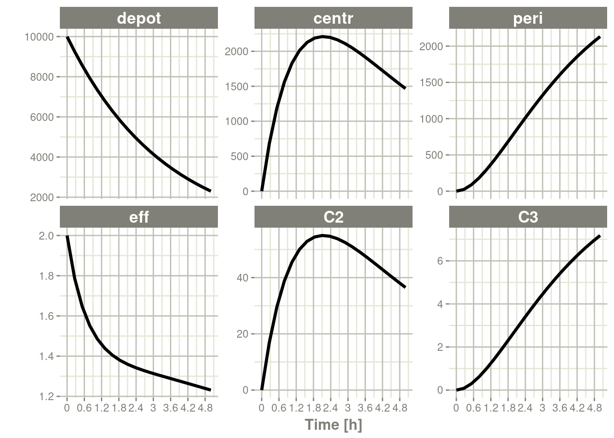
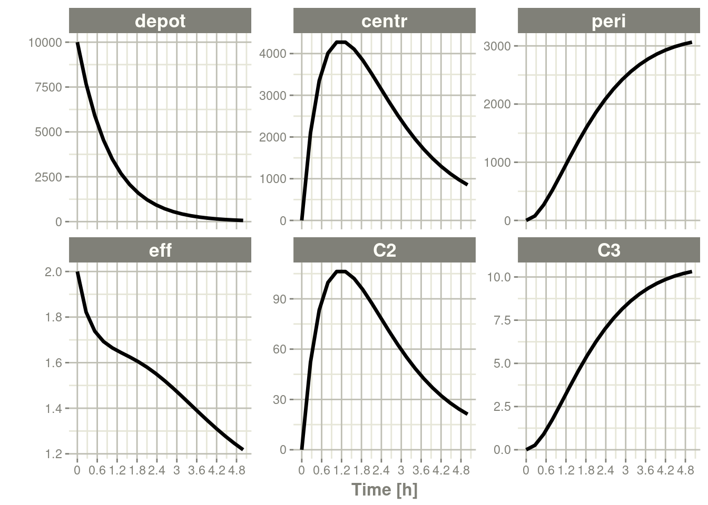

# 第十章rxode2的输出

## 10.1使用rxode2数据框

### 10.1.1创建交互式数据框

`rxode2`支持返回已求解的对象，该对象是一个修改后的数据帧。 这是由`predict()`、`solve()`或`rxSolve()`方法完成的。

```R
library(rxode2)
library(units)

### Setup example model
mod1 <- rxode2({
  C2 = centr/V2;
  C3 = peri/V3;
  d/dt(depot) =-KA*depot;
  d/dt(centr) = KA*depot - CL*C2 - Q*C2 + Q*C3;
  d/dt(peri)  =                    Q*C2 - Q*C3;
  d/dt(eff)  = Kin - Kout*(1-C2/(EC50+C2))*eff;
})

### Seup parameters and initial conditions

theta <- 
  c(KA=2.94E-01, CL=1.86E+01, V2=4.02E+01, # central 
    Q=1.05E+01,  V3=2.97E+02,              # peripheral
    Kin=1, Kout=1, EC50=200)               # effects

inits <- c(eff=1)

### Setup dosing event information
ev <- eventTable(amount.units="mg", time.units="hours") %>%
  add.dosing(dose=10000, nbr.doses=10, dosing.interval=12) %>%
  add.dosing(dose=20000, nbr.doses=5, start.time=120,
             dosing.interval=24) %>%
  add.sampling(0:240);


### Now solve
x <- predict(mod1,theta, ev, inits)
print(x)
```

```R
#> ── Solved rxode2 object ──
#> ── Parameters ($params): ──
#>      V2      V3      KA      CL       Q     Kin    Kout    EC50 
#>  40.200 297.000   0.294  18.600  10.500   1.000   1.000 200.000 
#> ── Initial Conditions ($inits): ──
#> depot centr  peri   eff 
#>     0     0     0     1 
#> ── First part of data (object): ──
#> # A tibble: 241 × 7
#>   time    C2    C3  depot centr  peri   eff
#>    [h] <dbl> <dbl>  <dbl> <dbl> <dbl> <dbl>
#> 1    0   0   0     10000     0     0   1   
#> 2    1  44.4 0.920  7453. 1784.  273.  1.08
#> 3    2  54.9 2.67   5554. 2206.  794.  1.18
#> 4    3  51.9 4.46   4140. 2087. 1324.  1.23
#> 5    4  44.5 5.98   3085. 1789. 1776.  1.23
#> 6    5  36.5 7.18   2299. 1467. 2132.  1.21
#> # … with 235 more rows
```

或者

```R
x <- solve(mod1,theta, ev, inits)
print(x)
```

```R
#> ── Solved rxode2 object ──
#> ── Parameters ($params): ──
#>      V2      V3      KA      CL       Q     Kin    Kout    EC50 
#>  40.200 297.000   0.294  18.600  10.500   1.000   1.000 200.000 
#> ── Initial Conditions ($inits): ──
#> depot centr  peri   eff 
#>     0     0     0     1 
#> ── First part of data (object): ──
#> # A tibble: 241 × 7
#>   time    C2    C3  depot centr  peri   eff
#>    [h] <dbl> <dbl>  <dbl> <dbl> <dbl> <dbl>
#> 1    0   0   0     10000     0     0   1   
#> 2    1  44.4 0.920  7453. 1784.  273.  1.08
#> 3    2  54.9 2.67   5554. 2206.  794.  1.18
#> 4    3  51.9 4.46   4140. 2087. 1324.  1.23
#> 5    4  44.5 5.98   3085. 1789. 1776.  1.23
#> 6    5  36.5 7.18   2299. 1467. 2132.  1.21
#> # … with 235 more rows
```

或者和`mattigr`的管道操作符一起使用

```R
x <- mod1 %>% solve(theta, ev, inits)
print(x)
```

```R
#> ── Solved rxode2 object ──
#> ── Parameters ($params): ──
#>      V2      V3      KA      CL       Q     Kin    Kout    EC50 
#>  40.200 297.000   0.294  18.600  10.500   1.000   1.000 200.000 
#> ── Initial Conditions ($inits): ──
#> depot centr  peri   eff 
#>     0     0     0     1 
#> ── First part of data (object): ──
#> # A tibble: 241 × 7
#>   time    C2    C3  depot centr  peri   eff
#>    [h] <dbl> <dbl>  <dbl> <dbl> <dbl> <dbl>
#> 1    0   0   0     10000     0     0   1   
#> 2    1  44.4 0.920  7453. 1784.  273.  1.08
#> 3    2  54.9 2.67   5554. 2206.  794.  1.18
#> 4    3  51.9 4.46   4140. 2087. 1324.  1.23
#> 5    4  44.5 5.98   3085. 1789. 1776.  1.23
#> 6    5  36.5 7.18   2299. 1467. 2132.  1.21
#> # … with 235 more rows
```

### 10.1.2rxode2已求解对象的属性

### 10.1.3使用已求解的对象作为简单的数据帧

已求解的对象作为`data.frame`或`tbl`可以通过`dpylr`添加包对数据进行筛选。例如，您可以轻松的对其进行筛选。

```R
library(dplyr)
```

```R
#> 
#> Attaching package: 'dplyr'
```

```R
#> The following objects are masked from 'package:stats':
#> 
#>     filter, lag
```

```R
#> The following objects are masked from 'package:base':
#> 
#>     intersect, setdiff, setequal, union
```

```R
### You can  drop units for comparisons and filtering
x <- mod1 %>% solve(theta,ev,inits) %>%
    drop_units %>% filter(time <= 3) %>% as.tbl
```

```R
#> Warning: `as.tbl()` was deprecated in dplyr 1.0.0.
#> ℹ Please use `tibble::as_tibble()` instead.
```

```R
### or keep them and compare with the proper units.
x <- mod1 %>% solve(theta,ev,inits) %>%
    filter(time <= set_units(3, hr)) %>% as.tbl
x
```

```R
#> # A tibble: 4 × 7
#>   time    C2    C3  depot centr  peri   eff
#>    [h] <dbl> <dbl>  <dbl> <dbl> <dbl> <dbl>
#> 1    0   0   0     10000     0     0   1   
#> 2    1  44.4 0.920  7453. 1784.  273.  1.08
#> 3    2  54.9 2.67   5554. 2206.  794.  1.18
#> 4    3  51.9 4.46   4140. 2087. 1324.  1.23
```

## 10.2交互式更新数据集

然而，它不仅仅是一个简单的数据对象。您可以使用已求解的对象动态更新参数，甚至修改采样时间。

首先，我们需要重新创建原始已求解的系统：

```R
x <- mod1 %>% solve(theta,ev,inits);
print(x)
```

```R
#> ── Solved rxode2 object ──
#> ── Parameters ($params): ──
#>      V2      V3      KA      CL       Q     Kin    Kout    EC50 
#>  40.200 297.000   0.294  18.600  10.500   1.000   1.000 200.000 
#> ── Initial Conditions ($inits): ──
#> depot centr  peri   eff 
#>     0     0     0     1 
#> ── First part of data (object): ──
#> # A tibble: 241 × 7
#>   time    C2    C3  depot centr  peri   eff
#>    [h] <dbl> <dbl>  <dbl> <dbl> <dbl> <dbl>
#> 1    0   0   0     10000     0     0   1   
#> 2    1  44.4 0.920  7453. 1784.  273.  1.08
#> 3    2  54.9 2.67   5554. 2206.  794.  1.18
#> 4    3  51.9 4.46   4140. 2087. 1324.  1.23
#> 5    4  44.5 5.98   3085. 1789. 1776.  1.23
#> 6    5  36.5 7.18   2299. 1467. 2132.  1.21
#> # … with 235 more rows
```

### 10.2.1修改初始条件

要检查或更改初始条件，您可以使用语法 `cmt.0`、`cmt0`或`cmt_0`。在模型定义`eff`房室的情况下，可以这样操作：

```R
x$eff0
```

```R
#> [1] 1
```

它显示eff房室的初始条件。如果您希望将此初始条件修改为2，可以通过以下方式轻松完成：

```R
x$eff0 <- 2
print(x)
```

```R
#> ── Solved rxode2 object ──
#> ── Parameters ($params): ──
#>      V2      V3      KA      CL       Q     Kin    Kout    EC50 
#>  40.200 297.000   0.294  18.600  10.500   1.000   1.000 200.000 
#> ── Initial Conditions ($inits): ──
#> depot centr  peri   eff 
#>     0     0     0     2 
#> ── First part of data (object): ──
#> # A tibble: 241 × 7
#>   time    C2    C3  depot centr  peri   eff
#>    [h] <dbl> <dbl>  <dbl> <dbl> <dbl> <dbl>
#> 1    0   0   0     10000     0     0   2   
#> 2    1  44.4 0.920  7453. 1784.  273.  1.50
#> 3    2  54.9 2.67   5554. 2206.  794.  1.37
#> 4    3  51.9 4.46   4140. 2087. 1324.  1.31
#> 5    4  44.5 5.98   3085. 1789. 1776.  1.27
#> 6    5  36.5 7.18   2299. 1467. 2132.  1.23
#> # … with 235 more rows
```

```R
plot(x)
```


### 10.2.2修改rxode2的观测时间

请注意，eff房室的初始条件现在是`2`。

您还可以通过修改`t`或`time`轻松修改采样时间。例如：

```R
x$t <- seq(0,5,length.out=20)
print(x)
```

```R
#> ── Solved rxode2 object ──
#> ── Parameters ($params): ──
#>      V2      V3      KA      CL       Q     Kin    Kout    EC50 
#>  40.200 297.000   0.294  18.600  10.500   1.000   1.000 200.000 
#> ── Initial Conditions ($inits): ──
#> depot centr  peri   eff 
#>     0     0     0     2 
#> ── First part of data (object): ──
#> # A tibble: 20 × 7
#>    time    C2     C3  depot centr  peri   eff
#>     [h] <dbl>  <dbl>  <dbl> <dbl> <dbl> <dbl>
#> 1 0       0   0      10000     0    0    2   
#> 2 0.263  16.8 0.0817  9255.  677.  24.3  1.79
#> 3 0.526  29.5 0.299   8566. 1187.  88.7  1.65
#> 4 0.789  38.9 0.615   7929. 1562. 183.   1.55
#> 5 1.05   45.5 1.00    7338. 1830. 298.   1.49
#> 6 1.32   50.1 1.44    6792. 2013. 427.   1.44
#> # … with 14 more rows
```

```R
plot(x)
```



### 10.2.3修改仿真参数

您还可以通过`$`操作符访问或修改参数。例如，对于`KA`可以通过以下方式访问：

```R
x$KA
```

```R
#> [1] 0.294
```

您可以通过为其赋值一个新值来修改它。

```R
x$KA <- 1
print(x)
```

```R
#> ── Solved rxode2 object ──
#> ── Parameters ($params): ──
#>    V2    V3    KA    CL     Q   Kin  Kout  EC50 
#>  40.2 297.0   1.0  18.6  10.5   1.0   1.0 200.0 
#> ── Initial Conditions ($inits): ──
#> depot centr  peri   eff 
#>     0     0     0     2 
#> ── First part of data (object): ──
#> # A tibble: 20 × 7
#>    time    C2    C3  depot centr   peri   eff
#>     [h] <dbl> <dbl>  <dbl> <dbl>  <dbl> <dbl>
#> 1 0       0   0     10000     0     0    2   
#> 2 0.263  52.2 0.261  7686. 2098.   77.6  1.82
#> 3 0.526  83.3 0.900  5908. 3348.  267.   1.74
#> 4 0.789  99.8 1.75   4541. 4010.  519.   1.69
#> 5 1.05  106.  2.69   3490. 4273.  800.   1.67
#> 6 1.32  106.  3.66   2683. 4272. 1086.   1.64
#> # … with 14 more rows
```

```R
plot(x)
```



您可以使用`$params`、`$inits`、`$events`来访问/修改所有参数、初始化或事件，语法类似与上面使用。

这种语法使得更新和探索各种参数对已求解对象的影响变得容易。