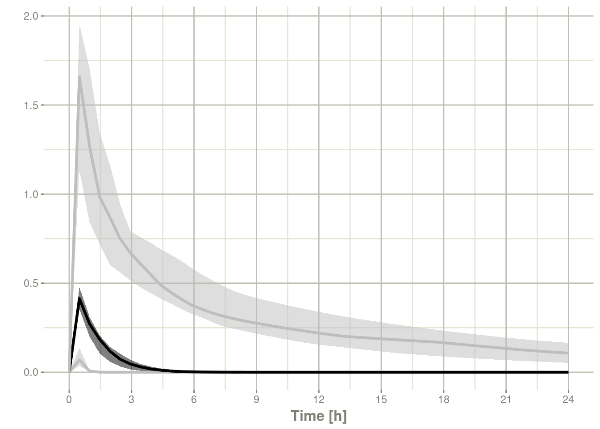
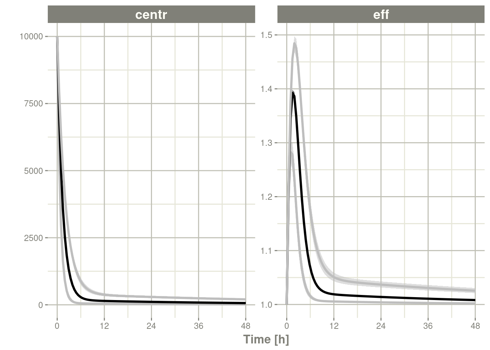
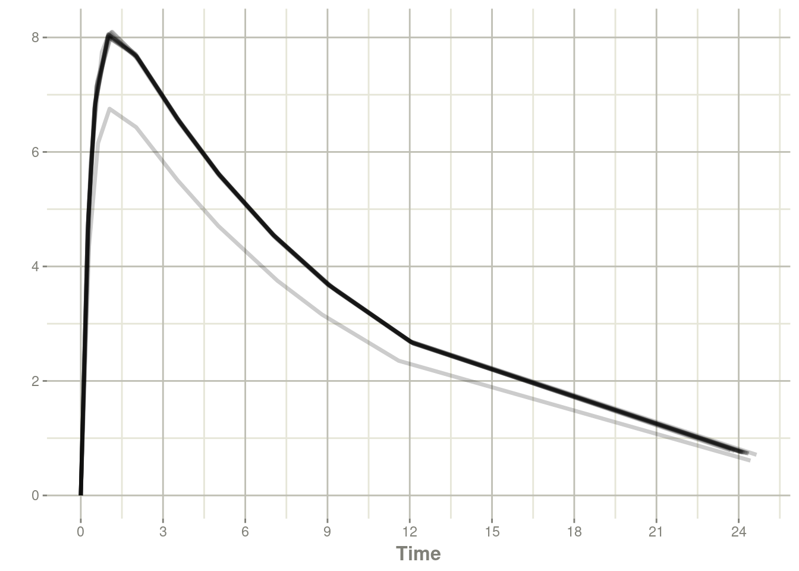

# 第十一章模拟

## 11.1单一个体的求解

最初，创建rxode2只是为了求解一个个体的ODE。这是一个单独的系统，不会对各个参数进行任何更改。

当然这在目前仍然是支持的，经典的例子可以在 [rxode2介绍](https://nlmixr2.github.io/rxode2/articles/rxode2-intro.html)中找到。

本文讨论了多个个体和单一个体求解的区别，有三个区别：

- 单一求解不会并行求解每个ID
- 单一求解在参数(`$params`)和实际数据集中缺少id列。
- 单一求解允许更轻松地探索参数，因为每个参数都可以修改。对于多个个体求解，您必须确保更新每个单独的参数。

第一个明显的区别是速度；对于多个个体，你可以并行运行每个个体ID。有关多个体求解速度提高的更多信息和示例，参阅rxdoe添加包的[加速rxode2](https://nlmixr2.github.io/rxode2-manual/rxode2-speed.html)插图。

下一个区别是最终数据中输出的信息量。

以教程中最初的2房室间接效应模型为例：

```R
library(rxode2)
mod1 <-rxode2({
    KA=2.94E-01
    CL=1.86E+01
    V2=4.02E+01
    Q=1.05E+01
    V3=2.97E+02
    Kin=1
    Kout=1
    EC50=200
    C2 = centr/V2
    C3 = peri/V3
    d/dt(depot) =-KA*depot
    d/dt(centr) = KA*depot - CL*C2 - Q*C2 + Q*C3
    d/dt(peri)  =                    Q*C2 - Q*C3
    d/dt(eff)  = Kin - Kout*(1-C2/(EC50+C2))*eff
    eff(0) = 1
})

et <- et(amount.units='mg', time.units='hours') %>%
    et(dose=10000, addl=9, ii=12) %>%
    et(amt=20000, nbr.doses=5, start.time=120, dosing.interval=24) %>%
    et(0:240) # sampling
```

现在进行一个简单的求解

```R
x <- rxSolve(mod1, et)
x
```

```R
#> ── Solved rxode2 object ──
#> ── Parameters (x$params): ──
#>      KA      CL      V2       Q      V3     Kin    Kout    EC50 
#>   0.294  18.600  40.200  10.500 297.000   1.000   1.000 200.000 
#> ── Initial Conditions (x$inits): ──
#> depot centr  peri   eff 
#>     0     0     0     1 
#> ── First part of data (object): ──
#> # A tibble: 241 × 7
#>   time    C2    C3  depot centr  peri   eff
#>    [h] <dbl> <dbl>  <dbl> <dbl> <dbl> <dbl>
#> 1    0   0   0     10000     0     0   1   
#> 2    1  44.4 0.920  7453. 1784.  273.  1.08
#> 3    2  54.9 2.67   5554. 2206.  794.  1.18
#> 4    3  51.9 4.46   4140. 2087. 1324.  1.23
#> 5    4  44.5 5.98   3085. 1789. 1776.  1.23
#> 6    5  36.5 7.18   2299. 1467. 2132.  1.21
#> # … with 235 more rows
```

```R
print(x)
```

```R
#> ── Solved rxode2 object ──
#> ── Parameters ($params): ──
#>      KA      CL      V2       Q      V3     Kin    Kout    EC50 
#>   0.294  18.600  40.200  10.500 297.000   1.000   1.000 200.000 
#> ── Initial Conditions ($inits): ──
#> depot centr  peri   eff 
#>     0     0     0     1 
#> ── First part of data (object): ──
#> # A tibble: 241 × 7
#>   time    C2    C3  depot centr  peri   eff
#>    [h] <dbl> <dbl>  <dbl> <dbl> <dbl> <dbl>
#> 1    0   0   0     10000     0     0   1   
#> 2    1  44.4 0.920  7453. 1784.  273.  1.08
#> 3    2  54.9 2.67   5554. 2206.  794.  1.18
#> 4    3  51.9 4.46   4140. 2087. 1324.  1.23
#> 5    4  44.5 5.98   3085. 1789. 1776.  1.23
#> 6    5  36.5 7.18   2299. 1467. 2132.  1.21
#> # … with 235 more rows
```

```R
plot(x, C2, eff)
```


为了更好地看到单一个体求解之间的差异，您可以解决2个个体

```R
x2 <- rxSolve(mod1, et %>% et(id=1:2), params=data.frame(CL=c(18.6, 7.6)))
print(x2)
```

```R
#> ── Solved rxode2 object ──
#> ── Parameters ($params): ──
#> # A tibble: 2 × 9
#>   id       KA    CL    V2     Q    V3   Kin  Kout  EC50
#>   <fct> <dbl> <dbl> <dbl> <dbl> <dbl> <dbl> <dbl> <dbl>
#> 1 1     0.294  18.6  40.2  10.5   297     1     1   200
#> 2 2     0.294   7.6  40.2  10.5   297     1     1   200
#> ── Initial Conditions ($inits): ──
#> depot centr  peri   eff 
#>     0     0     0     1 
#> ── First part of data (object): ──
#> # A tibble: 482 × 8
#>      id time    C2    C3  depot centr  peri   eff
#>   <int>  [h] <dbl> <dbl>  <dbl> <dbl> <dbl> <dbl>
#> 1     1    0   0   0     10000     0     0   1   
#> 2     1    1  44.4 0.920  7453. 1784.  273.  1.08
#> 3     1    2  54.9 2.67   5554. 2206.  794.  1.18
#> 4     1    3  51.9 4.46   4140. 2087. 1324.  1.23
#> 5     1    4  44.5 5.98   3085. 1789. 1776.  1.23
#> 6     1    5  36.5 7.18   2299. 1467. 2132.  1.21
#> # … with 476 more rows
```

```R
plot(x2, C2, eff)
```


通过观察这两个求解结果，您可以看到：

- 多个个体的求解结果包含数据框中的`id`列，然后是每个个体的参数的数据框。

最后一个不那么明显的特征，修改个体参数。对于单一个体的数据，可以通过修改rxode2数据框改变初始条件和参数值，就好像它们是数据帧的一部分，如[rxode2数据框](https://nlmixr2.github.io/rxode2/articles/rxode2-data-frame.html)中所述。

对于多个个体求解，此功能仍然有效，但在提供每个个体的参数值时需要小心，否则您可能会不小心修改了关键个体的求解和删除参数。

### 11.1.1单一个体求解与多个个体求解的总结

| 特征           | 单一个体求解             | 多个个体求解                               |
| -------------- | ------------------------ | ------------------------------------------ |
| 并行           | 无                       | 每个个体                                   |
| $params        | data.frame带有一组参数值 | data.frame带有每个个体的一组参数（w/ID列） |
| 已求解后的数据 | 可以用$语法修改单个参数  | 必须修改所有参数来更新已求解的对象         |

## 11.2使用rxode2进行群体模拟

### 11.2.1使用rxode2模拟变异性

在定量药理学中，非线性混合效应建模软件（如nlmixr）表征受试者之间的变异。有了这个受试者之间的变异，您可以模拟新的受试者。

假设您有一个2房室的间接效应模型，您可以在下面设置创建一个描述该系统的rxode2模型：

#### 11.2.1.1设置rxode2模型

```R
library(rxode2)

set.seed(32)
rxSetSeed(32)

mod <- rxode2({
  eff(0) = 1
  C2 = centr/V2*(1+prop.err);
  C3 = peri/V3;
  CL =  TCl*exp(eta.Cl) ## This is coded as a variable in the model
  d/dt(depot) =-KA*depot;
  d/dt(centr) = KA*depot - CL*C2 - Q*C2 + Q*C3;
  d/dt(peri)  =                    Q*C2 - Q*C3;
  d/dt(eff)  = Kin - Kout*(1-C2/(EC50+C2))*eff;
})
```

#### 11.2.1.2添加参数估计值

下一步是将参数输入R，以便您可以开始模拟：

```R
theta <- c(KA=2.94E-01, TCl=1.86E+01, V2=4.02E+01,  # central 
           Q=1.05E+01, V3=2.97E+02,                # peripheral
           Kin=1, Kout=1, EC50=200, prop.err=0)      # effects
```

在这种情况下，我使用`lotri`来指定omega，因为它使用与nlmixr类似（也类似于 NONMEM）的下三角矩阵规范：

```R
### the column names of the omega matrix need to match the parameters specified by rxode2
omega <- lotri(eta.Cl ~ 0.4^2)
omega
#>        eta.Cl
#> eta.Cl   0.16
```

#### 11.2.1.3模拟

模拟的下一步是为整体模拟创建给药方案：

```R
ev <- et(amount.units="mg", time.units="hours") %>%
  et(amt=10000, cmt="centr")
```

如果您愿意，您还可以添加采样时间（尽管现在rxode2可以为您填写这些时间）：

```R
ev <- ev %>% et(0,48, length.out=100)
```

注意当添加采样时间时，`et`使用与`seq`类似的参数。有很多种的方法可以用来增加采样时间和事件，以实现使复杂的给药方案(见[事件插图](https://nlmixr2.github.io/rxode2-manual/rxode2-events.html))。这包括在[采样和给药时间两者](https://nlmixr2.github.io/rxode2-manual/rxode2-events.html#add-doses-and-samples-within-a-sampling-window)上增加变异的方法。

一旦上述操作都完成后，您可以使用`rxSolve`进行模拟：

```R
sim  <- rxSolve(mod,theta,ev,omega=omega,nSub=100)
```

要快速查看和自定义模拟，您可以使用默认 `plot`程序。因为这是一个rxode2对象，所以它将创建一个 `ggplot2`对象，您可以根据需要随意修改此ggplot2对象。`plot`的额外参数告诉rxode2/R您对绘图感兴趣的信息。在本例中，我们感兴趣的是查看衍生出的参数`C2`：

#### 11.2.1.4通过`plot`检查模拟

```R
library(ggplot2)
### The plots from rxode2 are ggplots so they can be modified with
### standard ggplot commands.
plot(sim, C2, log="y") +
    ylab("Central Compartment") 
```


当然，这个额外附加参数也可以是一个状态值，比如`eff`：

```R
### They also takes many of the standard plot arguments; See ?plot
plot(sim, eff, ylab="Effect")
```


或者，你甚至可以并排同时查看这两个：

```R
plot(sim, C2, eff)
```


或者，可以通过patchwork把他们堆积起来：

```R
library(patchwork)
plot(sim, C2, log="y") / plot(sim, eff)
```


#### 11.2.1.5处理数据以创建摘要图

通常在定量药理学模拟中，仅仅模拟系统是不够的。我们必须做一些更容易理解的事情，比如观察模拟的中心和极端趋势。

由于`rxode2`对象是一种[数据框](https://nlmixr2.github.io/rxode2-manual/rxode2-data-frame.html)

因此现在可以直接使用模拟数据执行计算和生成绘图。您可以

以下代码，绘制了模拟数据的第5、50和95个百分位数。

```R
confint(sim, "C2", level=0.95) %>%
    plot(ylab="Central Concentration", log="y")
```

```R
#> ! in order to put confidence bands around the intervals, you need at least 2500 simulations
```

```R
#> summarizing data...done
```


```R
confint(sim, "eff", level=0.95) %>%
    plot(ylab="Effect")
```

```R
#> ! in order to put confidence bands around the intervals, you need at least 2500 simulations
#> summarizing data...done
```


请注意，您可以看到为该示例模拟的参数

```R
head(sim$param)
```

```R
#>   sim.id   V2 prop.err  V3  TCl     eta.Cl    KA    Q Kin Kout EC50
#> 1      1 40.2        0 297 18.6 -0.2332273 0.294 10.5   1    1  200
#> 2      2 40.2        0 297 18.6 -0.3097188 0.294 10.5   1    1  200
#> 3      3 40.2        0 297 18.6 -0.1103929 0.294 10.5   1    1  200
#> 4      4 40.2        0 297 18.6  0.3790298 0.294 10.5   1    1  200
#> 5      5 40.2        0 297 18.6 -0.2001559 0.294 10.5   1    1  200
#> 6      6 40.2        0 297 18.6  0.1855595 0.294 10.5   1    1  200
```

#### 11.2.1.6无法解释的变异（sigma）的模拟

除了方便地模拟个体之间的变异，您还可以轻松模拟无法解释的变异【译者注：这里是指残差变异，残差变异又被称之为剩余的无法解释的变异】。

```R
mod <- rxode2({
  eff(0) = 1
  C2 = centr/V2;
  C3 = peri/V3;
  CL =  TCl*exp(eta.Cl) ## This is coded as a variable in the model
  d/dt(depot) =-KA*depot;
  d/dt(centr) = KA*depot - CL*C2 - Q*C2 + Q*C3;
  d/dt(peri)  =                    Q*C2 - Q*C3;
  d/dt(eff)  = Kin - Kout*(1-C2/(EC50+C2))*eff;
  e = eff+eff.err
  cp = centr*(1+cp.err)
})

theta <- c(KA=2.94E-01, TCl=1.86E+01, V2=4.02E+01,  # central 
           Q=1.05E+01, V3=2.97E+02,                # peripheral
           Kin=1, Kout=1, EC50=200)                # effects  

sigma <- lotri(eff.err ~ 0.1, cp.err ~ 0.1)


sim  <- rxSolve(mod, theta, ev, omega=omega, nSub=100, sigma=sigma)
s <- confint(sim, c("eff", "centr"));
```

```R
#> ! in order to put confidence bands around the intervals, you need at least 2500 simulations
```

```R
#> summarizing data...done
```

```R
plot(s)
```


#### 11.2.1.7模拟个体

有时您可能想要在临床试验中匹配个体的剂量和观察结果。要做到这一点，您必须使用`rxode2`事件规范 创建一个data.Frame，以及创建一个`ID`列来指示个体。rxode2的事件插图详细介绍了应该如何创建这些数据集。

```R
library(dplyr)
ev1 <- eventTable(amount.units="mg", time.units="hours") %>%
    add.dosing(dose=10000, nbr.doses=1, dosing.to=2) %>%
    add.sampling(seq(0,48,length.out=10));

ev2 <- eventTable(amount.units="mg", time.units="hours") %>%
    add.dosing(dose=5000, nbr.doses=1, dosing.to=2) %>%
    add.sampling(seq(0,48,length.out=8));

dat <- rbind(data.frame(ID=1, ev1$get.EventTable()),
             data.frame(ID=2, ev2$get.EventTable()))


### Note the number of subject is not needed since it is determined by the data
sim  <- rxSolve(mod, theta, dat, omega=omega, sigma=sigma)

sim %>% select(id, time, e, cp)
```

```R
#>    id          time         e         cp
#> 1   1  0.000000 [h] 1.0444940 5227.28602
#> 2   1  5.333333 [h] 0.7186017  513.87177
#> 3   1 10.666667 [h] 1.2883307  101.02653
#> 4   1 16.000000 [h] 0.8259603  106.42998
#> 5   1 21.333333 [h] 0.8209345  197.54042
#> 6   1 26.666667 [h] 1.1566976  103.53138
#> 7   1 32.000000 [h] 1.1361974  151.14445
#> 8   1 37.333333 [h] 0.8207058  150.22830
#> 9   1 42.666667 [h] 0.7685176   81.82299
#> 10  1 48.000000 [h] 1.0482719   76.25287
#> 11  2  0.000000 [h] 0.6760207 4393.70285
#> 12  2  6.857143 [h] 0.9278252   64.17252
#> 13  2 13.714286 [h] 1.7870333   49.54396
#> 14  2 20.571429 [h] 0.8339921   38.91878
#> 15  2 27.428571 [h] 0.8989828   32.64892
#> 16  2 34.285714 [h] 0.9293400   25.13497
#> 17  2 41.142857 [h] 1.3691292   21.36848
#> 18  2 48.000000 [h] 0.5910913    5.68595
```

## 11.3模拟临床试验

通过使用简单的单一事件表或来自上述临床试验的数据，可以执行完整的临床试验模拟。

通常在临床试验模拟中，您希望考虑固定效应参数估计中的不确定性【译者注：这里的不确定性是指参数估计的精度，以及精度的方差协方差矩阵；参数估计的精度不仅固定效应参数有，个体间变异和个体内变异等参数也存在其对应的精度的方差协方差矩阵；初学者容易将不确定性的方差协方差矩阵与描述个体间变异OMEGA(OMEGA矩阵也是一种方差协方差矩阵)混淆，读者应区分并知悉这是两种不同的东西】，甚至包括受试者之间的变异以及无法解释的变异的不确定性。

`rxode2`允许您在模拟时通过参数`nStud`指定多个虚拟“研究”进行模拟，来解释这些不确定性 。这些研究中的每一项都对个体间变异`omega`)和未解释变异(sigma)之间的固定效应效应参数和协方差矩阵的实现进行了采样。根据你从模型中得到的信息，有几种策略可用于模拟`omega`和`sigma`矩阵的实现。

第一种策略，在标准差(或相关参数)没有任何标准误时，或者在您所模拟的模型中存在参数间相关性时，采用此策略。在这种情况下，建议的策略是使用逆Wishart（参数化以缩放到共轭先验）/[缩放逆chi分布](https://en.wikipedia.org/wiki/Scaled_inverse_chi-squared_distribution)。 这种方法使用单个参数来告知 采样的协方差矩阵的变异性（自由度）。

第二种策略，如果您在方差/标准差上有标准误，而协方差矩阵中没有参数间相关性，采用此策略。在这种方法中，您可以分别对标准差和相关矩阵进行模拟。首先，在thetaMat多元正态模拟中模拟方差/标准差分量。在模拟并转换为标准差后，将使用协方差矩阵的自由度来模拟相关矩阵。将模拟的标准差与模拟的相关矩阵相结合后将得到一个模拟的协方差矩阵。对于较小维度的协方差矩阵 （尺寸<10x10）建议您使用`lkj`分布来模拟相关矩阵。对于更高维度的协方差矩阵，建议您使用逆wishart分布(转换为相关矩阵)进行模拟。

协方差/方差先验是由`rxode2`的`cvPost()` 函数模拟的。

### 11.3.1基于逆Wishart相关性的模拟

此模拟的示例如下：

```R
### Creating covariance matrix
tmp <- matrix(rnorm(8^2), 8, 8)
tMat <- tcrossprod(tmp, tmp) / (8 ^ 2)
dimnames(tMat) <- list(NULL, names(theta))

sim  <- rxSolve(mod, theta, ev, omega=omega, nSub=100, sigma=sigma, thetaMat=tMat, nStud=10,
                dfSub=10, dfObs=100)

s <-sim %>% confint(c("centr", "eff"))
```

```R
#> summarizing data...done
```

```R
plot(s)
```


如果你想查看每个虚拟研究中使用的`omega`和`sigma`，请通过使用`$omega.list`和`$sigma.list`在已求解的数据对象中访问它们 ：

```R
head(sim$omega.list)
```

```R
#> [[1]]
#>           eta.Cl
#> eta.Cl 0.1676778
#> 
#> [[2]]
#>           eta.Cl
#> eta.Cl 0.2917085
#> 
#> [[3]]
#>           eta.Cl
#> eta.Cl 0.1776813
#> 
#> [[4]]
#>           eta.Cl
#> eta.Cl 0.1578682
#> 
#> [[5]]
#>           eta.Cl
#> eta.Cl 0.1845614
#> 
#> [[6]]
#>           eta.Cl
#> eta.Cl 0.3282268
```

```R
head(sim$sigma.list)
```

```R
#> [[1]]
#>             eff.err      cp.err
#> eff.err 0.112416983 0.004197039
#> cp.err  0.004197039 0.097293971
#> 
#> [[2]]
#>              eff.err       cp.err
#> eff.err  0.084311199 -0.006277998
#> cp.err  -0.006277998  0.122140938
#> 
#> [[3]]
#>            eff.err     cp.err
#> eff.err 0.09834771 0.01060251
#> cp.err  0.01060251 0.10024751
#> 
#> [[4]]
#>             eff.err      cp.err
#> eff.err 0.125556975 0.007690868
#> cp.err  0.007690868 0.090991261
#> 
#> [[5]]
#>            eff.err     cp.err
#> eff.err  0.1116261 -0.0184748
#> cp.err  -0.0184748  0.1320288
#> 
#> [[6]]
#>             eff.err      cp.err
#> eff.err 0.093539238 0.007270049
#> cp.err  0.007270049 0.098648424
```

您还可以从`$params`数据框中看到参数实现。

### 11.3.2使用方差/标准差标准误差进行模拟

假设我们希望模拟[xpose中包含的nonmem运行](https://github.com/UUPharmacometrics/xpose/blob/master/inst/extdata/run001.lst)

首先我们设置模型:

```R
rx1 <- rxode2({
  cl <- tcl*(1+crcl.cl*(CLCR-65)) * exp(eta.cl)
  v <- tv * WT * exp(eta.v)
  ka <- tka * exp(eta.ka)
  ipred <- linCmt()
  obs <- ipred * (1 + prop.sd) + add.sd 
})
```

接下来我们输入参数的估计值：

```R
theta <- c(tcl=2.63E+01, tv=1.35E+00, tka=4.20E+00, tlag=2.08E-01,
           prop.sd=2.05E-01, add.sd=1.06E-02, crcl.cl=7.17E-03,
           ## Note that since we are using the separation strategy the ETA variances are here too
           eta.cl=7.30E-02,  eta.v=3.80E-02, eta.ka=1.91E+00)
```

以及它们的协方差；对我来说，创建命名协方差矩阵的最简单方法是使用`lotri()`：

```R
thetaMat <- lotri(
    tcl + tv + tka + tlag + prop.sd + add.sd + crcl.cl + eta.cl + eta.v + eta.ka ~
        c(7.95E-01,
          2.05E-02, 1.92E-03,
          7.22E-02, -8.30E-03, 6.55E-01,
          -3.45E-03, -6.42E-05, 3.22E-03, 2.47E-04,
          8.71E-04, 2.53E-04, -4.71E-03, -5.79E-05, 5.04E-04,
          6.30E-04, -3.17E-06, -6.52E-04, -1.53E-05, -3.14E-05, 1.34E-05,
          -3.30E-04, 5.46E-06, -3.15E-04, 2.46E-06, 3.15E-06, -1.58E-06, 2.88E-06,
          -1.29E-03, -7.97E-05, 1.68E-03, -2.75E-05, -8.26E-05, 1.13E-05, -1.66E-06, 1.58E-04,
          -1.23E-03, -1.27E-05, -1.33E-03, -1.47E-05, -1.03E-04, 1.02E-05, 1.67E-06, 6.68E-05, 1.56E-04,
          7.69E-02, -7.23E-03, 3.74E-01, 1.79E-03, -2.85E-03, 1.18E-05, -2.54E-04, 1.61E-03, -9.03E-04, 3.12E-01))

evw <- et(amount.units="mg", time.units="hours") %>%
    et(amt=100) %>%
    ## For this problem we will simulate with sampling windows
    et(list(c(0, 0.5),
       c(0.5, 1),
       c(1, 3),
       c(3, 6),
       c(6, 12))) %>%
    et(id=1:1000)

### From the run we know that:
###   total number of observations is: 476
###    Total number of individuals:     74
sim  <- rxSolve(rx1, theta, evw,  nSub=100, nStud=10,
                thetaMat=thetaMat,
                ## Match boundaries of problem
                thetaLower=0, 
                sigma=c("prop.sd", "add.sd"), ## Sigmas are standard deviations
                sigmaXform="identity", # default sigma xform="identity"
                omega=c("eta.cl", "eta.v", "eta.ka"), ## etas are variances
                omegaXform="variance", # default omega xform="variance"
                iCov=data.frame(WT=rnorm(1000, 70, 15), CLCR=rnorm(1000, 65, 25)),
                dfSub=74, dfObs=476);
```

```R
#> ℹ thetaMat has too many items, ignored: 'tlag'
```

```R
print(sim)
```

```R
#> ── Solved rxode2 object ──
#> ── Parameters ($params): ──
#> # A tibble: 10,000 × 9
#>    sim.id id      tcl crcl.cl  eta.cl    tv   eta.v   tka  eta.ka
#>     <int> <fct> <dbl>   <dbl>   <dbl> <dbl>   <dbl> <dbl>   <dbl>
#>  1      1 1      26.7    2.27  0.0525  2.52  0.692   4.83 -2.16  
#>  2      1 2      26.7    2.27  0.0383  2.52 -0.226   4.83 -1.49  
#>  3      1 3      26.7    2.27  0.207   2.52  0.346   4.83  0.939 
#>  4      1 4      26.7    2.27 -0.0993  2.52 -0.0124  4.83 -0.299 
#>  5      1 5      26.7    2.27 -0.308   2.52 -0.277   4.83  0.703 
#>  6      1 6      26.7    2.27  0.0300  2.52  0.278   4.83  1.36  
#>  7      1 7      26.7    2.27  0.0196  2.52  0.0696  4.83 -0.0215
#>  8      1 8      26.7    2.27 -0.233   2.52  0.0493  4.83 -0.573 
#>  9      1 9      26.7    2.27  0.693   2.52  0.277   4.83 -0.161 
#> 10      1 10     26.7    2.27 -0.0748  2.52  0.206   4.83 -0.296 
#> # … with 9,990 more rows
#> ── Initial Conditions ($inits): ──
#> named numeric(0)
#> 
#> Simulation with uncertainty in:
#> • parameters ($thetaMat for changes)
#> • omega matrix ($omegaList)
#> • sigma matrix ($sigmaList)
#> 
#> ── First part of data (object): ──
#> # A tibble: 50,000 × 10
#>   sim.id    id   time    cl     v    ka   ipred     obs    WT  CLCR
#>    <int> <int>    [h] <dbl> <dbl> <dbl>   <dbl>   <dbl> <dbl> <dbl>
#> 1      1     1 0.0155  301. 313.  0.559 0.00274 -3.08    62.2  69.3
#> 2      1     1 0.749   301. 313.  0.559 0.0760   0.736   62.2  69.3
#> 3      1     1 1.02    301. 313.  0.559 0.0845  -2.18    62.2  69.3
#> 4      1     1 3.41    301. 313.  0.559 0.0493   1.36    62.2  69.3
#> 5      1     1 7.81    301. 313.  0.559 0.00540  2.30    62.2  69.3
#> 6      1     2 0.0833 2582.  71.7 1.09  0.0376  -0.0849  35.7 105. 
#> # … with 49,994 more rows
```

```R
### Notice that the simulation time-points change for the individual

### If you want the same sampling time-points you can do that as well:
evw <- et(amount.units="mg", time.units="hours") %>%
    et(amt=100) %>%
    et(0, 24, length.out=50) %>%
    et(id=1:100)

sim  <- rxSolve(rx1, theta, evw,  nSub=100, nStud=10,
                thetaMat=thetaMat,
                ## Match boundaries of problem
                thetaLower=0, 
                sigma=c("prop.sd", "add.sd"), ## Sigmas are standard deviations
                sigmaXform="identity", # default sigma xform="identity"
                omega=c("eta.cl", "eta.v", "eta.ka"), ## etas are variances
                omegaXform="variance", # default omega xform="variance"
                iCov=data.frame(WT=rnorm(100, 70, 15), CLCR=rnorm(100, 65, 25)),
                dfSub=74, dfObs=476,
                resample=TRUE)
```

```R
#> ℹ thetaMat has too many items, ignored: 'tlag'
```

```R
s <-sim %>% confint(c("ipred"))
```

```R
#> summarizing data...
```

```R
#> done
```

```R
plot(s)
```



### 11.3.3`omega`或`sigma`参数没有不确定性的进行模拟

如果您不希望从`omega`或`sigma`矩阵的任一先验分布中抽样，则您可以通过在求解时指定`simVariability = FALSE`选项，以下方式关闭此功能 ：

```R
mod <- rxode2({
  eff(0) = 1
  C2 = centr/V2;
  C3 = peri/V3;
  CL =  TCl*exp(eta.Cl) ## This is coded as a variable in the model
  d/dt(depot) =-KA*depot;
  d/dt(centr) = KA*depot - CL*C2 - Q*C2 + Q*C3;
  d/dt(peri)  =                    Q*C2 - Q*C3;
  d/dt(eff)  = Kin - Kout*(1-C2/(EC50+C2))*eff;
  e = eff+eff.err
  cp = centr*(1+cp.err)
})

theta <- c(KA=2.94E-01, TCl=1.86E+01, V2=4.02E+01,  # central 
           Q=1.05E+01, V3=2.97E+02,                # peripheral
           Kin=1, Kout=1, EC50=200)                # effects  

sigma <- lotri(eff.err ~ 0.1, cp.err ~ 0.1)


sim  <- rxSolve(mod, theta, ev, omega=omega, nSub=100, sigma=sigma,
                thetaMat=tMat, nStud=10,
                simVariability=FALSE)

s <-sim %>% confint(c("centr", "eff"))
```

```R
#> summarizing data...done
```

```R
plot(s)
```



请注意，因为`omega`和`sigma`的实现不是模拟的， 所以`$omega.list`和`$sigma.list`都返回`NULL`。

##### 11.3.3.0.1 rxode2多线程求解与仿真

rxode2现在现在支持在支持OpenMP的编译器(包括Linux和Windows)上进行多线程求解。默认情况下也可以支持Mac OSX，它使用rxCores()确定的所有可用内核进行解算。根据您的系统的不同，这可能是矫枉过正，在某个时候，求解的速度受到计算能力以外的因素的限制。

您还可以通过使用多核来使用threefry模拟引擎生成随机偏差来加快模拟速度。这由nCoresRV参数控制。例如：

```R
sim  <- rxSolve(mod, theta, ev, omega=omega, nSub=100, sigma=sigma, thetaMat=tMat, nStud=10,
                nCoresRV=2)

s <-sim %>% confint(c("eff", "centr"))
```

```R
#> summarizing data...done
```

默认情况下为`1`核，因为结果取决于模拟中使用的核数和随机种子，以及每个线程共享/架构的工作负载。但是，如果您确保您的合作者拥有相同数量的可用内核，并且拥有支持OpenMP线程的编译，那么您可以使用更多的内核来加快此过程。

## 11.4使用先验数据进行求解

rxode2可以使用[单一个体](https://nlmixr2.github.io/rxode2-manual/rxode2-single-subject.html)或 [多个个体的单个事件表](https://nlmixr2.github.io/rxode2-manual/rxode2-sim-var.html)来求解ODEs。此外，rxode2可以使用带有个性化事件的任意数据框。例如，当使用`nlmixr`时，您可以使用 `rxode2/vignettes/theo_sd`数据框

```R
library(rxode2)
### Load data from nlmixr
d <- qs::qread("rxode2/vignettes/theo_sd.qs")

### Create rxode2 model
theo <- rxode2({
    tka ~ 0.45 # Log Ka
    tcl ~ 1 # Log Cl
    tv ~ 3.45    # Log V
    eta.ka ~ 0.6
    eta.cl ~ 0.3
    eta.v ~ 0.1
    ka <- exp(tka + eta.ka)
    cl <- exp(tcl + eta.cl)
    v <- exp(tv + eta.v)
    d/dt(depot) = -ka * depot
    d/dt(center) = ka * depot - cl / v * center
    cp = center / v
})

### Create parameter dataset
library(dplyr)
parsDf <- tribble(
  ~ eta.ka, ~ eta.cl, ~ eta.v, 
  0.105, -0.487, -0.080,
  0.221, 0.144, 0.021,
  0.368, 0.031, 0.058,
 -0.277, -0.015, -0.007,
 -0.046, -0.155, -0.142,
 -0.382, 0.367, 0.203,
 -0.791, 0.160, 0.047,
 -0.181, 0.168, 0.096,
  1.420, 0.042, 0.012,
 -0.738, -0.391, -0.170,
  0.790, 0.281, 0.146,
 -0.527, -0.126, -0.198) %>%
    mutate(tka = 0.451, tcl = 1.017, tv = 3.449)

### Now solve the dataset
solveData <- rxSolve(theo, parsDf, d)

plot(solveData, cp)
```



```R
print(solveData)
#> ── Solved rxode2 object ──
#> ── Parameters ($params): ──
#> # A tibble: 12 × 1
#>    id   
#>    <fct>
#>  1 1    
#>  2 2    
#>  3 3    
#>  4 4    
#>  5 5    
#>  6 6    
#>  7 7    
#>  8 8    
#>  9 9    
#> 10 10   
#> 11 11   
#> 12 12   
#> ── Initial Conditions ($inits): ──
#>  depot center 
#>      0      0 
#> ── First part of data (object): ──
#> # A tibble: 132 × 8
#>      id  time    ka    cl     v    cp     depot center
#>   <int> <dbl> <dbl> <dbl> <dbl> <dbl>     <dbl>  <dbl>
#> 1     1  0     2.86  3.67  34.8  0    320.          0 
#> 2     1  0.25  2.86  3.67  34.8  4.62 157.        161.
#> 3     1  0.57  2.86  3.67  34.8  7.12  62.8       248.
#> 4     1  1.12  2.86  3.67  34.8  8.09  13.0       282.
#> 5     1  2.02  2.86  3.67  34.8  7.68   0.996     267.
#> 6     1  3.82  2.86  3.67  34.8  6.38   0.00581   222.
#> # … with 126 more rows
```

```R
### Of course the fasest way to solve if you don't care about the rxode2 extra parameters is

solveData <- rxSolve(theo, parsDf, d, returnType="data.frame")

### solved data
dplyr::as.tbl(solveData)
```

```R
#> # A tibble: 132 × 8
#>       id  time    ka    cl     v    cp   depot center
#>    <int> <dbl> <dbl> <dbl> <dbl> <dbl>   <dbl>  <dbl>
#>  1     1  0     2.86  3.67  34.8  0    3.20e+2    0  
#>  2     1  0.25  2.86  3.67  34.8  4.62 1.57e+2  161. 
#>  3     1  0.57  2.86  3.67  34.8  7.12 6.28e+1  248. 
#>  4     1  1.12  2.86  3.67  34.8  8.09 1.30e+1  282. 
#>  5     1  2.02  2.86  3.67  34.8  7.68 9.96e-1  267. 
#>  6     1  3.82  2.86  3.67  34.8  6.38 5.81e-3  222. 
#>  7     1  5.1   2.86  3.67  34.8  5.58 1.50e-4  194. 
#>  8     1  7.03  2.86  3.67  34.8  4.55 6.02e-7  158. 
#>  9     1  9.05  2.86  3.67  34.8  3.68 1.77e-9  128. 
#> 10     1 12.1   2.86  3.67  34.8  2.66 9.43e-9   92.6
#> # … with 122 more rows
```

```R
data.table::data.table(solveData)
```

```R
#>      id  time       ka       cl        v        cp         depot    center
#>   1:  1  0.00 2.857651 3.669297 34.81332 0.0000000  3.199920e+02   0.00000
#>   2:  1  0.25 2.857651 3.669297 34.81332 4.6240421  1.566295e+02 160.97825
#>   3:  1  0.57 2.857651 3.669297 34.81332 7.1151647  6.276731e+01 247.70249
#>   4:  1  1.12 2.857651 3.669297 34.81332 8.0922106  1.303613e+01 281.71670
#>   5:  1  2.02 2.857651 3.669297 34.81332 7.6837844  9.958446e-01 267.49803
#>  ---                                                                      
#> 128: 12  5.07 2.857651 3.669297 34.81332 5.6044213  1.636210e-04 195.10850
#> 129: 12  7.07 2.857651 3.669297 34.81332 4.5392337  5.385697e-07 158.02579
#> 130: 12  9.03 2.857651 3.669297 34.81332 3.6920276  1.882087e-09 128.53173
#> 131: 12 12.05 2.857651 3.669297 34.81332 2.6855080  8.461424e-09  93.49144
#> 132: 12 24.15 2.857651 3.669297 34.81332 0.7501667 -4.775222e-10  26.11579
```