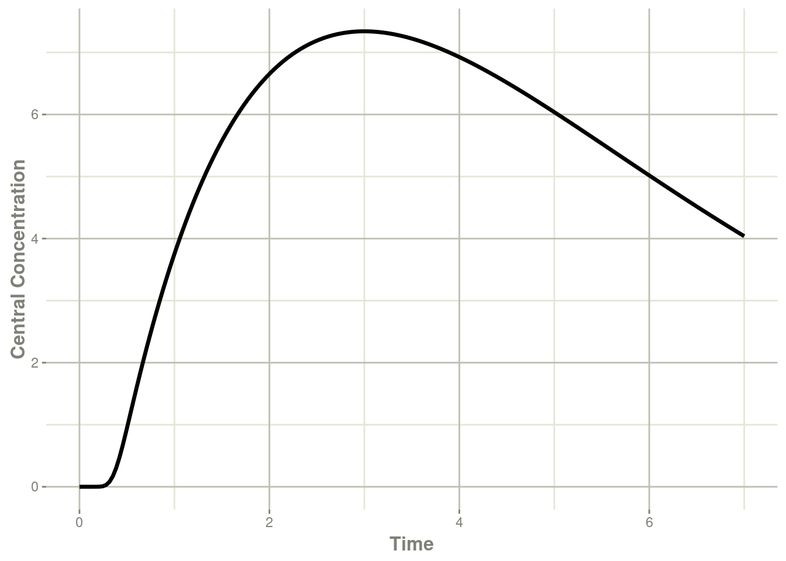

# 第十二章例子

本节是一些示例模型，帮助您在常见的模拟场景中入门。

## 12.1仅预测的模型

仅预测模型很容易创建。您使用 rxode2 语法时没有任何 ODE 系统。一个非常简单的例子是一房室模型。

```R
library(rxode2)
mod <- rxode2({
    ipre <- 10 * exp(-ke * t);
})
mod
```

```R
#> rxode2 2.0.11 model named rx_0e10114a74e3a755fa455546005b64e9 model (✔ ready). 
#> x$params: ke
#> x$lhs: ipre
```

求解rxode2模型与保存简单的ODE系统相同，但当然更快。

```R
et  <- et(seq(0,24,length.out=50))
cmt1 <- rxSolve(mod,et,params=c(ke=0.5))
cmt1
```

```R
#> ── Solved rxode2 object ──
#> ── Parameters (x$params): ──
#>  ke 
#> 0.5 
#> ── Initial Conditions (x$inits): ──
#> named numeric(0)
#> ── First part of data (object): ──
#> # A tibble: 50 × 2
#>    time  ipre
#>   <dbl> <dbl>
#> 1 0     10   
#> 2 0.490  7.83
#> 3 0.980  6.13
#> 4 1.47   4.80
#> 5 1.96   3.75
#> 6 2.45   2.94
#> # … with 44 more rows
```

## 12.2已求解的房室模型

已求解的模型也很容易创建。您只需将 `linCmt()`伪函数到您的代码中。`linCmt()`函数根据参数名称找出要使用的模型类型。

定量药理学模型通常使用清除率的参数化（主要即主要以清除率和表观分布容积参数描述房室模型）。清除率参数化的房室也存在多种实现形式，比如由NONMEM风格的名称 `CL`、`Q`、`Q1`、`Q2`等指定，或由分布清除率`CLD`， `CLD2`指定。分布容积由Central（`VC`或`V`）指定， 外周/组织（`VP`，`VT`）。虽然还有更多的清除率参数化方式的名称命名方式可用，但下面是一些清除率参数化方式的参数名称命名方式的示例：

| par1 | par2 | par3 | par4 | par5 | par6 | par7 | ncmt |
| :--- | :--- | :--- | :--- | :--- | :--- | :--- | ---: |
| ka   | cl   | q    | q2   | v    | vp   | vp2  |    3 |
| cl   | q    | q2   | v    | vp   | vp2  |      |    3 |
| ka   | cl   | q    | q2   | vc   | vp   | vp2  |    3 |
| cl   | q    | q2   | vc   | vp   | vp2  |      |    3 |
| ka   | cl   | q1   | q2   | v    | vp   | vp2  |    3 |

另一个种流行的参数化方式是微观参数化方式。rxode2 假设`1`号房室是中央室，消除速率常数由`K`、`Ke`或`Kel`指定。下面一些微观参数化方式的参数名称命名方式的示例：

| par1 | par2 | par3 | par4 | par5 | par6 | par7 | ncmt |
| :--- | :--- | :--- | :--- | :--- | :--- | :--- | ---: |
| ka   | v    | k    | k12  | k21  | k13  | k31  |    3 |
| v    | k    | k12  | k21  | k13  | k31  |      |    3 |
| ka   | vc   | k    | 12   | k21  | k13  | k31  |    3 |
| vc   | k    | k12  | k21  | k13  | k31  |      |    3 |
| ka   | v1   | k    | 12   | k21  | k13  | k31  |    3 |

最后一个可能用到的参数化方式是是使用`alpha`和`V`和/或 `A`/`B`/`C`等参数进行参数化，即宏观参数化方式。下面一些宏观参数化方式的参数名称命名方式的示例：

| par1 | par2  | par3  | par4 | par5 | par6 | par7 | ncmt |
| :--- | :---- | :---- | :--- | :--- | :--- | :--- | ---: |
| ka   | v     | alpha | beta | aob  |      |      |    1 |
| v    | alpha | beta  | aob  |      |      |      |    1 |
| ka   | vc    | alpha | beta | aob  |      |      |    1 |
| vc   | alpha | beta  | aob  |      |      |      |    1 |
| ka   | v1    | alpha | beta | aob  |      |      |    1 |

一旦`linCmt()`完成侦测，`1`、`2`或`3` 房室模型的解析将作为`linCmt()`的值。

当模型中存在一级速率吸收常数 `ka` 时，可以在线性已求解系统中进行给药的房室是 `depot`和`central`。在没有任何额外的ODE的情况下，这些房室的编号是`depot=1`及`central=2`。

当缺少一级速率吸收常数 `ka` 时，你仅可以向 `central`房室给药。在没有任何额外的ODE的情况下，这些房室的编号是`central=1`。

这些房室采用与ODE模型相同的事件类型，并在[rxode2事件插图](https://nlmixr2.github.io/rxode2-manual/rxode2-events.html)中讨论。

```R
mod <- rxode2({
    ke <- 0.5
    V <- 1
    ipre <- linCmt();
})
mod
```

```R
#> rxode2 2.0.11 model named rx_c0a8cbd1096a07a0112eacf07071569f model (✔ ready). 
#> x$stateExtra: central
#> x$params: ke, V
#> x$lhs: ipre
```

然后它将充当ODE模型;您可以在指定一次给药至depot房室事件后，求解这个系统：

```R
et  <- et(amt=10,time=0,cmt=depot) %>%
    et(seq(0,24,length.out=50))
cmt1 <- rxSolve(mod,et,params=c(ke=0.5))
cmt1
```

```R
#> ── Solved rxode2 object ──
#> ── Parameters (x$params): ──
#>  ke   V 
#> 0.5 1.0 
#> ── Initial Conditions (x$inits): ──
#> named numeric(0)
#> ── First part of data (object): ──
#> # A tibble: 50 × 2
#>    time  ipre
#>   <dbl> <dbl>
#> 1 0     10   
#> 2 0.490  7.83
#> 3 0.980  6.13
#> 4 1.47   4.80
#> 5 1.96   3.75
#> 6 2.45   2.94
#> # … with 44 more rows
```

## 12.3混合已求解的系统和ODEs

除了纯ODE之外，您还可以将已求解的系统与ODE混合。先前的2房室间接效应模型可以简化为一个 `linCmt()`函数：

```R
library(rxode2)
## Setup example model
mod1 <-rxode2({
    C2 = centr/V2;
    C3 = peri/V3;
    d/dt(depot) =-KA*depot;
    d/dt(centr) = KA*depot - CL*C2 - Q*C2 + Q*C3;
    d/dt(peri)  =                    Q*C2 - Q*C3;
    d/dt(eff)  = Kin - Kout*(1-C2/(EC50+C2))*eff;
});

## Seup parameters and initial conditions

theta <-
    c(KA=2.94E-01, CL=1.86E+01, V2=4.02E+01, # central
      Q=1.05E+01,  V3=2.97E+02,              # peripheral
      Kin=1, Kout=1, EC50=200)               # effects

inits <- c(eff=1);

## Setup dosing event information
ev <- eventTable(amount.units="mg", time.units="hours") %>%
    add.dosing(dose=10000, nbr.doses=10, dosing.interval=12) %>%
    add.dosing(dose=20000, nbr.doses=5, start.time=120,dosing.interval=24) %>%
    add.sampling(0:240);

## Setup a mixed solved/ode system:
mod2 <- rxode2({
    ## the order of variables do not matter, the type of compartmental
    ## model is determined by the parameters specified.
    C2   = linCmt(KA, CL, V2, Q, V3);
    eff(0) = 1  ## This specifies that the effect compartment starts at 1.
    d/dt(eff) =  Kin - Kout*(1-C2/(EC50+C2))*eff;
})
```

这允许上面的间接反应模型将2房室模型分配给`C2`变量，并在间接效应模型中使用。

当混合已求解的系统和ODEs时，已求解系统的房室总是最后一个房室。这是因为已求解的系统在技术上不是待解决的房室。在最后添加给药房室末端不会干扰需要求解的实际ODE。

因此，在2房室间接效应模型中，效应室eff是#1房室，而PK给药的房室depot房室是#2号房室。

此房室模型需要一个新的事件表，因为房室编号已更改：

```R
ev <- eventTable(amount.units='mg', time.units='hours') %>%
    add.dosing(dose=10000, nbr.doses=10, dosing.interval=12,dosing.to=2) %>%
    add.dosing(dose=20000, nbr.doses=5, start.time=120,dosing.interval=24,dosing.to=2) %>%
    add.sampling(0:240);
```

这可以通过以下命令求解：

```R
x <- mod2 %>%  solve(theta, ev)
print(x)
```

```R
#> ── Solved rxode2 object ──
#> ── Parameters ($params): ──
#>      CL      V2       Q      V3      KA     Kin    Kout    EC50 
#>  18.600  40.200  10.500 297.000   0.294   1.000   1.000 200.000 
#> ── Initial Conditions ($inits): ──
#> eff 
#>   1 
#> ── First part of data (object): ──
#> # A tibble: 241 × 3
#>   time    C2   eff
#>    [h] <dbl> <dbl>
#> 1    0 249.   1   
#> 2    1 121.   1.35
#> 3    2  60.3  1.38
#> 4    3  31.0  1.28
#> 5    4  17.0  1.18
#> 6    5  10.2  1.11
#> # … with 235 more rows
```

请注意，此求解不需要指定效应室eff初始条件为`1`。相反，此初始条件已经由`eff(0)=1`预先指定。

这可以轻松的实现对不同的初始条件的求解：

```R
x <- mod2 %>%  solve(theta, ev,c(eff=2))
print(x)
```

```R
#> ── Solved rxode2 object ──
#> ── Parameters ($params): ──
#>      CL      V2       Q      V3      KA     Kin    Kout    EC50 
#>  18.600  40.200  10.500 297.000   0.294   1.000   1.000 200.000 
#> ── Initial Conditions ($inits): ──
#> eff 
#>   2 
#> ── First part of data (object): ──
#> # A tibble: 241 × 3
#>   time    C2   eff
#>    [h] <dbl> <dbl>
#> 1    0 249.   2   
#> 2    1 121.   1.93
#> 3    2  60.3  1.67
#> 4    3  31.0  1.41
#> 5    4  17.0  1.23
#> 6    5  10.2  1.13
#> # … with 235 more rows
```

如果您已经在块中定义了变量，则rxode2侦测也不需要您在`linCmt()`函数中再次进行指定。因此，下面的函数也将解决同一个系统。

```R
mod3 <- rxode2({
    KA=2.94E-01;
    CL=1.86E+01;
    V2=4.02E+01;
    Q=1.05E+01;
    V3=2.97E+02;
    Kin=1;
    Kout=1;
    EC50=200;
    ## The linCmt() picks up the variables from above
    C2   = linCmt();
    eff(0) = 1  ## This specifies that the effect compartment starts at 1.
    d/dt(eff) =  Kin - Kout*(1-C2/(EC50+C2))*eff;
})

x <- mod3 %>%  solve(ev)
print(x)
```

```R
#> ── Solved rxode2 object ──
#> ── Parameters ($params): ──
#>      KA      CL      V2       Q      V3     Kin    Kout    EC50 
#>   0.294  18.600  40.200  10.500 297.000   1.000   1.000 200.000 
#> ── Initial Conditions ($inits): ──
#> eff 
#>   1 
#> ── First part of data (object): ──
#> # A tibble: 241 × 3
#>   time    C2   eff
#>    [h] <dbl> <dbl>
#> 1    0 249.   1   
#> 2    1 121.   1.35
#> 3    2  60.3  1.38
#> 4    3  31.0  1.28
#> 5    4  17.0  1.18
#> 6    5  10.2  1.11
#> # … with 235 more rows
```

请注意，您在求解上述模型系统时不需要指定参数，因为它们已经内置在模型中，但您可以覆盖参数：

```R
x <- mod3 %>%  solve(c(KA=10),ev)
print(x)
```

```R
#> ── Solved rxode2 object ──
#> ── Parameters ($params): ──
#>    KA    CL    V2     Q    V3   Kin  Kout  EC50 
#>  10.0  18.6  40.2  10.5 297.0   1.0   1.0 200.0 
#> ── Initial Conditions ($inits): ──
#> eff 
#>   1 
#> ── First part of data (object): ──
#> # A tibble: 241 × 3
#>   time    C2   eff
#>    [h] <dbl> <dbl>
#> 1    0 249.   1   
#> 2    1 121.   1.35
#> 3    2  60.3  1.38
#> 4    3  31.0  1.28
#> 5    4  17.0  1.18
#> 6    5  10.2  1.11
#> # … with 235 more rows
```

## 12.4基于体重的给药

这是一个达托霉素(daptomycin)基于重量给药的示例模型。达托霉素(daptomycin)是一种来自发酵的玫瑰孢链霉菌(roseosporus)的环状脂肽抗生素。

基于体重的给药模拟有3个阶段：-1.创建rxode2模型 -2. 模拟协变量 -3.创建基于体重的给药的事件表（与协变量合并）

### 12.4.1在rxode2中创建2房室模型

```R
library(rxode2)

## Note the time covariate is not included in the simulation
m1 <- rxode2({
  CL ~ (1-0.2*SEX)*(0.807+0.00514*(CRCL-91.2))*exp(eta.cl)
  V1 ~ 4.8*exp(eta.v1)
  Q ~ (3.46+0.0593*(WT-75.1))*exp(eta.q);
  V2 ~ 1.93*(3.13+0.0458*(WT-75.1))*exp(eta.v2)
  A1 ~ centr;
  A2 ~ peri;
  d/dt(centr) ~ - A1*(CL/V1 + Q/V1) + A2*Q/V2;
  d/dt(peri) ~ A1*Q/V1 - A2*Q/V2;
  DV = centr / V1 * (1 + prop.err)
})
```

### 12.4.2模拟协变量

此模拟与年龄、性别和体重相关。由于我们将使用基于体重的给药，因此需要首先对协变量进行模拟

```R
set.seed(42)
rxSetSeed(42)
library(dplyr)
nsub=30
### Simulate Weight based on age and gender
AGE<-round(runif(nsub,min=18,max=70))
SEX<-round(runif(nsub,min=0,max=1))
HTm<-round(rnorm(nsub,176.3,0.17*sqrt(4482)),digits=1)
HTf<-round(rnorm(nsub,162.2,0.16*sqrt(4857)),digits=1)
WTm<-round(exp(3.28+1.92*log(HTm/100))*exp(rnorm(nsub,0,0.14)),digits=1)
WTf<-round(exp(3.49+1.45*log(HTf/100))*exp(rnorm(nsub,0,0.17)),digits=1)
WT<-ifelse(SEX==1,WTf,WTm)
CRCL<-round(runif(nsub,30,140))
## id is in lower case to match the event table
cov.df <- tibble(id=seq_along(AGE), AGE=AGE, SEX=SEX, WT=WT, CRCL=CRCL)
print(cov.df)
#> # A tibble: 30 x 5
#>       id   AGE   SEX    WT  CRCL
#>    <int> <dbl> <dbl> <dbl> <dbl>
#>  1     1    66     1  49.4    83
#>  2     2    67     1  52.5    79
#>  3     3    33     0  97.9    37
#>  4     4    61     1  63.8    66
#>  5     5    51     0  71.8   127
#>  6     6    45     1  69.6   132
#>  7     7    56     0  61      73
#>  8     8    25     0  57.7    47
#>  9     9    52     1  58.7    65
#> 10    10    55     1  73.1    64
#> # ... with 20 more rows
```

### 12.4.3创建基于体重的事件表

```R
s<-c(0,0.25,0.5,0.75,1,1.5,seq(2,24,by=1))
s <- lapply(s, function(x){.x <- 0.1 * x; c(x - .x, x + .x)})

e <- et() %>%
    ## Specify the id and weight based dosing from covariate data.frame
    ## This requires rxode2 XXX 
    et(id=cov.df$id, amt=6*cov.df$WT, rate=6 * cov.df$WT) %>%
    ## Sampling is added for each ID
    et(s) %>%
    as.data.frame %>%
    ## Merge the event table with the covarite information
    merge(cov.df, by="id") %>%
    as_tibble


e
```

```R
#> # A tibble: 900 x 12
#>       id    low  time   high cmt         amt  rate  evid   AGE   SEX    WT  CRCL
#>    <int>  <dbl> <dbl>  <dbl> <chr>     <dbl> <dbl> <int> <dbl> <dbl> <dbl> <dbl>
#>  1     1  0     0      0     (obs)       NA    NA      0    66     1  49.4    83
#>  2     1 NA     0     NA     (default)  296.  296.     1    66     1  49.4    83
#>  3     1  0.225 0.246  0.275 (obs)       NA    NA      0    66     1  49.4    83
#>  4     1  0.45  0.516  0.55  (obs)       NA    NA      0    66     1  49.4    83
#>  5     1  0.675 0.729  0.825 (obs)       NA    NA      0    66     1  49.4    83
#>  6     1  0.9   0.921  1.1   (obs)       NA    NA      0    66     1  49.4    83
#>  7     1  1.35  1.42   1.65  (obs)       NA    NA      0    66     1  49.4    83
#>  8     1  1.8   1.82   2.2   (obs)       NA    NA      0    66     1  49.4    83
#>  9     1  2.7   2.97   3.3   (obs)       NA    NA      0    66     1  49.4    83
#> 10     1  3.6   3.87   4.4   (obs)       NA    NA      0    66     1  49.4    83
#> # ... with 890 more rows
```

### 12.4.4求解达托霉素的模拟

```R
data <- rxSolve(m1, e,
             ## Lotri uses lower-triangular matrix rep. for named matrix
             omega=lotri(eta.cl ~ .306, 
                         eta.q ~0.0652,
                         eta.v1 ~.567,
                         eta.v2 ~ .191),
             sigma=lotri(prop.err ~ 0.15),
             addDosing = TRUE, addCov = TRUE)

print(data)
```

```R
#> -- Solved rxode2 object --
#> -- Parameters ($params): --
#> # A tibble: 30 x 5
#>    id    eta.cl eta.v1   eta.q  eta.v2
#>    <fct>  <dbl>  <dbl>   <dbl>   <dbl>
#>  1 1     -0.147  0.112  0.284  -0.187 
#>  2 2     -0.280 -0.189  0.222  -0.843 
#>  3 3      0.515  0.471  0.0387 -0.687 
#>  4 4     -0.359  0.351  0.269   0.146 
#>  5 5      0.565 -0.240  0.363   0.330 
#>  6 6     -0.991  1.95   0.0108 -0.352 
#>  7 7     -0.604 -1.19   0.0556  0.0760
#>  8 8     -0.500 -0.212  0.315   0.902 
#>  9 9      1.33   0.317 -0.0113  0.164 
#> 10 10     0.201  0.390  0.182  -0.277 
#> # ... with 20 more rows
#> -- Initial Conditions ($inits): --
#> centr  peri 
#>     0     0 
#> -- First part of data (object): --
#> # A tibble: 900 x 9
#>      id  evid   cmt   amt  time    DV   SEX    WT  CRCL
#>   <int> <int> <int> <dbl> <dbl> <dbl> <dbl> <dbl> <dbl>
#> 1     1     1     1  296. 0      0        1  49.4    83
#> 2     1     0    NA   NA  0      0        1  49.4    83
#> 3     1     0    NA   NA  0.246  7.72     1  49.4    83
#> 4     1     0    NA   NA  0.516 21.2      1  49.4    83
#> 5     1     0    NA   NA  0.729 27.4      1  49.4    83
#> 6     1     0    NA   NA  0.921 39.1      1  49.4    83
#> # ... with 894 more rows
```

```R
plot(data, log="y")
```

```R
#> Warning in self$trans$transform(x): NaNs produced
```

```R
#> Warning: Transformation introduced infinite values in continuous y-axis
```

```R
#> Warning: Removed 1 row containing missing values (`geom_line()`).
```


### 12.4.5达托霉素的参考文献

这种基于重量的模拟改编自下面的关于达托霉素的文献：

Dvorchik B, Arbeit RD, Chung J, Liu S, Knebel W, Kastrissios H..达托霉素的群体药代动力学. Antimicrob Agents Che mother 2004; 48: 2799-2807. [doi:(10.1128/AAC.48.8.2799-2807.2004](doi:(10.1128/AAC.48.8.2799-2807.2004))[https://dx.doi.org/10.1128%2FAAC.48.8.2799-2807.2004]

此模拟示例来自Sherwin Sy的创作，并由Matthew Fidler进行了修改

## 12.5场景间和其他嵌套示例

在rxode2中可以进行多个级别的嵌套;在此示例中，我们将使用以下不确定性和可变性来源：

| 水平               | 变量               | 矩阵指定   | 集成矩阵   |
| ------------------ | ------------------ | ---------- | ---------- |
| 模型不确定性       | NA                 | `thetaMat` | `thetaMat` |
| 研究者间           | `inv.Cl`，`inv.Ka` | `omega`    | `theta`    |
| 个体间             | `eta.Cl`，`eta.Ka` | `omega`    | `omega`    |
| 眼睛               | `eye.Cl`，`eye.Ka` | `omega`    | `omega`    |
| 场景间             | `iov.Cl`，`occ.Ka` | `omega`    | `omega`    |
| 浓度的无法解释变异 | `prop.sd`          | `sigma`    | `sigma`    |
| 效应的无法解释变异 | `add.sd`           | `sigma`    | `sigma`    |

### 12.5.1事件表

此事件表包含嵌套变量：

- inv：研究者ID【译者注：这里应该是想要表达临床试验不同研究中心间的变异，研究中心有时被抽象为site:中心，此处作者抽象为investigator:研究者】
- id：个体id
- 眼睛：眼睛ID（左或右）
- occ：场景

```R
library(rxode2)
library(dplyr)

et(amountUnits="mg", timeUnits="hours") %>%
  et(amt=10000, addl=9,ii=12,cmt="depot") %>%
  et(time=120, amt=2000, addl=4, ii=14, cmt="depot") %>%
  et(seq(0, 240, by=4)) %>% # Assumes sampling when there is no dosing information
  et(seq(0, 240, by=4) + 0.1) %>% ## adds 0.1 for separate eye
  et(id=1:20) %>%
  ## Add an occasion per dose
  mutate(occ=cumsum(!is.na(amt))) %>%
  mutate(occ=ifelse(occ == 0, 1, occ)) %>%
  mutate(occ=2- occ %% 2) %>%
  mutate(eye=ifelse(round(time) == time, 1, 2)) %>%
  mutate(inv=ifelse(id < 10, 1, 2)) %>% as_tibble ->
  ev
```

### 12.5.2rxode2模型

这将创建具有多级嵌套的`rxode2`模型。注意变量`inv.Cl`，`inv.Ka`，`eta.Cl`等;每一个嵌套层级只需要一个变量。

```R
mod <- rxode2({
  ## Clearance with individuals
  eff(0) = 1
  C2 = centr/V2*(1+prop.sd);
  C3 = peri/V3;
  CL =  TCl*exp(eta.Cl + eye.Cl + iov.Cl + inv.Cl)
  KA = TKA * exp(eta.Ka + eye.Ka + iov.Cl + inv.Ka)
  d/dt(depot) =-KA*depot;
  d/dt(centr) = KA*depot - CL*C2 - Q*C2 + Q*C3;
  d/dt(peri)  =                    Q*C2 - Q*C3;
  d/dt(eff)  = Kin - Kout*(1-C2/(EC50+C2))*eff;
  ef0 = eff + add.sd
})
```

### 12.5.3模型参数的不确定性

```R
theta <- c("TKA"=0.294, "TCl"=18.6, "V2"=40.2,
           "Q"=10.5, "V3"=297, "Kin"=1, "Kout"=1, "EC50"=200)

## Creating covariance matrix
tmp <- matrix(rnorm(8^2), 8, 8)
tMat <- tcrossprod(tmp, tmp) / (8 ^ 2)
dimnames(tMat) <- list(names(theta), names(theta))

tMat
```

```R
#>                TKA         TCl            V2             Q           V3
#> TKA   1.408151e-01  0.08277499  0.0180178917 -0.0470325576  0.029172564
#> TCl   8.277499e-02  0.18104452 -0.0532724661 -0.0421074920  0.068093695
#> V2    1.801789e-02 -0.05327247  0.0581816756  0.0001167516  0.006496495
#> Q    -4.703256e-02 -0.04210749  0.0001167516  0.1549374667  0.020764042
#> V3    2.917256e-02  0.06809370  0.0064964951  0.0207640421  0.118986685
#> Kin  -3.445136e-02  0.01464937 -0.0426405263  0.1503174753 -0.039702872
#> Kout -2.904363e-02 -0.04914350  0.0324790929  0.0069332072  0.030349396
#> EC50 -4.017336e-05  0.02850637 -0.0326094799 -0.0489119232 -0.029606732
#>               Kin         Kout          EC50
#> TKA  -0.034451357 -0.029043632 -4.017336e-05
#> TCl   0.014649373 -0.049143503  2.850637e-02
#> V2   -0.042640526  0.032479093 -3.260948e-02
#> Q     0.150317475  0.006933207 -4.891192e-02
#> V3   -0.039702872  0.030349396 -2.960673e-02
#> Kin   0.299597107 -0.074421154 -6.528526e-03
#> Kout -0.074421154  0.061039604 -2.800741e-02
#> EC50 -0.006528526 -0.028007407  4.167429e-02
```

### 12.5.4嵌套变异性

要指定多级嵌套，您可以将其指定为嵌套的 `lotri`矩阵;使用这种方法时，您使用条件运算符`|`指定在哪个变量上发生嵌套;对于贝叶斯模拟，我们需要指定每个参数有多少信息;对于`rxode2`，这是`nu`参数。

在这种情况下： -id，`nu=100`或模型来自100个受试者， -eye，`nu=200`或模型来自200只眼睛 ，-occ，`nu=200`或模型来自200种场景，-inv，`nu=10`或模型来自10名研究者

要在`lotri`指定，可以使用`| var(nu=X)`，或者：

```R
omega <- lotri(lotri(eta.Cl ~ 0.1,
                     eta.Ka ~ 0.1) | id(nu=100),
               lotri(eye.Cl ~ 0.05,
                     eye.Ka ~ 0.05) | eye(nu=200),
               lotri(iov.Cl ~ 0.01,
                     iov.Ka ~ 0.01) | occ(nu=200),
               lotri(inv.Cl ~ 0.02,
                     inv.Ka ~ 0.02) | inv(nu=10))
omega
```

```R
#> $id
#>        eta.Cl eta.Ka
#> eta.Cl    0.1    0.0
#> eta.Ka    0.0    0.1
#> 
#> $eye
#>        eye.Cl eye.Ka
#> eye.Cl   0.05   0.00
#> eye.Ka   0.00   0.05
#> 
#> $occ
#>        iov.Cl iov.Ka
#> iov.Cl   0.01   0.00
#> iov.Ka   0.00   0.01
#> 
#> $inv
#>        inv.Cl inv.Ka
#> inv.Cl   0.02   0.00
#> inv.Ka   0.00   0.02
#> 
#> Properties: nu
```

### 12.5.5无法解释的变异

最后要指定的可变性是无法解释的变异

```R
sigma <- lotri(prop.sd ~ .25,
               add.sd~ 0.125)
```

### 12.5.6求解问题

```R
s <- rxSolve(mod, theta, ev,
             thetaMat=tMat, omega=omega,
             sigma=sigma, sigmaDf=400,
             nStud=400)
```

```R
#> unhandled error message: EE:[lsoda] 70000 steps taken before reaching tout
#>  @(lsoda.c:750
```

```R
#> Warning: some ID(s) could not solve the ODEs correctly; These values are
#> replaced with 'NA'
```

```R
print(s)
```

```R
#> -- Solved rxode2 object --
#> -- Parameters ($params): --
#> # A tibble: 8,000 x 24
#>    sim.id id    inv.Cl~1 inv.C~2 inv.K~3 inv.K~4 eye.C~5 eye.C~6 eye.K~7 eye.K~8
#>     <int> <fct>    <dbl>   <dbl>   <dbl>   <dbl>   <dbl>   <dbl>   <dbl>   <dbl>
#>  1      1 1       -0.202   0.314  -0.260   0.170  0.171  -0.420  -0.140  -0.472 
#>  2      1 2       -0.202   0.314  -0.260   0.170  0.0361  0.0354  0.0821 -0.418 
#>  3      1 3       -0.202   0.314  -0.260   0.170  0.269   0.0473 -0.484  -0.101 
#>  4      1 4       -0.202   0.314  -0.260   0.170 -0.231  -0.180  -0.131   0.0724
#>  5      1 5       -0.202   0.314  -0.260   0.170 -0.368   0.129   0.501   0.172 
#>  6      1 6       -0.202   0.314  -0.260   0.170 -0.113  -0.208  -0.590  -0.334 
#>  7      1 7       -0.202   0.314  -0.260   0.170 -0.276   0.117  -0.254  -0.148 
#>  8      1 8       -0.202   0.314  -0.260   0.170  0.231  -0.0689  0.129   0.507 
#>  9      1 9       -0.202   0.314  -0.260   0.170 -0.292  -0.344   0.107   0.232 
#> 10      1 10      -0.202   0.314  -0.260   0.170 -0.293   0.0939 -0.514  -0.185 
#> # ... with 7,990 more rows, 14 more variables: `iov.Cl(occ==1)` <dbl>,
#> #   `iov.Cl(occ==2)` <dbl>, `iov.Ka(occ==1)` <dbl>, `iov.Ka(occ==2)` <dbl>,
#> #   V2 <dbl>, V3 <dbl>, TCl <dbl>, eta.Cl <dbl>, TKA <dbl>, eta.Ka <dbl>,
#> #   Q <dbl>, Kin <dbl>, Kout <dbl>, EC50 <dbl>, and abbreviated variable names
#> #   1: `inv.Cl(inv==1)`, 2: `inv.Cl(inv==2)`, 3: `inv.Ka(inv==1)`,
#> #   4: `inv.Ka(inv==2)`, 5: `eye.Cl(eye==1)`, 6: `eye.Cl(eye==2)`,
#> #   7: `eye.Ka(eye==1)`, 8: `eye.Ka(eye==2)`
#> -- Initial Conditions ($inits): --
#> depot centr  peri   eff 
#>     0     0     0     1 
#> 
#> Simulation with uncertainty in:
#> * parameters ($thetaMat for changes)
#> * omega matrix ($omegaList)
#> 
#> -- First part of data (object): --
#> # A tibble: 976,000 x 21
#>   sim.id    id time inv.Cl inv.Ka eye.Cl eye.Ka  iov.Cl iov.Ka     C2       C3
#>    <int> <int>  [h]  <dbl>  <dbl>  <dbl>  <dbl>   <dbl>  <dbl>  <dbl>    <dbl>
#> 1      1     1  0   -0.202 -0.260  0.171 -0.140 -0.0381 0.0391   0     0      
#> 2      1     1  0.1 -0.202 -0.260 -0.420 -0.472 -0.0381 0.0391  -2.95 -0.00314
#> 3      1     1  4   -0.202 -0.260  0.171 -0.140 -0.0381 0.0391 -53.9  -2.18   
#> 4      1     1  4.1 -0.202 -0.260 -0.420 -0.472 -0.0381 0.0391 -36.2  -2.27   
#> 5      1     1  8   -0.202 -0.260  0.171 -0.140 -0.0381 0.0391 -58.0  -6.11   
#> 6      1     1  8.1 -0.202 -0.260 -0.420 -0.472 -0.0381 0.0391 -22.8  -6.22   
#> # ... with 975,994 more rows, and 10 more variables: CL <dbl>, KA <dbl>,
#> #   ef0 <dbl>, depot <dbl>, centr <dbl>, peri <dbl>, eff <dbl>, occ <fct>,
#> #   eye <fct>, inv <fct>
```

一项研究中有多名研究者;每个研究者都有一些受试者在他的研究中心入组.`rxode2`自动确定研究者的数量，然后在研究者水平为每个研究者模拟随机效应。对于输出，`inv.Cl(inv==1)`将输出研究者1的`inv.Cl`，`inv.Cl(inv==2)`将输出研究者2的`inv.Cl`等。

`inv.Cl(inv==1)`、`inv.Cl(inv==2)`等将在每个研究中被模拟，然后合并以形成研究者之间的变异。在方程形式中，它们表示如下：

```R
inv.Cl = (inv == 1) * `inv.Cl(inv==1)` + (inv == 2) * `inv.Cl(inv==2)`
```

如果您查看模拟的参数，您可以看到`inv.Cl(inv==1)` 和`inv.Cl(inv==2)`都在`s$params`中;它在每个研究中是相同的：

```R
print(head(s$params))
```

```R
#>   sim.id id inv.Cl(inv==1) inv.Cl(inv==2) inv.Ka(inv==1) inv.Ka(inv==2)
#> 1      1  1     -0.2022386      0.3144136     -0.2599115      0.1699445
#> 2      1  2     -0.2022386      0.3144136     -0.2599115      0.1699445
#> 3      1  3     -0.2022386      0.3144136     -0.2599115      0.1699445
#> 4      1  4     -0.2022386      0.3144136     -0.2599115      0.1699445
#> 5      1  5     -0.2022386      0.3144136     -0.2599115      0.1699445
#> 6      1  6     -0.2022386      0.3144136     -0.2599115      0.1699445
#>   eye.Cl(eye==1) eye.Cl(eye==2) eye.Ka(eye==1) eye.Ka(eye==2) iov.Cl(occ==1)
#> 1     0.17073129    -0.41996232     -0.1396676    -0.47194363   -0.038088093
#> 2     0.03607197     0.03541692      0.0821007    -0.41780285   -0.137537040
#> 3     0.26936860     0.04732331     -0.4842336    -0.10113442    0.051341682
#> 4    -0.23101553    -0.17967167     -0.1311976     0.07238211    0.083307828
#> 5    -0.36771204     0.12904386      0.5007750     0.17169021   -0.006988387
#> 6    -0.11255970    -0.20831770     -0.5903606    -0.33404416    0.017359073
#>   iov.Cl(occ==2) iov.Ka(occ==1) iov.Ka(occ==2)       V2       V3      TCl
#> 1    -0.02640295     0.03906335     0.08082907 40.30657 297.0657 17.98116
#> 2     0.11320643    -0.05818325    -0.04738385 40.30657 297.0657 17.98116
#> 3    -0.09714493     0.11129638    -0.08423628 40.30657 297.0657 17.98116
#> 4    -0.16483538     0.02682606     0.05338649 40.30657 297.0657 17.98116
#> 5    -0.14905541    -0.12916147     0.15052921 40.30657 297.0657 17.98116
#> 6    -0.06090189    -0.03821761     0.22133375 40.30657 297.0657 17.98116
#>       eta.Cl       TKA     eta.Ka        Q       Kin     Kout     EC50
#> 1  0.1255527 -0.201923 -0.5537485 10.27033 0.3588164 1.273849 200.1076
#> 2 -0.4939314 -0.201923  0.1843165 10.27033 0.3588164 1.273849 200.1076
#> 3  0.3628319 -0.201923 -0.1429071 10.27033 0.3588164 1.273849 200.1076
#> 4  0.9051354 -0.201923  0.3662940 10.27033 0.3588164 1.273849 200.1076
#> 5  0.6288535 -0.201923 -0.0873943 10.27033 0.3588164 1.273849 200.1076
#> 6  0.2794271 -0.201923  0.3369920 10.27033 0.3588164 1.273849 200.1076
```

```R
print(head(s$params %>% filter(sim.id == 2)))
```

```R
#>   sim.id id inv.Cl(inv==1) inv.Cl(inv==2) inv.Ka(inv==1) inv.Ka(inv==2)
#> 1      2  1       0.269099    -0.03113882     -0.2495935    -0.07401625
#> 2      2  2       0.269099    -0.03113882     -0.2495935    -0.07401625
#> 3      2  3       0.269099    -0.03113882     -0.2495935    -0.07401625
#> 4      2  4       0.269099    -0.03113882     -0.2495935    -0.07401625
#> 5      2  5       0.269099    -0.03113882     -0.2495935    -0.07401625
#> 6      2  6       0.269099    -0.03113882     -0.2495935    -0.07401625
#>   eye.Cl(eye==1) eye.Cl(eye==2) eye.Ka(eye==1) eye.Ka(eye==2) iov.Cl(occ==1)
#> 1      0.1241993    0.041788101    0.046696060     -0.4757259    -0.12703256
#> 2     -0.2429869   -0.272713695    0.535736941     -0.2558208    -0.07818270
#> 3     -0.2394184   -0.191109523   -0.008623256      0.2089974    -0.10398049
#> 4     -0.1136205    0.009124802   -0.061481545      0.1693383     0.28689686
#> 5     -0.0571466    0.079101905    0.020527524     -0.3797383    -0.08602325
#> 6      0.3404940    0.181620316   -0.230666768     -0.2565292    -0.06364471
#>   iov.Cl(occ==2) iov.Ka(occ==1) iov.Ka(occ==2)       V2       V3      TCl
#> 1     0.03439817    0.013110729     0.05902598 40.11784 296.8096 18.42138
#> 2     0.12976537    0.097348229     0.01634439 40.11784 296.8096 18.42138
#> 3    -0.02100928    0.064078040    -0.12742109 40.11784 296.8096 18.42138
#> 4     0.02594699   -0.095784927     0.25669770 40.11784 296.8096 18.42138
#> 5     0.04611064    0.123204785     0.02336934 40.11784 296.8096 18.42138
#> 6    -0.03241107   -0.005876249     0.13239904 40.11784 296.8096 18.42138
#>        eta.Cl       TKA      eta.Ka        Q      Kin      Kout     EC50
#> 1  0.41059476 0.1568122  0.21051066 10.97538 1.775872 0.8755069 200.0143
#> 2  0.12890626 0.1568122 -0.20523053 10.97538 1.775872 0.8755069 200.0143
#> 3 -0.03656252 0.1568122  0.01471664 10.97538 1.775872 0.8755069 200.0143
#> 4 -0.18554527 0.1568122 -0.62093051 10.97538 1.775872 0.8755069 200.0143
#> 5 -0.04484490 0.1568122 -0.06739060 10.97538 1.775872 0.8755069 200.0143
#> 6  0.48614515 0.1568122 -0.35082813 10.97538 1.775872 0.8755069 200.0143
```

对于眼睛之间和场合之间的变异性，每个人都模拟了许多变量，这些变量成为眼睛之间和场合之间的变异性;在眼睛的情况下：

```R
eye.Cl = (eye == 1) * `eye.Cl(eye==1)` + (eye == 2) * `eye.Cl(eye==2)`
```

因此，当您查看模拟时，这些变量中的每一个（即 `eye.Cl(eye==1)`、`eye.Cl(eye==2)`等）会随每个个体的不同而变化，当组合在一起时，会产生在某些定量药理学模型参数中可以看到的眼睛之间的变异或场景之间的变异。

## 12.6转移室模型

Savic 2008首次引入了转移室的概念，作为对滞后时间类型现象的机制性解释。rxode2对这类模型进行了特殊处理：

您可以以与原始论文类似的方式指定它：

```R
library(rxode2)
mod <- rxode2({
    ## Table 3 from Savic 2007
    cl = 17.2 # (L/hr)
    vc = 45.1 # L
    ka = 0.38 # 1/hr
    mtt = 0.37 # hr
    bio=1
    n = 20.1
    k = cl/vc
    ktr = (n+1)/mtt
    ## note that lgammafn is the same as lgamma in R.
    d/dt(depot) = exp(log(bio*podo(depot))+log(ktr)+n*log(ktr*tad(depot))-
                        ktr*tad(depot)-lgammafn(n+1))-ka*depot
    d/dt(cen) = ka*depot-k*cen
})

et <- eventTable()
et$add.sampling(seq(0, 7, length.out=200))
et$add.dosing(20, start.time=0, evid=7)

transit <- rxSolve(mod, et)

plot(transit, cen, ylab="Central Concentration")
```



另一种选择是指定转移室函数 `transit`语句。这指定了参数`transit(转移室数量,平均转移时间, 生物利用度)`。其中生物利用度这项参数是可选的。

与前文相同的模型可以通过以下方式指定：

```R
mod <- rxode2({
    ## Table 3 from Savic 2007
    cl = 17.2 # (L/hr)
    vc = 45.1 # L
    ka = 0.38 # 1/hr
    mtt = 0.37 # hr
    bio=1
    n = 20.1
    k = cl/vc
    ktr = (n+1)/mtt
    d/dt(depot) = transit(n,mtt,bio)-ka*depot
    d/dt(cen) = ka*depot-k*cen
})

et <- eventTable();
et$add.sampling(seq(0, 7, length.out=200));
et$add.dosing(20, start.time=0, evid=7);

transit <- rxSolve(mod, et)

plot(transit, cen, ylab="Central Concentration")
```


使用这种方法时要记住以下几件事：

- 这种方法隐含地假设通过转移室的吸收在下一次给药开始之前完成
- 不同类型的给药房方式（即 注入/输注【译者注：比如静脉注射或静脉输液】）给药到房室，会影响到给药后时间（`tad`，Time After Dose）的计算 ，给药后时间会用于转移室计算，因此这又会进一步的影响转移室的计算。这些（因此）目前不受支持。最稳定的方式是使用`tad(cmt)`和 `podo(cmt)`，这样，给药到其他房室不会影响到转移室的计算。
- 在内部，`transit`语法使用当前定义的cmt`d/dt(cmt)=transit(...)`，或`cmt`。如果转移室在`d/dt()`之外使用（不推荐），则转移室会使用模型定义的最后一个`d/dt(cmt)`语句中的`cmt`。这也意味着房室之间不会相互影响（一种口服的，转移室药物立即静脉输注【译者注：不要怀疑你看不懂这句话，因为我也看不懂这句话，作者写这句话时感觉语法有些随意，上下文也不是很丰富与连贯，所以我也不清楚作者想要表达什么？比如，一种口服的药物被立即静脉输液？一个口服，转移室给药，并附加一个立即的静脉输液？】）