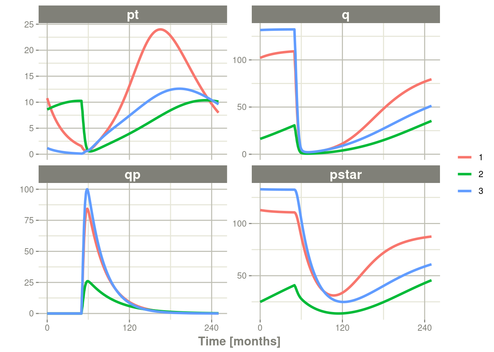
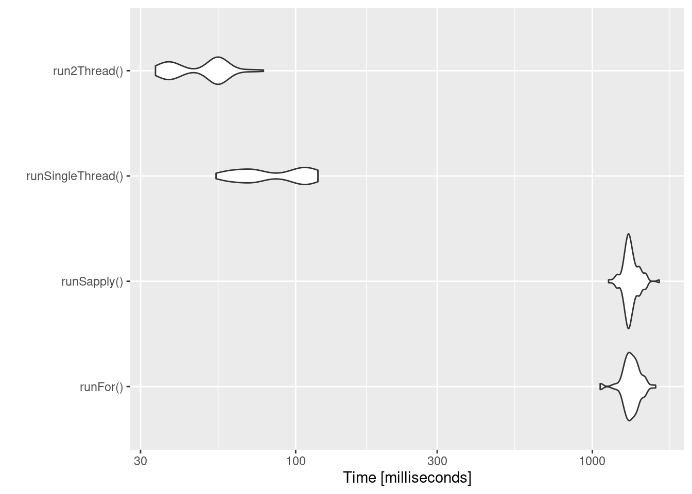

# 第十三章高级和其他主题

这包括高级或杂项主题在`rxode2`

## 13.1rxode2中的协变量

### 13.1.1个体的协变量

如果您希望求解个体的协变量，您可以通过`iCov`数据集指定它：

```R
library(rxode2)
library(units)
library(xgxr)

mod3 <- rxode2({
    KA=2.94E-01;
#### Clearance with individuals
    CL=1.86E+01 * (WT / 70) ^ 0.75;
    V2=4.02E+01;
    Q=1.05E+01;
    V3=2.97E+02;
    Kin=1;
    Kout=1;
    EC50=200;
#### The linCmt() picks up the variables from above
    C2   = linCmt();
    Tz= 8
    amp=0.1
    eff(0) = 1  ## This specifies that the effect compartment starts at 1.
    d/dt(eff) =  Kin - Kout*(1-C2/(EC50+C2))*eff;
})

ev <- et(amount.units="mg", time.units="hours") %>%
    et(amt=10000, cmt=1) %>%
    et(0,48,length.out=100) %>%
    et(id=1:4);

set.seed(10)
rxSetSeed(10)
#### Now use iCov to simulate a 4-id sample
r1 <- solve(mod3, ev,
### Create individual covariate data-frame
            iCov=data.frame(id=1:4, WT=rnorm(4, 70, 10)))
print(r1)
```

```R
#> -- Solved rxode2 object --
#> -- Parameters ($params): --
#>      KA      V2       Q      V3     Kin    Kout    EC50      Tz     amp 
#>   0.294  40.200  10.500 297.000   1.000   1.000 200.000   8.000   0.100 
#> -- Initial Conditions ($inits): --
#> eff 
#>   1 
#> -- First part of data (object): --
#> # A tibble: 400 x 6
#>      id  time    CL    C2   eff    WT
#>   <int>   [h] <dbl> <dbl> <dbl> <dbl>
#> 1     1 0      18.6 249.      1  70.2
#> 2     1 0.485  18.6 175.      1  70.2
#> 3     1 0.970  18.6 124.      1  70.2
#> 4     1 1.45   18.6  87.9     1  70.2
#> 5     1 1.94   18.6  62.7     1  70.2
#> 6     1 2.42   18.6  45.1     1  70.2
#> # ... with 394 more rows
```

```R
plot(r1, C2, log="y")
```


### 13.1.2随时间变化的协变量

协变量在rxode2中很容易指定，您可以将它们指定为变量。随时间变化的协变量，如昼夜节律模型中的时钟时间，也可以使用。扩展已讨论过的间接效应模型，我们有：

```R
library(rxode2)
library(units)

mod3 <- rxode2({
    KA=2.94E-01;
    CL=1.86E+01;
    V2=4.02E+01;
    Q=1.05E+01;
    V3=2.97E+02;
    Kin0=1;
    Kout=1;
    EC50=200;
#### The linCmt() picks up the variables from above
    C2   = linCmt();
    Tz= 8
    amp=0.1
    eff(0) = 1  ## This specifies that the effect compartment starts at 1.
#### Kin changes based on time of day (like cortosol)
    Kin =   Kin0 +amp *cos(2*pi*(ctime-Tz)/24)
    d/dt(eff) =  Kin - Kout*(1-C2/(EC50+C2))*eff;
})


ev <- eventTable(amount.units="mg", time.units="hours") %>%
    add.dosing(dose=10000, nbr.doses=1, dosing.to=1) %>%
    add.sampling(seq(0,48,length.out=100));


#### Create data frame of 8 am dosing for the first dose This is done
#### with base R but it can be done with dplyr or data.table
ev$ctime <- (ev$time+set_units(8,hr)) %% 24
```

现在事件数据集中存在一个协变量，系统可以通过结合数据集和模型来求解：

```R
r1 <- solve(mod3, ev, covsInterpolation="linear")
print(r1)
```

```R
#> -- Solved rxode2 object --
#> -- Parameters ($params): --
#>         KA         CL         V2          Q         V3       Kin0       Kout 
#>   0.294000  18.600000  40.200000  10.500000 297.000000   1.000000   1.000000 
#>       EC50         Tz        amp         pi 
#> 200.000000   8.000000   0.100000   3.141593 
#> -- Initial Conditions ($inits): --
#> eff 
#>   1 
#> -- First part of data (object): --
#> # A tibble: 100 x 5
#>    time    C2   Kin   eff ctime
#>     [h] <dbl> <dbl> <dbl>   [h]
#> 1 0     249.   1.1   1     8   
#> 2 0.485 175.   1.10  1.04  8.48
#> 3 0.970 124.   1.10  1.06  8.97
#> 4 1.45   88.0  1.09  1.07  9.45
#> 5 1.94   62.9  1.09  1.08  9.94
#> 6 2.42   45.2  1.08  1.08 10.4 
#> # ... with 94 more rows
```

在求解ODE方程时，对数据之外的时间进行采样。发生这种情况时，此 ODE 求解器可以在协变量值之间使用线性插值。它等价于 R的`approxfun`函数的`method="linear"`。【译者注：即这里的covsInterpolation参数项用于指定随时间变化的协变量，如何在观测的时间点进行填补】

```R
plot(r1,C2, ylab="Central Concentration")
```


```R
plot(r1,eff) + ylab("Effect") + xlab("Time")
```


请注意，在这种情况下，线性近似会导致求解系统在24小时内出现一些问题，其中协变量在24小时附近和0附近之间具有线性插值。虽然线性似乎是合理的，但时钟时间等情况使其他插值方法更具吸引力。

在rxode2中，默认协变量插值是最后一个观测结果向前结转（`locf`,Last Observation Carries Forward），或常数逼近。这是相当于R的`approxfun`与`method="constant"`。

```R
r1 <- solve(mod3, ev,covsInterpolation="locf")
print(r1)
#> -- Solved rxode2 object --
#> -- Parameters ($params): --
#>         KA         CL         V2          Q         V3       Kin0       Kout 
#>   0.294000  18.600000  40.200000  10.500000 297.000000   1.000000   1.000000 
#>       EC50         Tz        amp         pi 
#> 200.000000   8.000000   0.100000   3.141593 
#> -- Initial Conditions ($inits): --
#> eff 
#>   1 
#> -- First part of data (object): --
#> # A tibble: 100 x 5
#>    time    C2   Kin   eff ctime
#>     [h] <dbl> <dbl> <dbl>   [h]
#> 1 0     249.   1.1   1     8   
#> 2 0.485 175.   1.10  1.04  8.48
#> 3 0.970 124.   1.10  1.06  8.97
#> 4 1.45   88.0  1.09  1.08  9.45
#> 5 1.94   62.9  1.09  1.08  9.94
#> 6 2.42   45.2  1.08  1.08 10.4 
#> # ... with 94 more rows
```

给出了以下图表：

```R
plot(r1,C2, ylab="Central Concentration", xlab="Time")
```


```R
plot(r1,eff, ylab="Effect", xlab="Time")
```


在这种情况下，图中的曲线似乎更流畅。

您还可以使用NONMEM风格默认的的下一个观测结果向后结转（NOCB，next observation carried backward）的插值样式：

```R
r1 <- solve(mod3, ev,covsInterpolation="nocb")
print(r1)
#> -- Solved rxode2 object --
#> -- Parameters ($params): --
#>         KA         CL         V2          Q         V3       Kin0       Kout 
#>   0.294000  18.600000  40.200000  10.500000 297.000000   1.000000   1.000000 
#>       EC50         Tz        amp         pi 
#> 200.000000   8.000000   0.100000   3.141593 
#> -- Initial Conditions ($inits): --
#> eff 
#>   1 
#> -- First part of data (object): --
#> # A tibble: 100 x 5
#>    time    C2   Kin   eff ctime
#>     [h] <dbl> <dbl> <dbl>   [h]
#> 1 0     249.   1.1   1     8   
#> 2 0.485 175.   1.10  1.04  8.48
#> 3 0.970 124.   1.10  1.06  8.97
#> 4 1.45   88.0  1.09  1.07  9.45
#> 5 1.94   62.9  1.09  1.08  9.94
#> 6 2.42   45.2  1.08  1.08 10.4 
#> # ... with 94 more rows
```

给出了以下图表：

```R
plot(r1,C2, ylab="Central Concentration", xlab="Time")
```


```R
plot(r1,eff, ylab="Effect", xlab="Time")
```


## 13.2Shiny与rxode2

### 13.2.1制作R Shiny应用的工具

创建一个示例 R[Shiny应用程序](http://shiny.rstudio.com/)以交互方式探索各种复杂给药方案的反应的示例可在  http://qsp.engr.uga.edu:3838/rxode2/RegimenSimulator中找到。像这样的Shiny应用程序可以通过可以使用实验函数`genShinyApp.template()`以编程方式创建。

上述应用包括用于改变给药剂量、给药方案、剂量循环和循环次数的小部件。

```R
genShinyApp.template(appDir = "shinyExample", verbose=TRUE)

library(shiny)
runApp("shinyExample")
```

[单击此处转到Shiny应用程序](http://qsp.engr.uga.edu:3838/rxode2/RegimenSimulator)

### 13.2.2使用shiny以图形方式探索参数拟合

rxode2对象可以使用`rxShiny(obj)`进行探索。`rxShiny()`还允许您尝试新的模型，以了解它们的行为。

## 13.3将rxode2与管道一起使用

### 13.3.1为管道设置rxode2模型

在这个例子中，我们将展示如何在一个简单的管道中使用rxode2。

我们可以从一个模型开始，该模型可用于rxode2可以处理的不同模拟工作流：

```R
library(rxode2)

Ribba2012 <- rxode2({
    k = 100

    tkde = 0.24
    eta.tkde = 0
    kde ~ tkde*exp(eta.tkde)

    tkpq = 0.0295
    eta.kpq = 0
    kpq ~ tkpq * exp(eta.kpq)

    tkqpp = 0.0031
    eta.kqpp = 0
    kqpp ~ tkqpp * exp(eta.kqpp)

    tlambdap = 0.121
    eta.lambdap = 0
    lambdap ~ tlambdap*exp(eta.lambdap)

    tgamma = 0.729
    eta.gamma = 0
    gamma ~ tgamma*exp(eta.gamma)

    tdeltaqp = 0.00867
    eta.deltaqp = 0
    deltaqp ~ tdeltaqp*exp(eta.deltaqp)

    prop.err <- 0
    pstar <- (pt+q+qp)*(1+prop.err)
    d/dt(c) = -kde * c
    d/dt(pt) = lambdap * pt *(1-pstar/k) + kqpp*qp -
        kpq*pt - gamma*c*kde*pt
    d/dt(q) = kpq*pt -gamma*c*kde*q
    d/dt(qp) = gamma*c*kde*q - kqpp*qp - deltaqp*qp
#### initial conditions
    tpt0 = 7.13
    eta.pt0 = 0
    pt0 ~ tpt0*exp(eta.pt0)
    tq0 = 41.2
    eta.q0 = 0
    q0 ~ tq0*exp(eta.q0)
    pt(0) = pt0
    q(0) = q0
})
```

这是在Ribba 2012中描述的肿瘤生长模型。在这种情况下，我们将模型编译成R对象`Ribba2012`，尽管在rxode2模拟管道中，您不必将编译后的模型分配给任何对象，尽管我认为这是有意义的。

### 13.3.2模拟一个事件表

模拟单个事件表非常简单：

- 通过`et()`可以将rxode2模拟对象通过管道传输到事件表对象。
- 当完全指定事件时，您只需使用 `rxSolve()`求解 ODE 系统即可。
- 在这种情况下，您可以将输出通过管道传输到`plot()`以方便地查看结果。
- - `pt`（增殖组织），
  - `q`（静止组织）
  - `qp`（DNA损伤的静止组织）和
  - `pstar`（肿瘤组织总数）

```R
Ribba2012 %>% # Use rxode2
    et(time.units="months") %>% # Pipe to a new event table
    et(amt=1, time=50, until=58, ii=1.5) %>% # Add dosing every 1.5 months
    et(0, 250, by=0.5) %>% # Add some sampling times (not required)
    rxSolve() %>% # Solve the simulation
    plot(pt, q, qp, pstar) # Plot it, plotting the variables of interest
```


### 13.3.3从单个事件表模拟多个个体

#### 13.3.3.1模拟个体之间的变异

下一种可能有用的模拟是，模拟接受相同治疗的多个患者。在这种情况下，我们将使用文本规定 `omega`矩阵：

```R
#### Add CVs from paper for individual simulation
#### Uses exact formula:

lognCv = function(x){log((x/100)^2+1)}

library(lotri)
#### Now create omega matrix
#### I'm using lotri to quickly specify names/diagonals
omega <- lotri(eta.pt0 ~ lognCv(94),
               eta.q0 ~ lognCv(54),
               eta.lambdap ~ lognCv(72),
               eta.kqp ~ lognCv(76),
               eta.qpp ~ lognCv(97),
               eta.deltaqp ~ lognCv(115),
               eta.kde ~ lognCv(70))

omega
#>               eta.pt0    eta.q0 eta.lambdap   eta.kqp   eta.qpp eta.deltaqp
#> eta.pt0     0.6331848 0.0000000   0.0000000 0.0000000 0.0000000   0.0000000
#> eta.q0      0.0000000 0.2558818   0.0000000 0.0000000 0.0000000   0.0000000
#> eta.lambdap 0.0000000 0.0000000   0.4176571 0.0000000 0.0000000   0.0000000
#> eta.kqp     0.0000000 0.0000000   0.0000000 0.4559047 0.0000000   0.0000000
#> eta.qpp     0.0000000 0.0000000   0.0000000 0.0000000 0.6631518   0.0000000
#> eta.deltaqp 0.0000000 0.0000000   0.0000000 0.0000000 0.0000000   0.8426442
#> eta.kde     0.0000000 0.0000000   0.0000000 0.0000000 0.0000000   0.0000000
#>               eta.kde
#> eta.pt0     0.0000000
#> eta.q0      0.0000000
#> eta.lambdap 0.0000000
#> eta.kqp     0.0000000
#> eta.qpp     0.0000000
#> eta.deltaqp 0.0000000
#> eta.kde     0.3987761
```

有了这些信息，很容易从基于模型的参数中模拟3个主题：

```R
set.seed(1089)
rxSetSeed(1089)
Ribba2012 %>% # Use rxode2
    et(time.units="months") %>% # Pipe to a new event table
    et(amt=1, time=50, until=58, ii=1.5) %>% # Add dosing every 1.5 months
    et(0, 250, by=0.5) %>% # Add some sampling times (not required)
    rxSolve(nSub=3, omega=omega) %>% # Solve the simulation
    plot(pt, q, qp, pstar) # Plot it, plotting the variables of interest
```



请注意，此模拟中添加了两种不同的内容： -`nSub`指定模型中有多少个个体 -`omega`指定个体之间的变异。

#### 13.3.3.2具有无法解释的变异【残差变异】的模拟

您甚至可以很容易地添加无法解释的变异【译者注：这里无法解释的变异是指残差变异】：

```R
Ribba2012 %>% # Use rxode2
    et(time.units="months") %>% # Pipe to a new event table
    et(amt=1, time=50, until=58, ii=1.5) %>% # Add dosing every 1.5 months
     et(0, 250, by=0.5) %>% # Add some sampling times (not required)
    rxSolve(nSub=3, omega=omega, sigma=lotri(prop.err ~ 0.05^2)) %>% # Solve the simulation
    plot(pt, q, qp, pstar) # Plot it, plotting the variables of interest
```


在此示例中，我们仅通过添加`sigma`矩阵以在`pstar`或总的肿瘤组织上添加无法解释的变异【译者注：这里无法解释的变异是指残差变异】。

如果你愿意，你甚至可以模拟`theta` `omega`和`sigma`值的不确定性。

#### 13.3.3.3所有参数的不确定性模拟（按矩阵）

如果我们假设这些参数来自`95`受试者，每个受试者有 `8` 个观测结果，那么 omega 矩阵的自由度将为`95`，`sigma`矩阵的自由度是 `95*8=760`，因为`95`项通知(informed)了`omega`矩阵，而`760` 项通知`sigma`矩阵。

```R
Ribba2012 %>% # Use rxode2
    et(time.units="months") %>% # Pipe to a new event table
    et(amt=1, time=50, until=58, ii=1.5) %>% # Add dosing every 1.5 months
    et(0, 250, by=0.5) %>% # Add some sampling times (not required)
    rxSolve(nSub=3, nStud=3, omega=omega, sigma=lotri(prop.err ~ 0.05^2),
            dfSub=760, dfObs=95) %>% # Solve the simulation
    plot(pt, q, qp, pstar) # Plot it, plotting the variables of interest
```


通常在模拟中，我们有一个固定效应参数的完整协方差矩阵。在此示例中，我们没有此矩阵，但它可以通过`thetaMat`指定。

虽然我们没有完整的协方差矩阵，但我们可以从模型论文中获得有关协方差矩阵对角线元素的信息。这些可以转换如下：

```R
rseVar <- function(est, rse){
    return(est*rse/100)^2
}

thetaMat <- lotri(tpt0 ~ rseVar(7.13,25),
                  tq0 ~ rseVar(41.2,7),
                  tlambdap ~ rseVar(0.121, 16),
                  tkqpp ~ rseVar(0.0031, 35),
                  tdeltaqp ~ rseVar(0.00867, 21),
                  tgamma ~ rseVar(0.729, 37),
                  tkde ~ rseVar(0.24, 33)
                  );

thetaMat
#>            tpt0   tq0 tlambdap    tkqpp  tdeltaqp  tgamma   tkde
#> tpt0     1.7825 0.000  0.00000 0.000000 0.0000000 0.00000 0.0000
#> tq0      0.0000 2.884  0.00000 0.000000 0.0000000 0.00000 0.0000
#> tlambdap 0.0000 0.000  0.01936 0.000000 0.0000000 0.00000 0.0000
#> tkqpp    0.0000 0.000  0.00000 0.001085 0.0000000 0.00000 0.0000
#> tdeltaqp 0.0000 0.000  0.00000 0.000000 0.0018207 0.00000 0.0000
#> tgamma   0.0000 0.000  0.00000 0.000000 0.0000000 0.26973 0.0000
#> tkde     0.0000 0.000  0.00000 0.000000 0.0000000 0.00000 0.0792
```

现在我们有一个`thetaMat`来表示`theta`矩阵中的不确定性，以及模拟中的其他部分。您可以使用`thetaMat` 矩阵将这些信息放入您的模拟中。

由于`theta`的变异很大，很容易抽样出一个负速率常数，这是没有意义的。例如：

```R
Ribba2012 %>% # Use rxode2
et(time.units="months") %>% # Pipe to a new event table
et(amt=1, time=50, until=58, ii=1.5) %>% # Add dosing every 1.5 months
et(0, 250, by=0.5) %>% # Add some sampling times (not required)
rxSolve(nSub=2, nStud=2, omega=omega, sigma=lotri(prop.err ~ 0.05^2),
thetaMat=thetaMat, 
dfSub=760, dfObs=95) %>% # Solve the simulation
plot(pt, q, qp, pstar) # Plot it, plotting the variables of interest

#> unhandled error message: EE:[lsoda] 70000 steps taken before reaching tout
#> @(lsoda.c:750
#> Warning message:
#> In rxSolve_(object, .ctl, .nms, .xtra, params, events, inits, setupOnly = .setupOnly) :
#>  Some ID(s) could not solve the ODEs correctly; These values are replaced with NA.
```

要纠正这些问题，您只需使用截断的多元正态并指定合理的参数范围。对于`theta`，这由`thetaLower`和 `thetaUpper`指定。其他矩阵也有类似的参数： `omegaLower`，`omegaUpper`，`sigmaLower`和`sigmaUpper`。这些可以是命名向量、一个数值或与`thetaMat`矩阵中指定的参数数量匹配的数字向量。

在此此示例中，只需修改模拟即可使 `thetaLower=0`，以确保所有速率都是正数的：

```R
Ribba2012 %>% # Use rxode2
    et(time.units="months") %>% # Pipe to a new event table
    et(amt=1, time=50, until=58, ii=1.5) %>% # Add dosing every 1.5 months
    et(0, 250, by=0.5) %>% # Add some sampling times (not required)
    rxSolve(nSub=2, nStud=2, omega=omega, sigma=lotri(prop.err ~ 0.05^2),
            thetaMat=thetaMat,
            thetaLower=0, # Make sure the rates are reasonable
            dfSub=760, dfObs=95) %>% # Solve the simulation
    plot(pt, q, qp, pstar) # Plot it, plotting the variables of interest
```


### 13.3.4总结模拟的输出

您不仅可以很容易的使用`dplyr`和`data.table`来执行自己的模拟的总结，也可以通过使用`rxode2`的 `confint`函数。

```R
#### This takes a little more time; Most of the time is the summary
#### time.

sim0 <- Ribba2012 %>% # Use rxode2
    et(time.units="months") %>% # Pipe to a new event table
    et(amt=1, time=50, until=58, ii=1.5) %>% # Add dosing every 1.5 months
    et(0, 250, by=0.5) %>% # Add some sampling times (not required)
    rxSolve(nSub=10, nStud=10, omega=omega, sigma=lotri(prop.err ~ 0.05^2),
            thetaMat=thetaMat,
            thetaLower=0, # Make sure the rates are reasonable
            dfSub=760, dfObs=95) %>% # Solve the simulation
    confint(c("pt","q","qp","pstar"),level=0.90); # Create Simulation intervals

sim0 %>% plot() # Plot the simulation intervals
```


#### 13.3.4.1从参数的数据框进行模拟

虽然从矩阵模拟可能非常有用并且是模拟信息的一种快速方法，但有时您可能想要模拟更复杂的场景。例如，可能有一些理由认为`tkde`需要高于`tlambdap`，因此需要更仔细地进行模拟。您可以以任何您想要的方式生成数据框。给出了模拟新参数的内部方法。

```R
library(dplyr)
pars <- rxInits(Ribba2012);
pars <- pars[regexpr("(prop|eta)",names(pars)) == -1]
print(pars)
#>        k     tkde     tkpq    tkqpp tlambdap   tgamma tdeltaqp     tpt0 
#> 1.00e+02 2.40e-01 2.95e-02 3.10e-03 1.21e-01 7.29e-01 8.67e-03 7.13e+00 
#>      tq0 
#> 4.12e+01
#### This is the exported method for simulation of Theta/Omega internally in rxode2
df <- rxSimThetaOmega(params=pars, omega=omega,dfSub=760,
                      thetaMat=thetaMat, thetaLower=0, nSub=60,nStud=60) %>%
    filter(tkde > tlambdap) %>% as.tbl()
#### You could also simulate more and bind them together to a data frame.
print(df)
#> # A tibble: 2,220 x 16
#>        k  tkde   tkpq tkqpp tlambdap tgamma tdeltaqp  tpt0   tq0 eta.pt0  eta.q0
#>    <dbl> <dbl>  <dbl> <dbl>    <dbl>  <dbl>    <dbl> <dbl> <dbl>   <dbl>   <dbl>
#>  1   100 0.341 0.0295  1.03    0.315   1.05     1.06  7.91  41.4 -0.0615 -0.170 
#>  2   100 0.341 0.0295  1.03    0.315   1.05     1.06  7.91  41.4  1.22    0.300 
#>  3   100 0.341 0.0295  1.03    0.315   1.05     1.06  7.91  41.4  0.487   0.850 
#>  4   100 0.341 0.0295  1.03    0.315   1.05     1.06  7.91  41.4 -0.660  -0.298 
#>  5   100 0.341 0.0295  1.03    0.315   1.05     1.06  7.91  41.4  0.608   0.135 
#>  6   100 0.341 0.0295  1.03    0.315   1.05     1.06  7.91  41.4 -1.70    0.0789
#>  7   100 0.341 0.0295  1.03    0.315   1.05     1.06  7.91  41.4 -0.521   0.411 
#>  8   100 0.341 0.0295  1.03    0.315   1.05     1.06  7.91  41.4  0.630  -0.526 
#>  9   100 0.341 0.0295  1.03    0.315   1.05     1.06  7.91  41.4 -0.102  -0.617 
#> 10   100 0.341 0.0295  1.03    0.315   1.05     1.06  7.91  41.4  0.0731 -0.0867
#> # ... with 2,210 more rows, and 5 more variables: eta.lambdap <dbl>,
#> #   eta.kqp <dbl>, eta.qpp <dbl>, eta.deltaqp <dbl>, eta.kde <dbl>
#### Quick check to make sure that all the parameters are OK.
all(df$tkde>df$tlambdap)
#> [1] TRUE
sim1 <- Ribba2012 %>% # Use rxode2
    et(time.units="months") %>% # Pipe to a new event table
    et(amt=1, time=50, until=58, ii=1.5) %>% # Add dosing every 1.5 months
    et(0, 250, by=0.5) %>% # Add some sampling times (not required)
    rxSolve(df)
#### Note this information looses information about which ID is in a
#### "study", so it summarizes the confidence intervals by dividing the
#### subjects into sqrt(#subjects) subjects and then summarizes the
#### confidence intervals
sim2 <- sim1 %>% confint(c("pt","q","qp","pstar"),level=0.90); # Create Simulation intervals
save(sim2, file = file.path(system.file(package = "rxode2"), "pipeline-sim2.rds"), version = 2)
sim2 %>% plot()
```


## 13.4加速rxode2

### 13.4.1通过多个个体并行求解提高rxode2速度

`rxode2`最初是作为ODE解算器开发的，它允许对单个个体进行ODE解算。这种灵活性仍然受到支持。

来自`rxode2`教程的原始代码如下：

```R
library(rxode2)

library(microbenchmark)
library(ggplot2)

mod1 <- rxode2({
    C2 = centr/V2;
    C3 = peri/V3;
    d/dt(depot) = -KA*depot;
    d/dt(centr) = KA*depot - CL*C2 - Q*C2 + Q*C3;
    d/dt(peri) = Q*C2 - Q*C3;
    d/dt(eff) = Kin - Kout*(1-C2/(EC50+C2))*eff;
    eff(0) = 1
})

#### Create an event table

ev <- et() %>%
    et(amt=10000, addl=9,ii=12) %>%
    et(time=120, amt=20000, addl=4, ii=24) %>%
    et(0:240) ## Add Sampling

nsub <- 100 # 100 sub-problems
sigma <- matrix(c(0.09,0.08,0.08,0.25),2,2) # IIV covariance matrix
mv <- rxRmvn(n=nsub, rep(0,2), sigma) # Sample from covariance matrix
CL <- 7*exp(mv[,1])
V2 <- 40*exp(mv[,2])
params.all <- cbind(KA=0.3, CL=CL, V2=V2, Q=10, V3=300,
                    Kin=0.2, Kout=0.2, EC50=8)
```

#### 13.4.1.1for循环

编写代码实现下述示例的最慢方法是使用 `for` loop循环。在这个例子中，我们将它包含在一个函数中以比较用时。

```R
runFor <- function(){
    res <- NULL
    for (i in 1:nsub) {
        params <- params.all[i,]
        x <- mod1$solve(params, ev)
        ##Store results for effect compartment
        res <- cbind(res, x[, "eff"])
    }
    return(res)
}
```

#### 13.4.1.2通过apply类函数运行

一般来说，对于R，`apply`类型的函数比 `for`循环执行得更好，所以教程也建议采用此种方式增强速度

```R
runSapply <- function(){
    res <- apply(params.all, 1, function(theta)
        mod1$run(theta, ev)[, "eff"])
}
```

#### 13.4.1.3使用单线程求解运行

您还可以让rxode2使用单线程求解同时求解所有个体，而无需在R中收集结果。

这里的数据输出略有不同，但仍然提供相同的信息：

```R
runSingleThread <- function(){
  solve(mod1, params.all, ev, cores=1)[,c("sim.id", "time", "eff")]
}
```

#### 13.4.1.42使用线程求解运行

rxode2支持多线程求解，所以另一种选择是有`2` 线程（在求解器的选项中称为`cores`，可以在`rxControl()`或`rxSolve()`中看到有关选项） 。

```R
run2Thread <- function(){
  solve(mod1, params.all, ev, cores=2)[,c("sim.id", "time", "eff")]
}
```

#### 13.4.1.5比较所有方法的用时

现在是关键时刻，时机：

```R
bench <- microbenchmark(runFor(), runSapply(), runSingleThread(),run2Thread())
print(bench)
#> Unit: milliseconds
#>               expr        min         lq       mean     median         uq
#>           runFor() 1062.73099 1304.97351 1355.11433 1349.88837 1409.64603
#>        runSapply() 1133.98743 1300.32975 1346.84780 1331.50023 1382.29895
#>  runSingleThread()   53.90511   67.85757   86.31790   80.53222  105.34612
#>       run2Thread()   33.69476   37.82068   48.49613   53.49341   55.43786
#>         max neval
#>  1635.26890   100
#>  1681.23364   100
#>   118.88022   100
#>    77.92788   100
autoplot(bench)
```



很明显，性能会有跳跃式的提升是发生在使用`solve`方法并将所有参数提供给rxode2进行求解时，而不是发生在使用`for`或`sapply`循环遍历每个个体的方式求解的时候。 应用于求解的内核/线程的数量也在求解中起作用。

我们可以使用以下代码进一步探索线程数：

```R
runThread <- function(n){
    solve(mod1, params.all, ev, cores=n)[,c("sim.id", "time", "eff")]
}

bench <- eval(parse(text=sprintf("microbenchmark(%s)",
                                     paste(paste0("runThread(", seq(1, 2 * rxCores()),")"),
                                           collapse=","))))
print(bench)
#> Unit: milliseconds
#>          expr      min       lq     mean   median       uq      max neval
#>  runThread(1) 54.89976 71.36315 79.28627 82.80764 85.94690 95.65980   100
#>  runThread(2) 35.10327 38.48158 42.47366 41.74052 45.67836 59.75624   100
#>  runThread(3) 26.82482 30.17348 34.41744 33.63812 37.57002 61.36881   100
#>  runThread(4) 23.07798 27.67149 31.32003 30.51574 33.99461 46.33631   100
#>  runThread(5) 30.47240 38.82789 41.69443 41.54031 44.78454 50.49672   100
#>  runThread(6) 29.35039 33.44060 37.02153 37.26839 39.14627 59.46520   100
#>  runThread(7) 26.93386 29.83401 33.55118 33.39193 35.98574 49.71733   100
#>  runThread(8) 25.42155 28.83314 32.05635 32.01850 34.66935 54.87643   100
autoplot(bench)
```


在速度与数量或内核之间可能存在一个合适的位置。系统类型（mac、linux、windows和/或处理器）、ODE求解的复杂性和个体的数量可能会影响这个任意数量的线程。4个线程是一个很好的数字，无需任何先验知识，因为现在大多数系统至少有4个线程（或2个处理器和4个线程）。

### 13.4.2一个现实生活中的例子

在实现某些并行求解之前，运行`rxode2`的最快的方法是使用`lapply`。这就是Rik Schoemaker创建`nlmixr`比较的数据集方式，但为更快完成的pkgdown网站自动构建的运行，它被简化了。

```R
library(rxode2)
library(data.table)
#Define the rxode2 model
  ode1 <- "
  d/dt(abs)    = -KA*abs;
  d/dt(centr)  =  KA*abs-(CL/V)*centr;
  C2=centr/V;
  "
  
#Create the rxode2 simulation object
mod1 <- rxode2(model = ode1)

#Population parameter values on log-scale
  paramsl <- c(CL = log(4),
               V = log(70),
               KA = log(1))
#make 10,000 subjects to sample from:
  nsubg <- 300 # subjects per dose
  doses <- c(10, 30, 60, 120)
  nsub <- nsubg * length(doses)
#IIV of 30% for each parameter
  omega <- diag(c(0.09, 0.09, 0.09))# IIV covariance matrix
  sigma <- 0.2
#Sample from the multivariate normal
  set.seed(98176247)
  rxSetSeed(98176247)
  library(MASS)
  mv <-
    mvrnorm(nsub, rep(0, dim(omega)[1]), omega) # Sample from covariance matrix
#Combine population parameters with IIV
  params.all <-
    data.table(
      "ID" = seq(1:nsub),
      "CL" = exp(paramsl['CL'] + mv[, 1]),
      "V" = exp(paramsl['V'] + mv[, 2]),
      "KA" = exp(paramsl['KA'] + mv[, 3])
    )
#set the doses (looping through the 4 doses)
params.all[, AMT := rep(100 * doses,nsubg)]

Startlapply <- Sys.time()
  
#Run the simulations using lapply for speed
  s = lapply(1:nsub, function(i) {
#selects the parameters associated with the subject to be simulated
    params <- params.all[i]
#creates an eventTable with 7 doses every 24 hours
    ev <- eventTable()
    ev$add.dosing(
      dose = params$AMT,
      nbr.doses = 1,
      dosing.to = 1,
      rate = NULL,
      start.time = 0
    )
#generates 4 random samples in a 24 hour period
    ev$add.sampling(c(0, sort(round(sample(runif(600, 0, 1440), 4) / 60, 2))))
#runs the rxode2 simulation
    x <- as.data.table(mod1$run(params, ev))
#merges the parameters and ID number to the simulation output
    x[, names(params) := params]
  })
  
#runs the entire sequence of 100 subjects and binds the results to the object res
  res = as.data.table(do.call("rbind", s))
  
Stoplapply <- Sys.time()
  
print(Stoplapply - Startlapply)
#> Time difference of 26.99468 secs
```

通过应用一些新的并行求解概念，您可以简单地以更少的代码和更快的速度运行相同的模拟：

```R
rx <- rxode2({
    CL =  log(4)
    V = log(70)
    KA = log(1)
    CL = exp(CL + eta.CL)
    V = exp(V + eta.V)
    KA = exp(KA + eta.KA)
    d/dt(abs)    = -KA*abs;
    d/dt(centr)  =  KA*abs-(CL/V)*centr;
    C2=centr/V;
})

omega <- lotri(eta.CL ~ 0.09,
               eta.V ~ 0.09,
               eta.KA ~ 0.09)

doses <- c(10, 30, 60, 120)


startParallel <- Sys.time()
ev <- do.call("rbind",
        lapply(seq_along(doses), function(i){
            et() %>%
                et(amt=doses[i]) %>% # Add single dose
                et(0) %>% # Add 0 observation
#### Generate 4 samples in 24 hour period
                et(lapply(1:4, function(...){c(0, 24)})) %>%
                et(id=seq(1, nsubg) + (i - 1) * nsubg) %>%
#### Convert to data frame to skip sorting the data
#### When binding the data together
                as.data.frame 
        }))
#### To better compare, use the same output, that is data.table
res <- rxSolve(rx, ev, omega=omega, returnType="data.table")
endParallel <- Sys.time()
print(endParallel - startParallel)
#> Time difference of 0.1851892 secs
```

您可以看到这两种方法之间的惊人时间差;要记住的几件事：

- `rxode2`使用线程安全的sitmo`threefry`例程来模拟`eta` 值。因此，预计结果会有所不同（此外，随机抽样的顺序也不同，因此会有所不同）
- 之前的模拟是在R 3.5中运行的，它具有不同的随机数生成器，因此当使用较慢的模拟时，此模拟中的结果将与实际的nlmixr比较不同。
- 这个速度比较使用了`data.table`.`rxode2`在内部使用`data.table` （如果可用）尝试加快排序速度，因此这在安装了`data.table`的与未安装的之间会存在不同。通过使用`forderForceBase(TRUE)`可以强制rxode2在排序时使用`order()` 。在这种情况下，两者之间几乎没有区别，尽管在其他示例中`data.table`的存在会导致速度提升（并且不太可能导致速度变慢）。

#### 13.4.2.1想要通过更多的方法来运行多个体模拟

自教程发布以来的后续新版本有更多的方法来运行多个个体的模拟，包括使用`et()`（参见[rxode2事件](https://nlmixr2.github.io/rxode2/articles/rxode2-events.html#add-doses-and-samples-within-a-sampling-window) 如需更多信息）增加采样和给药时间的变异，能够同时提供`omega`和`sigma` 矩阵，以及通过添加`thetaMat`到R以模拟在`omega`，`sigma`和`theta`矩阵上的不确定性;见[rxode2模拟插图](https://nlmixr2.github.io/rxode2/articles/rxode2-sim-var.html)。

## 13.5在您的包中集成rxode2模型

### 13.5.1在包中使用预编译模型

如果您计划开发一个R添加包，并希望将预编译的rxode2模型包含到您开发的R添加包中，这是可以很容易实现的。您只需用`rxPkg()`命令制作这个R添加包。

```R
library(rxode2);
#### Now Create a model
idr <- rxode2({
    C2 = centr/V2;
    C3 = peri/V3;
    d/dt(depot) =-KA*depot;
    d/dt(centr) = KA*depot - CL*C2 - Q*C2 + Q*C3;
    d/dt(peri)  =                    Q*C2 - Q*C3;
    d/dt(eff)  = Kin - Kout*(1-C2/(EC50+C2))*eff;
})

#### You can specify as many models as you want to add

rxPkg(idr, package="myPackage"); ## Add the idr model to your package
```

上述操作将会：

- 将模型添加到您的R添加包中;一旦R添加包加载完成，您可以通过`idr`命令使用R添加包的数据
- 将正确的R添加包的需求添加到DESCRIPTION文件中。您需要更新此DESCRIPTION文件以描述包并修改作者、许可证等。
- 创建可以添加到R添加包文档中的骨架模型文档文件。在本例中，它将是`R`目录中的 `idr-doc.R`文件
- 创建一个`configure`和`configure.win`脚本，该脚本根据编译该脚本所依据的`rxode2`版本删除并重新生成`src`目录。如果您计划拥有自己编译的代码，应该对其进行修改，尽管我们并不建议这样做。
- 您可以在与rxode2对象交互的包中编写自己的R代码，以便您可以在包上下文中分发Shiny的应用程序和类似的东西。

一旦出现这种情况，您可以通过使用`rxUse()`将更多模型添加到您的R添加包中 。只需在您的R添加包中编译rxode2模型，然后用`rxUse()`添加该模型

```R
rxUse(model)
```

现在`model`和`idr`模型库中了。这还将在您的R添加包目录中创建`Model-doc.R`，以便您可以记录该模型。

然后，您可以使用`devtools`方法来安装/测试您的模型

```R
devtools::load_all() # Load all the functions in the package
devtools::document() # Create package documentation
devtools::install() # Install package
devtools::check() # Check the package
devtools::build() # build the package so you can submit it to places like CRAN
```

### 13.5.2在现有R添加包中使用模型

为了说明，让我们从一个空白的R添加包开始

```R
library(rxode2)
library(usethis)
pkgPath  <- file.path(rxTempDir(),"MyRxModel")
create_package(pkgPath);
use_gpl3_license("Matt")
use_package("rxode2", "LinkingTo")
use_package("rxode2", "Depends") ##  library(rxode2) on load; Can use imports instead.
use_roxygen_md()
##use_readme_md()
library(rxode2);
#### Now Create a model
idr <- rxode2({
    C2 = centr/V2;
    C3 = peri/V3;
    d/dt(depot) =-KA*depot;
    d/dt(centr) = KA*depot - CL*C2 - Q*C2 + Q*C3;
    d/dt(peri)  =                    Q*C2 - Q*C3;
    d/dt(eff)  = Kin - Kout*(1-C2/(EC50+C2))*eff;
});

rxUse(idr); ## Add the idr model to your package
rxUse(); # Update the compiled rxode2 sources for all of your packages
```

该`rxUse()`将： -创建`rxode2`源代码并将它们移动到包的`src/` 目录。如果R添加包中只有R源代码，它还会用`library-init.c`结束目录，`library-init.c`中注册了R添加包中所有的rxode2模型，以便在R中使用。 -为您的R添加包中包含的每个模型创stub R文档。当您加载您的程序包时，您将能够通过标准的`?`接口R文档。

您仍然需要： -导出至少一个函数。如果您没有希望导出的函数，可以使用roxygen添加`rxode2`的再导出，示例如下：

```R
##' @importFrom rxode2 rxode2
##' @export
rxode2::rxode2
```

如果您想在R添加包中使用`Suggests`而不是`Depends`， 您可能需要导出所有rxode2的标准例程【译者注："routines"此处被翻译为"例程"，您可以将其理解为rxode2程序包的子程序】

```R
##' @importFrom rxode2 rxode2
##' @export
rxode2::rxode2

##' @importFrom rxode2 et
##' @export
rxode2::et

##' @importFrom rxode2 etRep
##' @export
rxode2::etRep

##' @importFrom rxode2 etSeq
##' @export
rxode2::etSeq

##' @importFrom rxode2 as.et
##' @export
rxode2::as.et

##' @importFrom rxode2 eventTable
##' @export
rxode2::eventTable

##' @importFrom rxode2 add.dosing
##' @export
rxode2::add.dosing

##' @importFrom rxode2 add.sampling
##' @export
rxode2::add.sampling

##' @importFrom rxode2 rxSolve
##' @export
rxode2::rxSolve

##' @importFrom rxode2 rxControl
##' @export
rxode2::rxControl

##' @importFrom rxode2 rxClean
##' @export
rxode2::rxClean

##' @importFrom rxode2 rxUse
##' @export
rxode2::rxUse

##' @importFrom rxode2 rxShiny
##' @export
rxode2::rxShiny

##' @importFrom rxode2 genShinyApp.template
##' @export
rxode2::genShinyApp.template

##' @importFrom rxode2 cvPost
##' @export
rxode2::cvPost

### This is actually from `magrittr` but allows less imports
##' @importFrom rxode2 %>%
##' @export
rxode2::`%>%`
```

- 您还需要指示R加载包含在模型dll中的模型库模型。这通过以下方式实现：

```R
### In this case `rxModels` is the package name
##' @useDynLib rxModels, .registration=TRUE
```

如果这是一个带有rxode2模型的R添加包，并且您不打算添加任何其他编译源（推荐），您可以添加以下配置脚本

```R
#!/bin/sh
### This should be used for both configure and configure.win
echo "unlink('src', recursive=TRUE);rxode2::rxUse()" > build.R
${R_HOME}/bin/Rscript build.R
rm build.R
```

根据`check`，您可能需要一个虚拟的autoconf脚本，

```R
#### dummy autoconf script
#### It is saved to configure.ac
```

如果您想要与基于`Rcpp`或 `C`/`Fortan`的包中的其他源代码集成，则您需要包含`rxModels-compiled.h`和： -将定义宏`compiledModelCall`添加到注册列表中 `.Call`函数列表中。 -注册C接口以允许通过`R_init0_rxModels_rxode2_models()`进行模型求解（同样`rxModels`将被您换为您的R添加包的名称）。

完成后，您可以通过标准方法进行R添加包的编译/R添加包的文档生成：

```R
devtools::load_all()
devtools::document()
devtools::install()
```

如果您的R添加包在加载时使用了新版本的rxode2，则模型将在使用时重新编译。

但是，如果您希望为最新版本的 `rxode2` 重新编译模型，您只需在项目目录中再次调用`rxUse()`即可，然后使用安装/创建R添加包的标准方法。

```R
devtools::load_all()
devtools::document()
devtools::install()
```

**请注意**，您不必包含生成模型所需的`rxode2`代码，即可在 `src` 目录中重新生成rxode2的C代码。与所有rxode2对象一样，`summary`将显示重新创建相同模型的一种方法。【译者注：这一段度的不太明白，有待实际操作后对这段的翻译进行修订】

一个已编译模型的R添加包的示例可以在 [RXModels](https://github.com/nlmixr2/rxModels)存储库中找到。

## 13.6具有雅可比规范的刚性ODE

#### 13.6.0.1具有雅可比规范的刚性ODE

【译者注：如果你不感兴趣rxode2的具体实现原理，仅专注于基于rxode2的应用，您可以略过此章节。】

偶尔，您可能会遇到一个[刚性微分方程](https://en.wikipedia.org/wiki/Stiff_equation)(stiff differential equation)，这是一个在数值上不稳定的微分方程，参数的微小变化会导致ODEs的不同解。解决这个问题一种的方法是选择刚性求解器或混合刚性求解器 （就像默认的LSODA）。通常这就足够了。然而”精确的雅可比解(exact Jacobian solutions)“可能会增加ODE的稳定性。（注意，”雅可比矩阵(Jacobian)“是ODE规范关对每个变量的导数【译者注：你可以将其简单了理解为是导数矩阵】）。在rxode2中，您可以使用 `df(状态)/dy(变量)=`语句【译者注：即您可以使用此语句描述一个微分方程(导数方程)，并且允许您方程的等号左侧中的"谁(状态，比如中央室的药量)"相对于"谁(变量，比如时间，比如浓度等)"的导数，等于，"什么(即微分方程的右侧，您可以自编写方程的右侧的语句/公式)"】。在各种条件下具有刚性性质的经典常微分方程是[范德波尔](http://www.ece.northwestern.edu/local-apps/matlabhelp/techdoc/math_anal/diffeq6.html)(Van der Pol)微分方程。

在rxode2中，这些可以通过以下方式指定：

```R
library(rxode2)

Vtpol2 <- rxode2({
    d/dt(y)  = dy
    d/dt(dy) = mu*(1-y^2)*dy - y
##### Jacobian
    df(y)/dy(dy)  = 1
    df(dy)/dy(y)  = -2*dy*mu*y - 1
    df(dy)/dy(dy) = mu*(1-y^2)
##### Initial conditions
    y(0) = 2
    dy(0) = 0
##### mu
    mu = 1 ## nonstiff; 10 moderately stiff; 1000 stiff
})

et <- eventTable();
et$add.sampling(seq(0, 10, length.out=200));
et$add.dosing(20, start.time=0);

s1 <- Vtpol2 %>%  solve(et, method="lsoda")
print(s1)
#> -- Solved rxode2 object --
#> -- Parameters ($params): --
#> mu 
#>  1 
#> -- Initial Conditions ($inits): --
#>  y dy 
#>  2  0 
#> -- First part of data (object): --
#> # A tibble: 200 x 3
#>     time     y      dy
#>    <dbl> <dbl>   <dbl>
#> 1 0       22    0     
#> 2 0.0503  22.0 -0.0456
#> 3 0.101   22.0 -0.0456
#> 4 0.151   22.0 -0.0456
#> 5 0.201   22.0 -0.0456
#> 6 0.251   22.0 -0.0456
#> # ... with 194 more rows
```

虽然在mu=1时并不刚性，但mu=1000是一个刚性的系统

```R
s2 <- Vtpol2 %>%  solve(c(mu=1000), et)
print(s2)
#> -- Solved rxode2 object --
#> -- Parameters ($params): --
#>   mu 
#> 1000 
#> -- Initial Conditions ($inits): --
#>  y dy 
#>  2  0 
#> -- First part of data (object): --
#> # A tibble: 200 x 3
#>     time     y         dy
#>    <dbl> <dbl>      <dbl>
#> 1 0       22    0        
#> 2 0.0503  22.0 -0.0000455
#> 3 0.101   22.0 -0.0000455
#> 4 0.151   22.0 -0.0000455
#> 5 0.201   22.0 -0.0000455
#> 6 0.251   22.0 -0.0000455
#> # ... with 194 more rows
```

虽然这很容易做到，但有点乏味。如果你有适当的rxode2设置，你可以使用计算机代数系统符号来自动计算雅可比矩阵。

这是通过rxode2的`calcJac`选项完成的：

```R
Vtpol <- rxode2({
    d/dt(y)  = dy
    d/dt(dy) = mu*(1-y^2)*dy - y
##### Initial conditions
    y(0) = 2
    dy(0) = 0
##### mu
    mu = 1 ## nonstiff; 10 moderately stiff; 1000 stiff
}, calcJac=TRUE)
```

要查看生成的模型，可以使用`rxCat()`：

```R
> rxCat(Vtpol)
d/dt(y)=dy;
d/dt(dy)=mu*(1-y^2)*dy-y;
y(0)=2;
dy(0)=0;
mu=1;
df(y)/dy(y)=0;
df(dy)/dy(y)=-2*dy*mu*y-1;
df(y)/dy(dy)=1;
df(dy)/dy(dy)=mu*(-Rx_pow_di(y,2)+1);
```