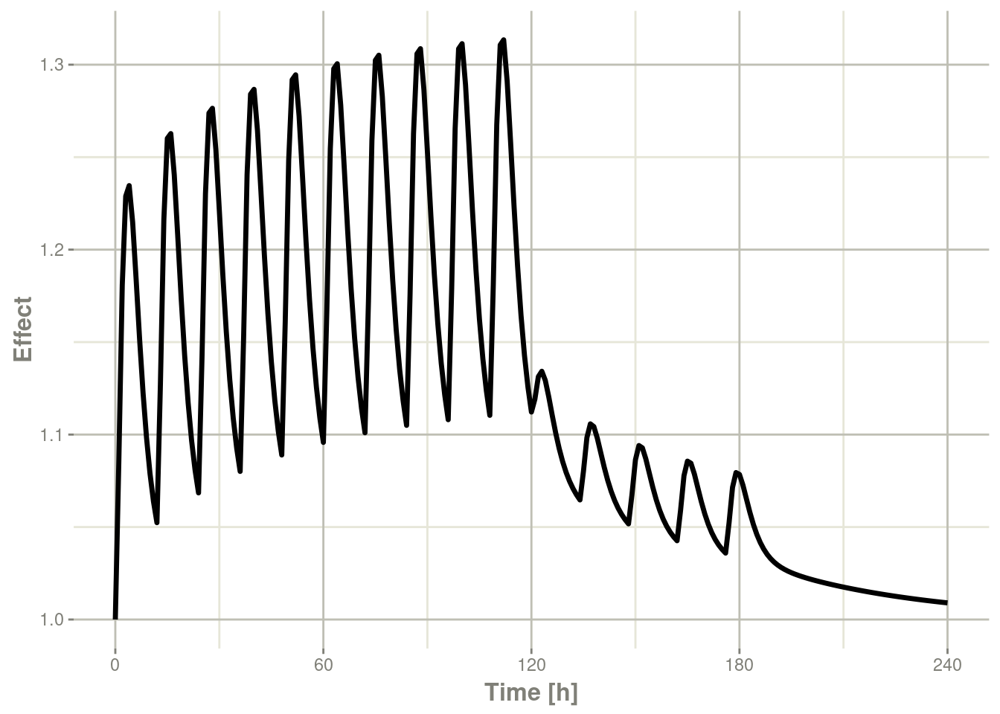

# 第五章入门

模型方程可以通过文本字符串、单独的模型文件或R表达式来指定。微分方程和代数方程都是允许的。微分方程由`d/dt(var_name) =`指定。不同方程间可以用英文分号分隔开。

加载`rxode2`包并编译模型：

```R
library(rxode2)
```

```R
#> rxode2 2.0.11 using 4 threads (see ?getRxThreads)
```

```R
mod1 <- rxode2({
  C2 <- centr/V2;
  C3 <- peri/V3;
  d/dt(depot) <- -KA*depot;
  d/dt(centr) <- KA*depot - CL*C2 - Q*C2 + Q*C3;
  d/dt(peri)  <- Q*C2 - Q*C3;
  d/dt(eff)   <- Kin - Kout*(1-C2/(EC50+C2))*eff;
})
```

## 5.1指定ODE参数和初始条件

模型参数可以定义为命名向量，向量中参数的名称必须是ODE模型中参数的超集【译者注：即ODE中的参数是向量中参数名称的子集】，向量内参数的顺序并不重要。

```R
theta <- 
   c(KA=2.94E-01, CL=1.86E+01, V2=4.02E+01, # central 
     Q=1.05E+01,  V3=2.97E+02,              # peripheral
     Kin=1, Kout=1, EC50=200)               # effects
```

初始条件(ICs,Initial conditions)也可以通过向量定义。如果未指定元素，则假定房室的初始条件为零。

```R
inits <- c(eff=1)
```

如果要在模型中指定初始条件，可以添加：

```R
eff(0) = 1
```

## 5.2在rxode2中指定给药和采样

`rxode2`提供了一种简单且非常灵活的方式，通过生成事件表的函数来指定给药(Dosing)和采样(Sampling) 。首先，通过"eventTable()"函数生成一个空的事件表：

```R
ev <- eventTable(amount.units='mg', time.units='hours')
```

接下来，使用`add.dosing()`和`add.sampling()`函数 `EventTable`对象来指定给药(数量、频率和/或时间等)和对系统状态进行采样观测的时间。这些函数可以多次调用以指定更复杂的给药或取样方案。在这里，使用下述代码通过这些函数指定10mg BID给药5天，随后20mg QD给药 5天：

```R
ev$add.dosing(dose=10000, nbr.doses=10, dosing.interval=12)
ev$add.dosing(dose=20000, nbr.doses=5, start.time=120,
              dosing.interval=24)
ev$add.sampling(0:240)
```

如果您愿意，您也可以使用`mattigr`管道操作符`%>%`来执行此操作

```R
ev <- eventTable(amount.units="mg", time.units="hours") %>%
  add.dosing(dose=10000, nbr.doses=10, dosing.interval=12) %>%
  add.dosing(dose=20000, nbr.doses=5, start.time=120,
             dosing.interval=24) %>%
  add.sampling(0:240)
```

函数`get.dosing()`和`get.sampling()`可用于从事件表中检索信息。

```R
head(ev$get.dosing())
```

```R
#>   id low time high       cmt   amt rate ii addl evid ss dur
#> 1  1  NA    0   NA (default) 10000    0 12    9    1  0   0
#> 2  1  NA  120   NA (default) 20000    0 24    4    1  0   0
```

```R
head(ev$get.sampling())
```

```R
#>   id low time high   cmt amt rate ii addl evid ss dur
#> 1  1  NA    0   NA (obs)  NA   NA NA   NA    0 NA  NA
#> 2  1  NA    1   NA (obs)  NA   NA NA   NA    0 NA  NA
#> 3  1  NA    2   NA (obs)  NA   NA NA   NA    0 NA  NA
#> 4  1  NA    3   NA (obs)  NA   NA NA   NA    0 NA  NA
#> 5  1  NA    4   NA (obs)  NA   NA NA   NA    0 NA  NA
#> 6  1  NA    5   NA (obs)  NA   NA NA   NA    0 NA  NA
```

您可能会注意到，这些与NONMEM事件表类似;如果您更熟悉NONMEM数据和事件，您可以直接将它们与事件表函数`et`一起使用

```R
ev  <- et(amountUnits="mg", timeUnits="hours") %>%
  et(amt=10000, addl=9,ii=12,cmt="depot") %>%
  et(time=120, amt=2000, addl=4, ii=14, cmt="depot") %>%
  et(0:240) # Add sampling 
```

您可以从上面的代码中看到，您可以将给药分配到rxode2模型中已命名的房室。这种与NONMEM的轻微偏差可以减少房室重新编号的需要。

这些事件也可以通过`rbind`、`c`、`seq`和`rep`组合和扩展(到多个体事件和复杂的方案)。有关使用rxode2创建复杂给药方案的更多信息，请参阅[rxode2事件部分](https://nlmixr2.github.io/rxode2/articles/rxode2-event-types.html)。

## 5.3求解ODE

现在可以通过调用模型对象的`run`或`solve`函数求解。将模型中所有变量的模拟结果存储在输出矩阵x中。

```R
x <- mod1$solve(theta, ev, inits);
knitr::kable(head(x))
```

| time | C2       | C3        | depot     | centr    | peri      | eff      |
| ---- | -------- | --------- | --------- | -------- | --------- | -------- |
| 0    | 0.00000  | 0.0000000 | 10000.000 | 0.000    | 0.0000    | 1.000000 |
| 1    | 44.37555 | 0.9198298 | 7452.765  | 1783.897 | 273.1895  | 1.084664 |
| 2    | 54.88296 | 2.6729825 | 5554.370  | 2206.295 | 793.8758  | 1.180825 |
| 3    | 51.90343 | 4.4564927 | 4139.542  | 2086.518 | 1323.5783 | 1.228914 |
| 4    | 44.49738 | 5.9807076 | 3085.103  | 1788.795 | 1776.2702 | 1.234610 |
| 5    | 36.48434 | 7.1774981 | 2299.255  | 1466.670 | 2131.7169 | 1.214742 |

您也可以求解这模型并创建一个rxode2数据框：

```R
x <- mod1 %>% rxSolve(theta, ev, inits);
x
```

```R
#> ── Solved rxode2 object ──
#> ── Parameters (x$params): ──
#>      V2      V3      KA      CL       Q     Kin    Kout    EC50 
#>  40.200 297.000   0.294  18.600  10.500   1.000   1.000 200.000 
#> ── Initial Conditions (x$inits): ──
#> depot centr  peri   eff 
#>     0     0     0     1 
#> ── First part of data (object): ──
#> # A tibble: 241 × 7
#>   time    C2    C3  depot centr  peri   eff
#>    [h] <dbl> <dbl>  <dbl> <dbl> <dbl> <dbl>
#> 1    0   0   0     10000     0     0   1   
#> 2    1  44.4 0.920  7453. 1784.  273.  1.08
#> 3    2  54.9 2.67   5554. 2206.  794.  1.18
#> 4    3  51.9 4.46   4140. 2087. 1324.  1.23
#> 5    4  44.5 5.98   3085. 1789. 1776.  1.23
#> 6    5  36.5 7.18   2299. 1467. 2132.  1.21
#> # … with 235 more rows
```

这将返回一个修改后的数据框。您可以在下图中看到房室中的数值：

```R
library(ggplot2)
plot(x,C2) + ylab("Central Concentration")
```


或者，

```R
plot(x,eff)  + ylab("Effect")
```



请注意，标签会自动使用初始事件表中的单位进行标记。rxode2提取`units`来标记绘图(如果它们存在)。