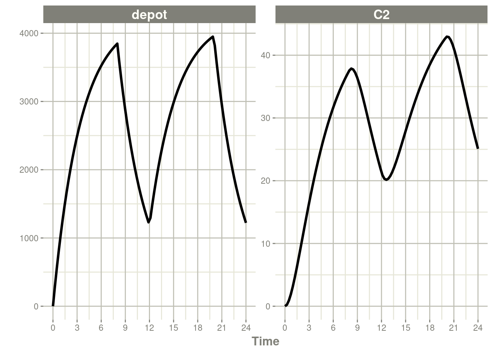
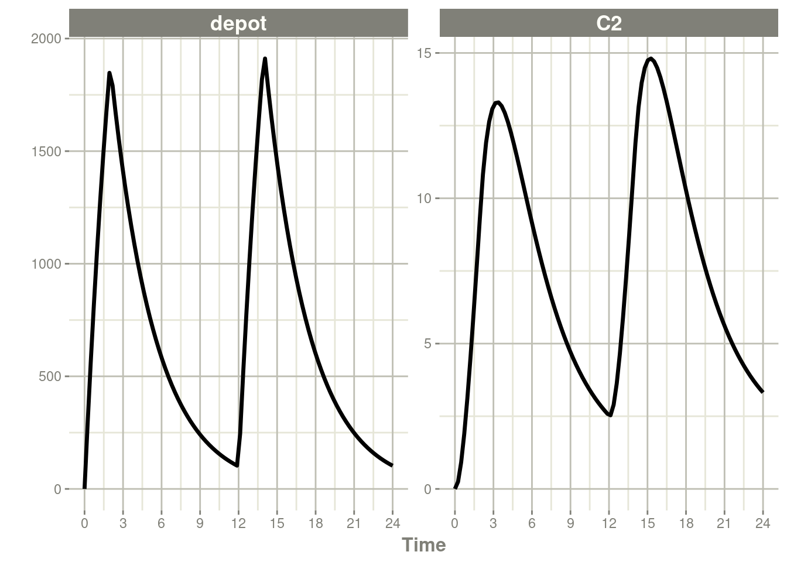
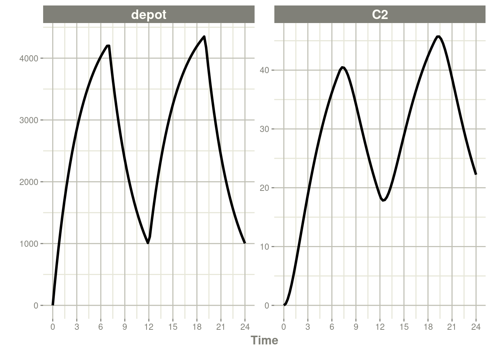
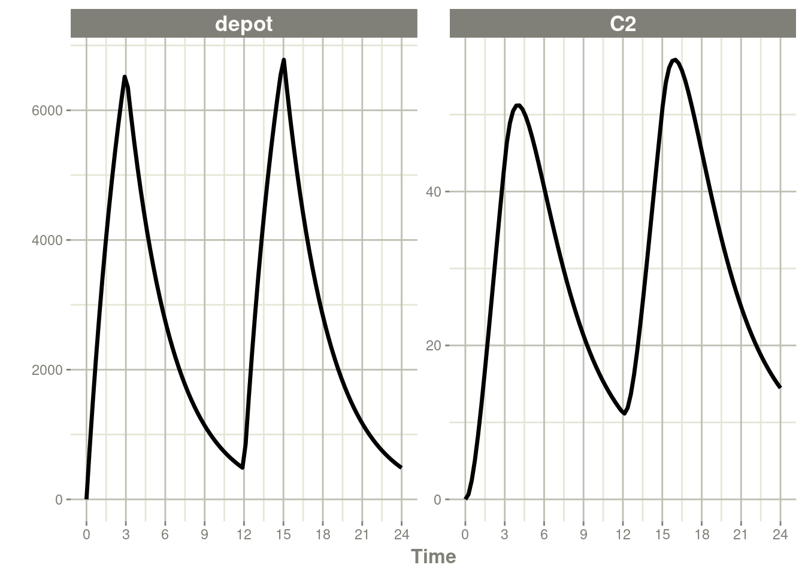
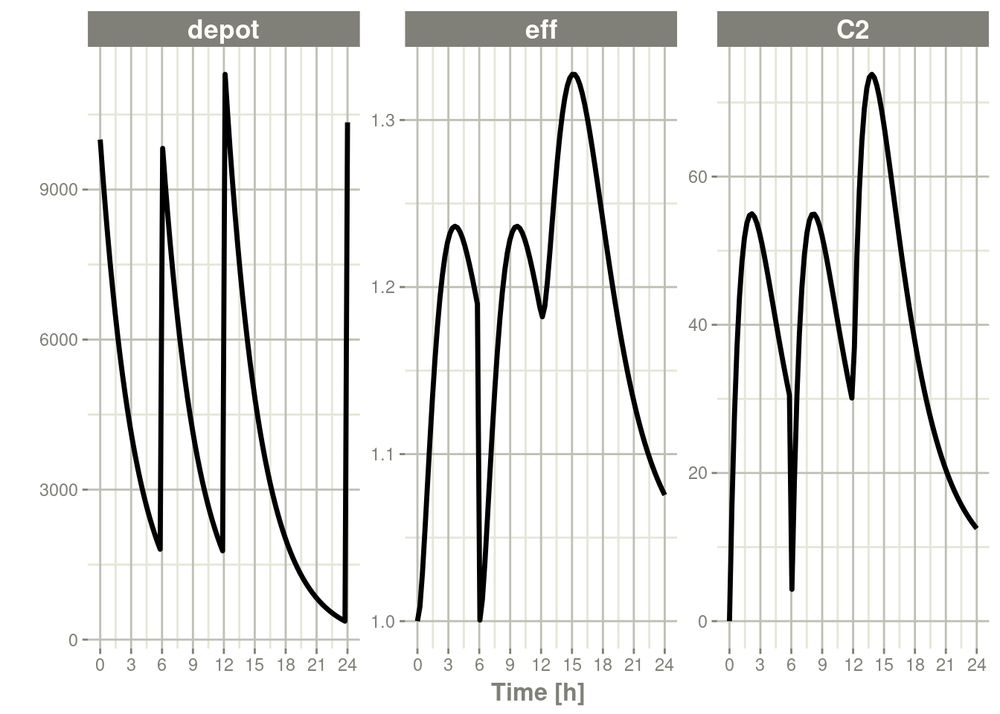

# 第七章rxode2事件

## 7.1rxode2事件表

通常，rxode2事件表格遵循NONMEM数据集约定，但有以下例外:

- 房室数据项(`cmt`)可以是包含房室名称的字符串/因子
  - 您可以关闭房室编号为负或“-cmt”的房室，其中cmt是房室的名称。
  - 房室数据项(`cmt`)仍然可以是数字，房室的数量由模型中房室名称的外观来定义。这可能很繁琐，所以您可以通过在模型开始时使用`cmt(cmtName`)来更容易地指定房室编号。
- 额外的一列，`dur`可指定输注持续的时长;
  - 生物利用度的变化将会改变输注速率`rate`，因为`dur`/`amt`在输入数据中是固定的。
  - 类似地，当为输注指定`rate`/`amt`时，由于`rate`/`amt`在输入数据中是固定的，因此生物利用度将改变输液持续时间`dur`。
- 一些不常见的NONMEM列不被rxode2支持，如:`pcmt`, `call`。
- 支持的nonmems风格的事件(0:观测Observation, 1: 给药Dose, 2: 其他Other, 3: 重置Reset, 4: 重置+给药Reset+Dose)。支持的其他事件:
  - `evid = 5`或替换事件;这会将用`AMT`列中指定的值替换房室的值。这等价于`deSolve`=`replace`。
  - `evid = 6`或倍增事件;这会将用`AMT`列中指定的值与房室的值相乘。这等价于`deSolve`=`multiply`。
  - `evid = 7`或者转移室模型/幻影事件。这将给药放入`dose()`函数中，并计算自上次给药以来的时间`tad()`，但实际上并没有将给药放入房室。这使得transit()函数可以很容易地应用于房室。

在数据表中以下的条目是合法的:

| 数据条目 | 意义               | 备注                                                         |
| -------- | ------------------ | ------------------------------------------------------------ |
| iid      | 个体的标识符       | 可以是整数、因子、字符还是数字                               |
| time     | 个体的时间         | 每个时间都是数字                                             |
| amt      | 给药药量           | 给药时值应为正数，观测时值应为0或NA                          |
| rate     | 输注速度           | 当指定此项时，输注时长dur=amt/rate                           |
|          |                    | 当rate=-1，给药使用速率参数化;当rate=-2，给药使用持续时长参数化 |
| dur      | 输注持续的时长     | 当指定此项时，输注速率rate=amt/dur                           |
| evid     | 事件标识符         | 0=观察;1=给药;2=其他;3=重置;4=重置+给药;5=替换;6=倍数;7=转移室 |
| cmt      | 房室               | 表示给药或观测事件所处的房室的名称                           |
| ss       | 稳态标志           | 0=非稳态;1=稳定状态;2=稳态+先前状态                          |
| ii       | 给药间隔           | 给药之间的间隔时间。                                         |
| addl     | 额外附加的给药次数 | 额外附件的与当前给药相同的给药次数。                         |

另外应注意:

- `evid`可以是经典的RxODE(描述[在这里](http://webtrans.yodao.com/server/webtrans/tranUrl?url=https%3A%2F%2Fnlmixr2.github.io%2Frxode2-manual%2Fevents.html%23classic-et&from=auto&to=auto&type=1&product=mdictweb&salt=1685712173380&sign=85e46ec8a62ae0e4e64dc44e6d513ddd))，或也可以是上面描述的`NONMEM`风格的`evid`。
- `NONMEM`的`DV`不是必需的;`rxode2`是一个ODE求解框架。
- `NONMEM`的`形状`不是必需的，因为它是在`EVID`。
- rxode2它可以接受`deSolve`兼容的数据框，而不是`NONMEM`-兼容的数据，。

当返回rxode2已求解的数据集时，根据求解器选项，您可能会看到一些额外的事件id (EVID):

- `EVID = -1`输注速率参数化，输注结束的时间(对应于`rate= -1`【译者注：见7.3节】）
- `EVID = -2`输注持续时长参数化，输注结束的时间(对应于`rate= -2`【译者注：见7.3节】）
- `EVID = -10`当指定零级输注速率时，输注速率结束的时间(对应于`rate> 0`【译者注：见7.3节】）
- `EVID = -20`当指定零级输注速率时，输注持续时长结束的时间(对应于`Dur > 0`【译者注：见7.3节】）
- `Evid = 101,102,103，…`这些对应于`1`，`2`，`3`模型事件时间(`mtime`）.

这些只能在使用adddose =TRUE和subsetNonmem=FALSE选项组合进行求解时访问。如果你想看到同经典的EVID等价的，你可以使用adddose =NA。

为了说明事件类型，我们将使用rxode2中原始的教程中的模型用于举例。

```R
library(rxode2)
### Model from rxode2 tutorial
m1 <- rxode({
KA =2.94E-01;
CL =1.86E+01;
V2 =4.02E+01;
Q =1.05E+01;
V3 =2.97E+02;
Kin=1;
Kout =1;
EC50 =200;
    ### Added modeled bioavaiblity, duration and rate
    fdepot = 1;
    durDepot = 8;
    rateDepot = 1250;
    C2 = centr/V2;
    C3 = peri/V3;
    d/dt(depot) =-KA*depot;
    f(depot) = fdepot
    dur(depot) = durDepot
    rate(depot) = rateDepot
    d/dt(centr) = KA*depot - CL*C2 - Q*C2 + Q*C3;
    d/dt(peri)  =                    Q*C2 - Q*C3;
    d/dt(eff)  = Kin - Kout*(1-C2/(EC50+C2))*eff;
    eff(0) = 1
});
```

## 7.2单次给药/额外附加的给药

单次给药是rxode2中默认的给药类型，仅需要提供`amt`/`dose`。请注意，这使用了rxode2事件表中描述的便利函数et()

```R
ev <- et(timeUnits="hr") %>%
    et(amt=10000, ii=12,until=24) %>%
    et(seq(0, 24, length.out=100))

ev
```

```R
#> ── EventTable with 101 records ──
#> 1 dosing records (see x$get.dosing(); add with add.dosing
#> or et)
#> 100 observation times (see x$get.sampling(); add with
#> add.sampling or et)
#> multiple doses in `addl` columns, expand with x$expand();
#> or etExpand(x)
#> ── First part of x: ──
#> # A tibble: 101 × 5
#>     time   amt  ii  addl evid         
#>      [h] <dbl> [h] <int> <evid>       
#>  1 0        NA  NA    NA 0:Observation
#>  2 0     10000  12     2 1:Dose (Add) 
#>  3 0.242    NA  NA    NA 0:Observation
#>  4 0.485    NA  NA    NA 0:Observation
#>  5 0.727    NA  NA    NA 0:Observation
#>  6 0.970    NA  NA    NA 0:Observation
#>  7 1.21     NA  NA    NA 0:Observation
#>  8 1.45     NA  NA    NA 0:Observation
#>  9 1.70     NA  NA    NA 0:Observation
#> 10 1.94     NA  NA    NA 0:Observation
#> # … with 91 more rows
```

【译者注：因为上面的代码全是输出的注释，所以虽然是代码，这次也对上述内容进行下翻译，并同时提供翻译和未翻译版，便于读者理解，下文为对上文代码的翻译】

```R
#>── 事件表，其中包含有101条记录 ──
#>1个给药记录(参见x$get.dosing();可使用add.dosing
#>或et添加)
#>100次观测(参见x$get.samping();可使用add.Samples
#>或et添加)
#>addl列中的多次给药，可使用x$Expand()展开;
#>或etExpand(X)
#>── 第一部分 关于x： ──
#>
#A Tibble：101×5
#>  时间    药量     给药间隔 附加给药次数 事件标志
#>  [h]   <dbl>    [h]     <int>     <evid>
#>1 0        NA    NA      NA        0：观测
#>2 0     10000    12      2         1：给药(及额外附加)
#>3 0.242    NA    NA      NA        0：观测
#>4 0.485    NA    NA      NA        0：观测
#>5 0.727    NA    NA      NA        0：观测
#>6 0.970    NA    NA      NA        0：观测
#>7 1.21     NA    NA      NA        0：观测
#>8 1.45     NA    NA      NA        0：观测
#>9 1.70     NA    NA      NA        0：观测
#>10 1.94     NA    NA      NA        0：观测
#>
#…后续还有了91行输出内容
```


```R
rxSolve(m1, ev) %>% plot(C2) +
    xlab("Time")
```


## 7.3输注给药

rxode2支持几种不同类型的输注实现形式:

- 已知输注速率的输注(`rate`）【译者注：常见于已知道输注速率的静脉输液;此时应在事件表中给出`rate`，并且`rate`的值应大于0】

- 已知输注时长的输注(`dur`）【译者注：常见于已知道输注持续时长的静脉输液;此时应在事件表中给出`dur`，并且`dur`的值应大于0】

- 需要估计输注速率的输注(零级速率吸收)【译者注：常见于将吸收处理为零级速率吸收，并需要估计吸收的零级速率常数;此时应在事件表中给出`rate`，并且`rate`的值应为`-1`】

- 需要估计输注时长的输注(零级速率吸收)【译者注：常见于将吸收处理为零级速率吸收，并需要估计吸收的持续的时长;此时应在事件表中给出`rate`，并且`rate`的值应为`-2`】

【译者注：对于0级速率吸收，模型参数化时存在4种形式，对应上述的4中实现形式：1人为可以控制的0级吸收（比如静脉输液），并且在数据中给出吸收速率;2人为可以控制的0级吸收（比如静脉输液），并且在数据中给出吸收持续的时长;3被近似认为是0级速率吸收，但仅知道药量，并需要估计吸收的0级速率常数;4被近似认为是0级速率吸收，但仅知道药量，并需要估计吸收持续的时长;】

### 7.3.1已知输注速率或输注时长的输注

下一种类型的事件是输注入;有两种方法可以指定输注;第一种是`dur`关键字。

一个例子是:

```R
ev <- et(timeUnits="hr") %>%
    et(amt=10000, ii=12,until=24, dur=8) %>%
    et(seq(0, 24, length.out=100))

ev
```

```R
#> ── EventTable with 101 records ──
#> 1 dosing records (see x$get.dosing(); add with add.dosing
#> or et)
#> 100 observation times (see x$get.sampling(); add with
#> add.sampling or et)
#> multiple doses in `addl` columns, expand with x$expand();
#> or etExpand(x)
#> ── First part of x: ──
#> # A tibble: 101 × 6
#>     time   amt  ii  addl evid          dur
#>      [h] <dbl> [h] <int> <evid>        [h]
#>  1 0        NA  NA    NA 0:Observation  NA
#>  2 0     10000  12     2 1:Dose (Add)    8
#>  3 0.242    NA  NA    NA 0:Observation  NA
#>  4 0.485    NA  NA    NA 0:Observation  NA
#>  5 0.727    NA  NA    NA 0:Observation  NA
#>  6 0.970    NA  NA    NA 0:Observation  NA
#>  7 1.21     NA  NA    NA 0:Observation  NA
#>  8 1.45     NA  NA    NA 0:Observation  NA
#>  9 1.70     NA  NA    NA 0:Observation  NA
#> 10 1.94     NA  NA    NA 0:Observation  NA
#> # … with 91 more rows
```

【译者注：因为上面的代码全是输出的注释，所以虽然是代码，这次也对上述内容进行下翻译，并同时提供翻译和未翻译版，便于读者理解，下文为对上文代码的翻译】

```R
#>── 事件表，其中包含有101条记录 ──
#>1个给药记录(参见x$get.dosing();可使用add.dosing
#>或et添加)
#>100次观测(参见x$get.samping();可使用add.Samples
#>或et添加)
#>addl列中的多次给药，可使用x$Expand()展开;
#>或etExpand(X)
#>── 第一部分 关于x： ──
#>
#A Tibble：101×6
#>  时间    药量     给药间隔 附加给药次数 事件标志       输注时长
#>  [h]   <dbl>    [h]     <int>     <evid>           [h]
#>1 0        NA    NA      NA        0：观测           NA
#>2 0     10000    12      2         1：给药(及额外附加) 8
#>3 0.242    NA    NA      NA        0：观测           NA
#>4 0.485    NA    NA      NA        0：观测           NA
#>5 0.727    NA    NA      NA        0：观测           NA
#>6 0.970    NA    NA      NA        0：观测           NA
#>7 1.21     NA    NA      NA        0：观测           NA
#>8 1.45     NA    NA      NA        0：观测           NA
#>9 1.70     NA    NA      NA        0：观测           NA
#>10 1.94     NA    NA      NA        0：观测           NA
#…后续还有了91行输出内容
```

```R
rxSolve(m1, ev) %>% plot(depot, C2) +
    xlab("Time")
```



另一种，它也可以由`rate`组件指定:

```R
ev <- et(timeUnits="hr") %>%
    et(amt=10000, ii=12,until=24, rate=10000/8) %>%
    et(seq(0, 24, length.out=100))

ev
```

```R
#> ── EventTable with 101 records ──
#> 1 dosing records (see x$get.dosing(); add with add.dosing
#> or et)
#> 100 observation times (see x$get.sampling(); add with
#> add.sampling or et)
#> multiple doses in `addl` columns, expand with x$expand();
#> or etExpand(x)
#> ── First part of x: ──
#> # A tibble: 101 × 6
#>     time   amt rate        ii  addl evid         
#>      [h] <dbl> <rate/dur> [h] <int> <evid>       
#>  1 0        NA NA          NA    NA 0:Observation
#>  2 0     10000  1250       12     2 1:Dose (Add) 
#>  3 0.242    NA NA          NA    NA 0:Observation
#>  4 0.485    NA NA          NA    NA 0:Observation
#>  5 0.727    NA NA          NA    NA 0:Observation
#>  6 0.970    NA NA          NA    NA 0:Observation
#>  7 1.21     NA NA          NA    NA 0:Observation
#>  8 1.45     NA NA          NA    NA 0:Observation
#>  9 1.70     NA NA          NA    NA 0:Observation
#> 10 1.94     NA NA          NA    NA 0:Observation
#> # … with 91 more rows
```

【译者注：因为上面的代码全是输出的注释，所以虽然是代码，这次也对上述内容进行下翻译，并同时提供翻译和未翻译版，便于读者理解，下文为对上文代码的翻译】

```R
#>── 事件表，其中包含有101条记录 ──
#>1个给药记录(参见x$get.dosing();可使用add.dosing
#>或et添加)
#>100次观测(参见x$get.samping();可使用add.Samples
#>或et添加)
#>addl列中的多次给药，可使用x$Expand()展开;
#>或etExpand(X)
#>── 第一部分 关于x： ──
#>
#A Tibble：101×6
#>  时间    药量 速率        给药间隔 附加给药次数 事件标志
#>  [h]   <dbl> <rate/dur> [h]     <int>     <evid>           
#>1 0        NA NA         NA      NA        0：观测           
#>2 0     10000 1250       12      2         1：给药(及额外附加)
#>3 0.242    NA NA         NA      NA        0：观测           
#>4 0.485    NA NA         NA      NA        0：观测           
#>5 0.727    NA NA         NA      NA        0：观测           
#>6 0.970    NA NA         NA      NA        0：观测           
#>7 1.21     NA NA         NA      NA        0：观测           
#>8 1.45     NA NA         NA      NA        0：观测           
#>9 1.70     NA NA         NA      NA        0：观测           
#>10 1.94     NA NA          NA      NA        0：观测          
#…后续还有了91行输出内容
```

```R
rxSolve(m1, ev) %>% plot(depot, C2) +
    xlab("Time")
```


上述两种实现方式是相同的，除了生物利用度如何输注改变之外。

在使用`rate`建模的情况下，当生物利用度减小，输注时长也会减小，这与在NONMEM中一样。例如:

```R
rxSolve(m1, ev, c(fdepot=0.25)) %>% plot(depot, C2) +
    xlab("Time")
```



同样，当增加生物利用度时，输注时长也会增加。

```R
rxSolve(m1, ev, c(fdepot=1.25)) %>% plot(depot, C2) +
    xlab("Time")
```


这种行为的基本原理是，`rate`和`amt`是由事件表指定的，因此，随着生物利用度的增加，唯一可以改变的是输注的持续时间。

与指定`rate`类似，如果您在事件表中指定amt和dur组件，生物利用度变化也会影响输注速率`rate`。

```R
ev <- et(timeUnits="hr") %>%
    et(amt=10000, ii=12,until=24, dur=8) %>%
    et(seq(0, 24, length.out=100))
```

你可以在下面的图中看到，生物利用度变化对`rate`影响而不是对输注持续时长影响的对比:

```R
library(ggplot2)
library(patchwork)

p1 <- rxSolve(m1, ev, c(fdepot=1.25)) %>% plot(depot) +
    xlab("Time") + ylim(0,5000)

p2 <- rxSolve(m1, ev, c(fdepot=0.25)) %>% plot(depot) +
    xlab("Time")+ ylim(0,5000)

### Use patchwork syntax to combine plots
p1 * p2
```


### 7.3.2需要估计输注时长或输注速率的输注(零级速率吸收)

您可以对输注持续时长进行建模，这相当于NONMEM的`rate=-2`。

```R
ev <- et(timeUnits="hr") %>%
    et(amt=10000, ii=12,until=24, rate=-2) %>%
    et(seq(0, 24, length.out=100))

ev
```
```R
#> ── EventTable with 101 records ──
#> 1 dosing records (see x$get.dosing(); add with add.dosing
#> or et)
#> 100 observation times (see x$get.sampling(); add with
#> add.sampling or et)
#> multiple doses in `addl` columns, expand with x$expand();
#> or etExpand(x)
#> ── First part of x: ──
#> # A tibble: 101 × 6
#>     time   amt rate        ii  addl evid         
#>      [h] <dbl> <rate/dur> [h] <int> <evid>       
#>  1 0        NA NA          NA    NA 0:Observation
#>  2 0     10000 -2:dur      12     2 1:Dose (Add) 
#>  3 0.242    NA NA          NA    NA 0:Observation
#>  4 0.485    NA NA          NA    NA 0:Observation
#>  5 0.727    NA NA          NA    NA 0:Observation
#>  6 0.970    NA NA          NA    NA 0:Observation
#>  7 1.21     NA NA          NA    NA 0:Observation
#>  8 1.45     NA NA          NA    NA 0:Observation
#>  9 1.70     NA NA          NA    NA 0:Observation
#> 10 1.94     NA NA          NA    NA 0:Observation
#> # … with 91 more rows
```

【译者注：因为上面的代码全是输出的注释，所以虽然是代码，这次也对上述内容进行下翻译，并同时提供翻译和未翻译版，便于读者理解，下文为对上文代码的翻译】

```R
#>── 事件表，其中包含有101条记录 ──
#>1个给药记录(参见x$get.dosing();可使用add.dosing
#>或et添加)
#>100次观测(参见x$get.samping();可使用add.Samples
#>或et添加)
#>addl列中的多次给药，可使用x$Expand()展开;
#>或etExpand(X)
#>── 第一部分 关于x： ──
#>
#A Tibble：101×6
#>  时间    药量 速率        给药间隔 附加给药次数 事件标志
#>  [h]   <dbl> <rate/dur> [h]     <int>     <evid>           
#>1 0        NA NA         NA      NA        0：观测           
#>2 0     10000 -2:dur     12      2         1：给药(及额外附加)
#>3 0.242    NA NA         NA      NA        0：观测           
#>4 0.485    NA NA         NA      NA        0：观测           
#>5 0.727    NA NA         NA      NA        0：观测           
#>6 0.970    NA NA         NA      NA        0：观测           
#>7 1.21     NA NA         NA      NA        0：观测           
#>8 1.45     NA NA         NA      NA        0：观测           
#>9 1.70     NA NA         NA      NA        0：观测           
#>10 1.94     NA NA          NA      NA        0：观测          
#…后续还有了91行输出内容
```

```R
rxSolve(m1, ev, c(durDepot=7)) %>% plot(depot, C2) +
    xlab("Time")
```



同样，您也可以对吸收速率进行建模。这相当于NONMEM的`rate=-1`，也是在rxode2的事件表中指定数据项的方式。

```R
ev <- et(timeUnits="hr") %>%
    et(amt=10000, ii=12,until=24, rate=-1) %>%
    et(seq(0, 24, length.out=100))

ev
```

```R
#> ── EventTable with 101 records ──
#> 1 dosing records (see x$get.dosing(); add with add.dosing
#> or et)
#> 100 observation times (see x$get.sampling(); add with
#> add.sampling or et)
#> multiple doses in `addl` columns, expand with x$expand();
#> or etExpand(x)
#> ── First part of x: ──
#> # A tibble: 101 × 6
#>     time   amt rate        ii  addl evid         
#>      [h] <dbl> <rate/dur> [h] <int> <evid>       
#>  1 0        NA NA          NA    NA 0:Observation
#>  2 0     10000 -1:rate     12     2 1:Dose (Add) 
#>  3 0.242    NA NA          NA    NA 0:Observation
#>  4 0.485    NA NA          NA    NA 0:Observation
#>  5 0.727    NA NA          NA    NA 0:Observation
#>  6 0.970    NA NA          NA    NA 0:Observation
#>  7 1.21     NA NA          NA    NA 0:Observation
#>  8 1.45     NA NA          NA    NA 0:Observation
#>  9 1.70     NA NA          NA    NA 0:Observation
#> 10 1.94     NA NA          NA    NA 0:Observation
#> # … with 91 more rows
```

【译者注：因为上面的代码全是输出的注释，所以虽然是代码，这次也对上述内容进行下翻译，并同时提供翻译和未翻译版，便于读者理解，下文为对上文代码的翻译】

```R
#>── 事件表，其中包含有101条记录 ──
#>1个给药记录(参见x$get.dosing();可使用add.dosing
#>或et添加)
#>100次观测(参见x$get.samping();可使用add.Samples
#>或et添加)
#>addl列中的多次给药，可使用x$Expand()展开;
#>或etExpand(X)
#>── 第一部分 关于x： ──
#>
#A Tibble：101×6
#>  时间    药量 速率        给药间隔 附加给药次数 事件标志
#>  [h]   <dbl> <rate/dur> [h]     <int>     <evid>           
#>1 0        NA NA         NA      NA        0：观测           
#>2 0     10000 -1:rate    12      2         1：给药(及额外附加)
#>3 0.242    NA NA         NA      NA        0：观测           
#>4 0.485    NA NA         NA      NA        0：观测           
#>5 0.727    NA NA         NA      NA        0：观测           
#>6 0.970    NA NA         NA      NA        0：观测           
#>7 1.21     NA NA         NA      NA        0：观测           
#>8 1.45     NA NA         NA      NA        0：观测           
#>9 1.70     NA NA         NA      NA        0：观测           
#>10 1.94     NA NA          NA      NA        0：观测          
#>
#…后续还有了91行输出内容
```

```R
rxSolve(m1, ev, c(rateDepot=10000/3)) %>% plot(depot, C2) +
    xlab("Time")
```



## 7.4稳态

以事件表中"给药"药量信息和“给出的给药间隔”信息重复足够多次给药直到稳态，然后基于稳态时的给药进行求解。【译者注：即到达稳态时的时间是事件表中SS=1时的时间，有关SS的进一步的中文解释可以见译者所著的Phoenix的[输入选项4 稳态 SS](https://s0521.github.io/cn/2019/07/%E8%BE%93%E5%85%A5%E9%80%89%E9%A1%B94-%E7%A8%B3%E6%80%81-ss/)一文】

```R
ev <- et(timeUnits="hr") %>%
    et(amt=10000, ii=12, ss=1) %>%
    et(seq(0, 24, length.out=100))

ev
```

```R
#> ── EventTable with 101 records ──
#> 1 dosing records (see x$get.dosing(); add with add.dosing
#> or et)
#> 100 observation times (see x$get.sampling(); add with
#> add.sampling or et)
#> ── First part of x: ──
#> # A tibble: 101 × 5
#>     time   amt  ii evid             ss
#>      [h] <dbl> [h] <evid>        <int>
#>  1 0        NA  NA 0:Observation    NA
#>  2 0     10000  12 1:Dose (Add)      1
#>  3 0.242    NA  NA 0:Observation    NA
#>  4 0.485    NA  NA 0:Observation    NA
#>  5 0.727    NA  NA 0:Observation    NA
#>  6 0.970    NA  NA 0:Observation    NA
#>  7 1.21     NA  NA 0:Observation    NA
#>  8 1.45     NA  NA 0:Observation    NA
#>  9 1.70     NA  NA 0:Observation    NA
#> 10 1.94     NA  NA 0:Observation    NA
#> # … with 91 more rows
```

【译者注：因为上面的代码全是输出的注释，所以虽然是代码，这次也对上述内容进行下翻译，并同时提供翻译和未翻译版，便于读者理解，下文为对上文代码的翻译】

```R
#>── 事件表，其中包含有101条记录 ──
#>1个给药记录(参见x$get.dosing();可使用add.dosing
#>或et添加)
#>100次观测(参见x$get.samping();可使用add.Samples
#>或et添加)
#>addl列中的多次给药，可使用x$Expand()展开;
#>或etExpand(X)
#>── 第一部分 关于x： ──
#>
#A Tibble：101×6
#>  时间    药量     给药间隔 附加给药次数 事件标志          稳态
#>  [h]   <dbl>    [h]     <int>     <evid>           <int> 
#> 1 0        NA    NA      NA        0：观测           NA
#> 2 0     10000    12      2         1：给药(及额外附加) 1
#> 3 0.242    NA    NA      NA        0：观测           NA
#> 4 0.485    NA    NA      NA        0：观测           NA
#> 5 0.727    NA    NA      NA        0：观测           NA
#> 6 0.970    NA    NA      NA        0：观测           NA
#> 7 1.21     NA    NA      NA        0：观测           NA
#> 8 1.45     NA    NA      NA        0：观测           NA
#> 9 1.70     NA    NA      NA        0：观测           NA
#>10 1.94     NA    NA      NA        0：观测           NA
#…后续还有了91行输出内容
```

```R
rxSolve(m1, ev) %>% plot(C2)
```


### 7.4.1复杂加药的稳定状态

通过使用`ss=2`标志，您可以使用类似”早上100 mg vs晚上150 mg“这样的不太规整的给药方案【译者注：吐槽，原文使用nonstandard dosing(非标准给药)容此给药方案，但这种给药方案在临床挺"标准"的，仅仅是有些嵌套而已，这种嵌套给基于NCA的PK参数带来了些麻烦，估计作者是因此将此种方案定义为不标准;所以我基于我的上述理由将此翻译为不太规整，以此来表达原文作者想表达含义】基于线性动力学中的超定位原理(super-positioning)【译者注：没见过其他人在药动学中提到此词，我猜作者可能是想说线性药动学的线性叠加原理】到达稳态。这是通过:

- 保存所有状态值
- 重置所有状态，求解系统至稳态
- 将所有先前的状态值加回来

```R
ev <- et(timeUnits="hr") %>%
    et(amt=10000, ii=24, ss=1) %>%
    et(time=12, amt=15000, ii=24, ss=2) %>%
    et(time=24, amt=10000, ii=24, addl=3) %>%
    et(time=36, amt=15000, ii=24, addl=3) %>%
    et(seq(0, 64, length.out=500))

library(ggplot2)

rxSolve(m1, ev,maxsteps=10000) %>% plot(C2) +
  annotate("rect", xmin=0, xmax=24, ymin=-Inf, ymax=Inf,
           alpha=0.2) +
  annotate("text", x=12.5, y=7,
           label="Initial Steady State Period") +
  annotate("text", x=44,   y=7,
           label="Steady State AM/PM dosing")
```


你可以看到，它需要一个完整的给药周期才能达到真正的复杂给药方案的稳态【译者注：此时到达稳态时的时间还是事件表中SS=1时的时间，Phoenix实现此类给药方案到达稳态的方式与此有些略微差异，是将SS=1和SS=2的信息卸载一行中的不同列并且SS=1，有关SS的进一步的中文解释可以见译者所著的Phoenix的[输入选项4 稳态 SS](https://s0521.github.io/cn/2019/07/%E8%BE%93%E5%85%A5%E9%80%89%E9%A1%B94-%E7%A8%B3%E6%80%81-ss/)一文】。

### 7.4.2输注或零阶吸收过程的稳态

`rxode2`支持的最后一种稳态是恒定输注速率数值直到输注到达稳态。这可以用与NONMEM相同的方式指定，即:

- 没有给药间间隔时间`ii`=`0`
- 稳态标识`ss`=`1`
- 输入已知的输注速率(此时事件表汇中`rate`>0)，或估计输注速率(此时`rate`=`-1`)。
- 药量为零`amt`=`0`
- 一旦达到稳态恒定输注，使用此记录时将关闭输注，就像NONMEM一样。

请注意，我们为模型指定输注持续时长的`rate`=`-2`没有多大意义，因为我们是在求解输注直到稳定状态。输注持续时长由稳态解指定。

还需要注意的是，这种输注至稳态的生物利用度变化也没有意义，因为它们既没有改变稳态输注的速率，也没有改变输注的持续时长。因此，这种给药事件的生物利用度参数化被忽略。

下面是一个例子:

```R
ev <- et(timeUnits="hr") %>%
    et(amt=0, ss=1,rate=10000/8)

p1 <- rxSolve(m1, ev) %>% plot(C2, eff)


ev <- et(timeUnits="hr") %>%
    et(amt=200000, rate=10000/8) %>%
    et(0, 250, length.out=1000)

p2 <- rxSolve(m1, ev) %>% plot(C2, eff)

library(patchwork)

p1 / p2
```


这不仅可以用于PK，也可以用于疾病过程的稳态。

## 7.5重置事件

重置事件通过`evid=3`或`evid= reset`实现，对于同时reset和dose, 由`evid=4`实现。

```R
ev <- et(timeUnits="hr") %>%
    et(amt=10000, ii=12, addl=3) %>%
    et(time=6, evid=reset) %>%
    et(seq(0, 24, length.out=100))

ev
```

```R
#> ── EventTable with 102 records ──
#> 2 dosing records (see x$get.dosing(); add with add.dosing
#> or et)
#> 100 observation times (see x$get.sampling(); add with
#> add.sampling or et)
#> multiple doses in `addl` columns, expand with x$expand();
#> or etExpand(x)
#> ── First part of x: ──
#> # A tibble: 102 × 5
#>     time   amt  ii  addl evid         
#>      [h] <dbl> [h] <int> <evid>       
#>  1 0        NA  NA    NA 0:Observation
#>  2 0     10000  12     3 1:Dose (Add) 
#>  3 0.242    NA  NA    NA 0:Observation
#>  4 0.485    NA  NA    NA 0:Observation
#>  5 0.727    NA  NA    NA 0:Observation
#>  6 0.970    NA  NA    NA 0:Observation
#>  7 1.21     NA  NA    NA 0:Observation
#>  8 1.45     NA  NA    NA 0:Observation
#>  9 1.70     NA  NA    NA 0:Observation
#> 10 1.94     NA  NA    NA 0:Observation
#> # … with 92 more rows
```

【译者注：因为上面的代码全是输出的注释，所以虽然是代码，这次也对上述内容进行下翻译，并同时提供翻译和未翻译版，便于读者理解，下文为对上文代码的翻译】

```R
#>── 事件表，其中包含有102条记录 ──
#>2个给药记录(参见x$get.dosing();可使用add.dosing
#>或et添加)
#>100次观测(参见x$get.samping();可使用add.Samples
#>或et添加)
#>addl列中的多次给药，可使用x$Expand()展开;
#>或etExpand(X)
#>── 第一部分 关于x： ──
#>
#A Tibble：102×5
#>  时间    药量     给药间隔 附加给药次数 事件标志
#>  [h]   <dbl>    [h]     <int>     <evid> 
#> 1 0        NA    NA      NA        0：观测
#> 2 0     10000    12      3         1：给药(及额外附加)
#> 3 0.242    NA    NA      NA        0：观测
#> 4 0.485    NA    NA      NA        0：观测
#> 5 0.727    NA    NA      NA        0：观测
#> 6 0.970    NA    NA      NA        0：观测
#> 7 1.21     NA    NA      NA        0：观测
#> 8 1.45     NA    NA      NA        0：观测
#> 9 1.70     NA    NA      NA        0：观测
#>10 1.94     NA    NA      NA        0：观测
#…后续还有了92行输出内容
```

求解器显示了当系统在给药后6小时重置时，系统中发生的情况。

```R
rxSolve(m1, ev) %>% plot(depot,C2, eff)
```


您可以看到所有房室都被重置为初始值。在下一次给药时开始给药的循环周期。

```R
ev <- et(timeUnits="hr") %>%
    et(amt=10000, ii=12, addl=3) %>%
    et(time=6, amt=10000, evid=4) %>%
    et(seq(0, 24, length.out=100))

ev
```

```R
#> ── EventTable with 102 records ──
#> 2 dosing records (see x$get.dosing(); add with add.dosing
#> or et)
#> 100 observation times (see x$get.sampling(); add with
#> add.sampling or et)
#> multiple doses in `addl` columns, expand with x$expand();
#> or etExpand(x)
#> ── First part of x: ──
#> # A tibble: 102 × 5
#>     time   amt  ii  addl evid         
#>      [h] <dbl> [h] <int> <evid>       
#>  1 0        NA  NA    NA 0:Observation
#>  2 0     10000  12     3 1:Dose (Add) 
#>  3 0.242    NA  NA    NA 0:Observation
#>  4 0.485    NA  NA    NA 0:Observation
#>  5 0.727    NA  NA    NA 0:Observation
#>  6 0.970    NA  NA    NA 0:Observation
#>  7 1.21     NA  NA    NA 0:Observation
#>  8 1.45     NA  NA    NA 0:Observation
#>  9 1.70     NA  NA    NA 0:Observation
#> 10 1.94     NA  NA    NA 0:Observation
#> # … with 92 more rows
```

【译者注：因为上面的代码全是输出的注释，所以虽然是代码，这次也对上述内容进行下翻译，并同时提供翻译和未翻译版，便于读者理解，下文为对上文代码的翻译】

```R
#>── 事件表，其中包含有102条记录 ──
#>2个给药记录(参见x$get.dosing();可使用add.dosing
#>或et添加)
#>100次观测(参见x$get.samping();可使用add.Samples
#>或et添加)
#>addl列中的多次给药，可使用x$Expand()展开;
#>或etExpand(X)
#>── 第一部分 关于x： ──
#>
#A Tibble：102×5
#>  时间    药量     给药间隔 附加给药次数 事件标志
#>  [h]   <dbl>    [h]     <int>     <evid> 
#> 1 0        NA    NA      NA        0：观测
#> 2 0     10000    12      3         1：给药(及额外附加)
#> 3 0.242    NA    NA      NA        0：观测
#> 4 0.485    NA    NA      NA        0：观测
#> 5 0.727    NA    NA      NA        0：观测
#> 6 0.970    NA    NA      NA        0：观测
#> 7 1.21     NA    NA      NA        0：观测
#> 8 1.45     NA    NA      NA        0：观测
#> 9 1.70     NA    NA      NA        0：观测
#>10 1.94     NA    NA      NA        0：观测
#…后续还有了92行输出内容
```

在这种情况下，整个系统被重置并在重置时发生给药。

```R
rxSolve(m1, ev) %>% plot(depot,C2, eff)
```



## 7.6关闭房室

您也可以关闭一个房室，这类似于重置事件。

```R
ev <- et(timeUnits="hr") %>%
    et(amt=10000, ii=12, addl=3) %>%
    et(time=6, cmt="-depot", evid=2) %>%
    et(seq(0, 24, length.out=100))

ev
```

```R
#> ── EventTable with 102 records ──
#> 2 dosing records (see x$get.dosing(); add with add.dosing
#> or et)
#> 100 observation times (see x$get.sampling(); add with
#> add.sampling or et)
#> multiple doses in `addl` columns, expand with x$expand();
#> or etExpand(x)
#> ── First part of x: ──
#> # A tibble: 102 × 6
#>     time cmt         amt  ii  addl evid         
#>      [h] <chr>     <dbl> [h] <int> <evid>       
#>  1 0     (obs)        NA  NA    NA 0:Observation
#>  2 0     (default) 10000  12     3 1:Dose (Add) 
#>  3 0.242 (obs)        NA  NA    NA 0:Observation
#>  4 0.485 (obs)        NA  NA    NA 0:Observation
#>  5 0.727 (obs)        NA  NA    NA 0:Observation
#>  6 0.970 (obs)        NA  NA    NA 0:Observation
#>  7 1.21  (obs)        NA  NA    NA 0:Observation
#>  8 1.45  (obs)        NA  NA    NA 0:Observation
#>  9 1.70  (obs)        NA  NA    NA 0:Observation
#> 10 1.94  (obs)        NA  NA    NA 0:Observation
#> # … with 92 more rows
```

```R
#>── 事件表，其中包含有102条记录 ──
#>2个给药记录(参见x$get.dosing();可使用add.dosing
#>或et添加)
#>100次观测(参见x$get.samping();可使用add.Samples
#>或et添加)
#>addl列中的多次给药，可使用x$Expand()展开;
#>或etExpand(X)
#>── 第一部分 关于x： ──
#>
#A Tibble：102×6
#>  时间   cmt        药量     给药间隔 附加给药次数 事件标志
#>  [h]   <chr>     <dbl>    [h]     <int>     <evid> 
#> 1 0    (obs)        NA    NA      NA        0：观测
#> 2 0    (default) 10000    12      3         1：给药(及额外附加)
#> 3 0.242(obs)        NA    NA      NA        0：观测
#> 4 0.485(obs)        NA    NA      NA        0：观测
#> 5 0.727(obs)        NA    NA      NA        0：观测
#> 6 0.970(obs)        NA    NA      NA        0：观测
#> 7 1.21 (obs)        NA    NA      NA        0：观测
#> 8 1.45 (obs)        NA    NA      NA        0：观测
#> 9 1.70 (obs)        NA    NA      NA        0：观测
#>10 1.94 (obs)        NA    NA      NA        0：观测
#…后续还有了92行输出内容
```

求解器显示了这在系统中的作用:

```R
rxSolve(m1, ev) %>% plot(depot,C2, eff)
```


在这种情况下，depot房室关闭，depot房室中的浓度被设置为初始值，但其他房室浓度/水平不重置。当depot房室发生另一次给药时，depot房室重新打开。

请注意，对房室的给药只会对被给药的房室起作用。因此，如果你关闭eff房室，即使另一个房室depot房室发生给药后，eff房室会仍然继续关闭。

```R
ev <- et(timeUnits="hr") %>%
    et(amt=10000, ii=12, addl=3) %>%
    et(time=6, cmt="-eff", evid=2) %>%
    et(seq(0, 24, length.out=100))

rxSolve(m1, ev) %>% plot(depot,C2, eff)
```


要重新打开房室，需要对此房室进行一次药量为零的给药或与为此房室添加一个evid=2的记录。

```R
ev <- et(timeUnits="hr") %>%
    et(amt=10000, ii=12, addl=3) %>%
    et(time=6, cmt="-eff", evid=2) %>%
    et(time=12,cmt="eff",evid=2) %>%
    et(seq(0, 24, length.out=100))

rxSolve(m1, ev) %>% plot(depot,C2, eff)
```


## 7.7经典的rxode2事件

【译者注：由于rxode2还有前一代版本rxode，所以为了兼容性也支持前一代版本中的evid的编码方式，对于不了解前代前一代版本rxode读者，无需学习与了解此章节，跳过整个7.7章节即可。】

最初RxODE支持复合事件IDs;rxode2仍然支持这些参数，但使用常规的NONMEM数据集标准通常更有用，部分建模工具也使用该标准，如在rxode2类型文章中有描述到的NONMEM、Monolix和nlmixr。

通常，RxODE支持在下表中描述的单个事件id`evid`中进行事件编码。

| 100  + cmt | Infusion/Event  Flag          | 输注标志或事件标志 |
| ---------- | ----------------------------- | ------------------ |
| 100 + cmt  | 0 = bolus dose                | 0 =注入式给药      |
|            | 1 = infusion (rate)           | 1 =输注(速率)      |
|            | 2 = infusion (dur)            | 2 =输注(时长)      |
|            | 6 = turn off modeled duration | 6 =关闭输注时长    |
|            | 7 = turn off modeled rate     | 7 =关闭输注速率    |
|            | 8 = turn on modeled duration  | 8 =打开输注时长    |
|            | 9 = turn on modeled rate      | 9 =打开输注速率    |
|            | 4 = replace event             | 4 =替换事件        |
|            | 5 = multiply event            | 5 =倍数事件        |

| <  99 cmt | SS flag & Turning of  Compartment                          | SS标志和房室关闭                      |
| --------- | ---------------------------------------------------------- | ------------------------------------- |
| < 99 cmt  | 1 = dose                                                   | 1 =给药                               |
|           | 10 = Steady state 1 (equivalent to SS=1)                   | 10 =稳态1(相当于SS=1)                 |
|           | 20 = Steady state 2 (equivalent to SS=2)                   | 20 =稳态2(相当于SS=2)                 |
|           | 30 = Turn off a compartment (equivalent to -CMT  w/EVID=2) | 30 =关闭一个房室(相当于-CMT w/EVID=2) |

经典的EVID将上表中的数字连接起来，因此向1号房室的输注将是10101，向199号室的输注将是119901。

支持EVID= 0(观测)、EVID=2(其他类型事件)和EVID=3。在内部，EVID=9是一个非观测事件，确保系统初始化为零;EVID=9不能手动设置。EVID 10-99表示参数化模型的时间干预，类似于NONMEM的MTIME(model-event-times)。这与药量(amt)和时间列一起指定ODE系统中的事件。

对于指定的EVIDs > 100的输注，amt列表示速率值。

对于输注标志1和2 `+amt`打开输注到特定的房室-amt关闭输注到特定的房室。要指定给药/持续时长，请将给药记录放在持续时长开始或停止的时间。

对于使用输注速率/持续时长输注参数化的输注的标志，在输注喀什市标志之后必须有一个停止输注的记录。

这些数字连接在一起形成一个完整的RxODE事件ID，如下面的例子所示:

### 7.7.1使用经典RxODE的EVID设置注入给药示例

*在第0时刻给#1号房室注入100剂量*

| time | evid | amt  |
| ---- | ---- | ---- |
| 0    | 101  | 100  |
| 0.5  | 0    | 0    |
| 1    | 0    | 0    |

*在第0时刻给#99号房室注入100剂量*

| 时间 | evid | amt  |
| ---- | ---- | ---- |
| 0    | 9901 | 100  |
| 0.5  | 0    | 0    |
| 1    | 0    | 0    |

*在第0时刻给$199号房室注入100剂量*

| 时间 | evid   | amt  |
| ---- | ------ | ---- |
| 0    | 109901 | 100  |
| 0.5  | 0      | 0    |
| 1    | 0      | 0    |

### 7.7.2使用经典RxODE的EVID设置输注事件示例

对#1号房室以速率50输注1.5小时(使用生物利用度参数化时，生物利用度的变化会改变输注时长)

| time | evid  | amt  |
| ---- | ----- | ---- |
| 0    | 10101 | 50   |
| 0.5  | 0     | 0    |
| 1    | 0     | 0    |
| 1.5  | 10101 | -50  |

对#1号房室以速率50输注1.5小时(使用生物利用度参数化时，生物利用度的变化改变输注速率)

| time | evid  | amt  |
| ---- | ----- | ---- |
| 0    | 20101 | 50   |
| 0.5  | 0     | 0    |
| 1    | 0     | 0    |
| 1.5  | 20101 | -50  |

模型以输注速率参数化并且药量为50

| time | evid  | amt  |
| ---- | ----- | ---- |
| 0    | 90101 | 50   |
| 0    | 70101 | 50   |
| 0.5  | 0     | 0    |
| 1    | 0     | 0    |

模型以输注时长参数化并且药量为50

| time | evid  | amt  |
| ---- | ----- | ---- |
| 0    | 80101 | 50   |
| 0    | 60101 | 50   |
| 0.5  | 0     | 0    |
| 1    | 0     | 0    |

### 7.7.3使用经典RxODE的EVID设置稳态的例子

给药至#1号房室至达稳态

| time | evid | amt  |
| ---- | ---- | ---- |
| 0    | 110  | 50   |

am50 pm 100给药至#1号房室至达稳

| time | evid | amt  |
| ---- | ---- | ---- |
| 0    | 110  | 50   |
| 12   | 120  | 100  |

### 7.7.4使用经典RxODE的EVID关闭房室

在时间为12时关闭#1号房室

| time | evid | amt  |
| ---- | ---- | ---- |
| 0    | 110  | 50   |
| 12   | 130  | NA   |

在rxode2中的事件标识码被编码为单个事件编号evid。对于100以下的房室，编码如下:

- 对于观察事件的事件是`0`。
- 对于特定的房室，注入给药定义为:
  - 100*(房室号)+ 1
  - 捕获`amt`后给药
- 对于静脉注射【译者注：原文此处似乎笔误，此处应为静脉输注】给药，事件定义为:
  - 10000 + 100*(房室号)+ 1
  - 输注速率记录在`amt`列
  - 通过在输注停止时用相同的`EVID`减法`amt`来关闭输注。

对于大于或等于100的房室，100位及以上的数字被转移到第100,000位数字。对于第99个房室的给药，注入房室的给药evid是9901，输注方式的给药evid是19901。第199房室的剂量是109901。第199室的输液剂量记录为119901。

## 7.8rxode2 & nlmixr的数据集

输入nlmixr的数据与rxode2的数据输入类型相同，它与NONMEM的数据相似(大多数NONMEM就绪的数据集可以直接在nlmixr中使用)。

## 7.9按使用类型描述的列

### 7.9.1个体标识符列

受试者个体识别列将受试者个体分开以识别随机效应。

- `ID`:个体标识符，可以是整数、字符或因子。

### 7.9.2观测列

观察列用于指示因变量以及如何使用或测量它。

- `DV`:包含测量值的数字列
- `CENS`表示删失的数字列，如低于测定的定量下限。
- `LIMIT`一个数值列，用于帮助指示删失的类型，如低于测定的定量下限。
- `MDV`:`DV`值缺失的指示符
- `CMT`:房室的名称或编号
- `DVID`:因变量标识符
- `EVID`事件标识符

### 7.9.3给药列

- `AMT`:给药量的具体数值
- `CMT`:房室的名称或编号
- `EVID`:事件标识符
- `ADDL`:额外附加的给药的次数
- `RATE`或`DUR`剂量:给药的速率或持续时长

### 7.9.4协变量列

## 7.10特定数据集列的详细信息

下面的详细信息按列名的字母顺序排序。要按用途分组，请参阅上面的文档。

### 7.10.1 `AMT`列

AMT列定义了给药的药量。

对于观测行，它应该是`0`或`NA`。

对于给药行，它是给予`CMT`的给药量。如果给药为零阶速率(如恒定速率输注)，则可以使用`RATE`或`DUR`列设置输注。

### 7.10.2 `CENS`/`LIMIT`列

`CENS`列是指示是否发生删失的指示列。对于药代动力学建模，通常在样品低于定量下限时进行删失。在`rxode2`内部保存这些值，以便`nlmixr`可以在似然计算中使用它们。

CENS = 0表示测量DV值时未删失。

CENS = 1表示一个值是左删失(或低于定量下限)，DV中的值是删失/定量极限。

CENS = -1表示一个值是右删失(或超过定量上限)，DV中的值为删失/定量极限。

`LIMIT`是关于`nlmixr`如何处理删失的附加信息，也存储在`rxode2`的数据结构中。当一个值处于删失状态时，比如低于定量下限1，您可能还会认为该值高于某个阈值，比如零。在这种情况下，0表示截尾值在0到1之间。

简而言之:

CENS = 0，LIMIT被忽略，因为观测值未删失

CENS = 1，个体预测值在(LIMIT, DV)范围内

CENS = -1，个体预测值在(DV, LIMIT)范围内

### 7.10.3 `CMT`列

CMT列表示事件发生的房室。当作为字符串或因子(首选方法)给出时，它将根据模型中的名称进行匹配。当以整数形式给出时，它与模型中出现的房室顺序相匹配。

### 7.10.4 `DUR`列

DUR列定义了一次输注的持续时长。它用于设置零级输注速率的持续时间。

### 7.10.5 `DV`列

DV列表示当前房室(见CMT)中观测到的当前测量值，带有当前测量标识符(见DVID)，该列数值可能缺失(见MDV)或删失(见CENS)。

### 7.10.6 `DVID`列

待办事项【译者注：这是作者下写给自己的话，意思是这里他还没有撰写或者在代码中实现，有待于未来完成此事】

### 7.10.7 `EVID`列

EVID列是一行数据的事件标识符。

对于观测记录行，它将是0。对于常规给药记录，它将是1。在[rxode2事件类型](https://nlmixr2.github.io/rxode2/articles/rxode2-event-types.html)和[经典rxode事件](https://nlmixr2.github.io/rxode2/articles/rxode2-events-classic.html)插图中详细介绍了更多EVID值。

### 7.10.8 `ID`列

ID列是个体标识符。这一栏用于将个体(通常是单个人或动物)与另一个个体分开。

在模型中，ID列用于分离个体。数值积分器会为每个新个体重新初始化，并为所有随机效应选择新值。

### 7.10.9 `RaTE`列

待办事项【译者注：这是作者下写给自己的话，意思是这里他还没有撰写或者在代码中实现，有待于未来完成此事】