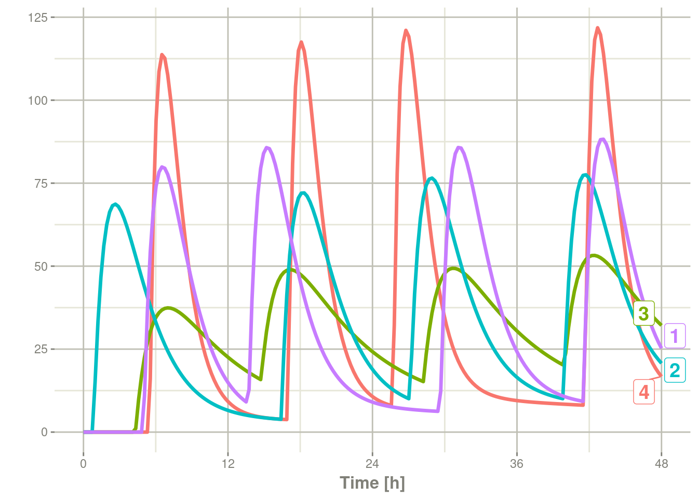
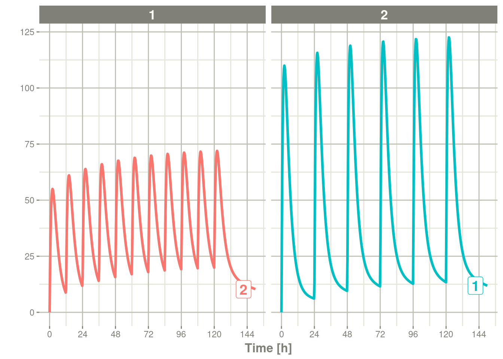
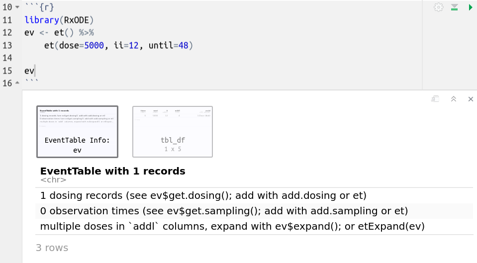

# 第八章轻松创建rxode2事件

rxode2中的事件表是一个专门的数据框，充当rxode2的所有事件和观测时间的容器。

要创建rxode2事件表，可以使用代码`eventTable()`， `et()`，甚至可以自己直接使用数据框创建事件表，自己直接使用数据框创建事件表时应确保其中包含正确事件信息。这与[rxode2支持的事件类型](https://nlmixr2.github.io/rxode2-manual/events.html#events)密切相关。

```R
library(rxode2)
library(units)
```

```r
#> udunits database from /usr/share/xml/udunits/udunits2.xml
```

```R
(ev <- eventTable())
```

```R
#> ── EventTable with 0 records ──
#> 0 dosing records (see x$get.dosing(); add with add.dosing
#> or et)
#> 0 observation times (see x$get.sampling(); add with
#> add.sampling or et)
```

或者

```R
(ev <- et())
```

```R
#> ── EventTable with 0 records ──
#> 0 dosing records (see x$get.dosing(); add with add.dosing
#> or et)
#> 0 observation times (see x$get.sampling(); add with
#> add.sampling or et)
```

使用此事件表，您可以通过管道或直接访问此事件表向其中添加采样/观测或给药记录。

下表列出了用于创建给药记录的两个主要函数

| add.dosing()函数 | et()函数 | 描述               |
| ---------------- | -------- | ------------------ |
| dose             | amt      | 给药的药量         |
| nbr.doses        | addl     | 额外附加的给药次数 |
| dosing.interval  | ii       | 给药间隔           |
| dosing.to        | cmt      | 给药房室           |
| rate             | rate     | 输注速率           |
| start.time       | time     | 给药开始时间       |
|                  | dur      | 输注持续是擦汗给你 |

采样时间可以通过`add.sampling(采样时间)`或 `et(采样时间)`添加。[给药时间窗和采样时间窗](https://nlmixr2.github.io/rxode2-manual/et.html#add-doses-and-samples-within-a-sampling-window)也是支持。

对于这些模型，我们可以使用rxode2教程中分享的模型来说明：

```R
## Model from rxode2 tutorial
m1 <-rxode2({
    KA=2.94E-01;
    CL=1.86E+01;
    V2=4.02E+01;
    Q=1.05E+01;
    V3=2.97E+02;
    Kin=1;
    Kout=1;
    EC50=200;
    ## Added modeled bioavaiblity, duration and rate
    fdepot = 1;
    durDepot = 8;
    rateDepot = 1250;
    C2 = centr/V2;
    C3 = peri/V3;
    d/dt(depot) =-KA*depot;
    f(depot) = fdepot
    dur(depot) = durDepot
    rate(depot) = rateDepot
    d/dt(centr) = KA*depot - CL*C2 - Q*C2 + Q*C3;
    d/dt(peri)  =                    Q*C2 - Q*C3;
    d/dt(eff)  = Kin - Kout*(1-C2/(EC50+C2))*eff;
    eff(0) = 1
})
```

## 8.1向事件表添加给药

事件表一旦创建，您就可以通过`add.dosing()`和`et()`函数将给药添加到事件表 。

使用 `add.dosing()`函数时您需要:

| 所需的参数      | 含义用途           |
| --------------- | ------------------ |
| dose            | 给药的药量         |
| nbr.doses       | 给药次数;至少是1.  |
| dosing.interval | 给药间隔;默认为24. |
| dosing.to       | 给药的房室.        |
| rate            | 输注速率           |
| start.time      | 给药开始的时间     |

```R
ev <- eventTable(amount.units="mg", time.units="hr")

## The methods ar attached to the event table, so you can use 
## them directly
ev$add.dosing(dose=10000, nbr.doses = 3)# loading doses
## Starts at time 0; Default dosing interval is 24

## You can also pipe the event tables to these methods.
ev <- ev %>%
  add.dosing(dose=5000, nbr.doses=14,
             dosing.interval=12)# maintenance

ev
```

```R
#> ── EventTable with 2 records ──
#> 2 dosing records (see x$get.dosing(); add with add.dosing
#> or et)
#> 0 observation times (see x$get.sampling(); add with
#> add.sampling or et)
#> multiple doses in `addl` columns, expand with x$expand();
#> or etExpand(x)
#> ── First part of x: ──
#> # A tibble: 2 × 5
#>   time   amt  ii  addl evid        
#>    [h]  [mg] [h] <int> <evid>      
#> 1    0 10000  24     2 1:Dose (Add)
#> 2    0  5000  12    13 1:Dose (Add)
```

请注意，单位已在表中指定。指定后，单位将使用`units`R添加包追踪单位，并在需要时进行转换。此外，`ggforce`使用它们来标记 `ggplot`坐标轴。对设置和删除`rxode2`事件表的单位时可以使用`set_units`和`drop_units`函数。【译者注：我在自己本地环境，开始时无法实现原作者描述的对单位的修改，在重新R后，上述对单位的修改可以实现了，所以在新手初次尝试示例前最后重启一次R，以确保案例可重现】

在此示例中，您可以看到时间坐标轴标记出了单位：

```R
rxSolve(m1, ev) %>% plot(C2)
```


如果您更熟悉NONMEM/rxode2事件记录，您还可以直接使用带有dose元素的`et`指定给药:

```R
ev <- et(timeUnits="hr") %>%
  et(amt=10000, until = set_units(3, days),
     ii=12) # loading doses

ev
```

```R
#> ── EventTable with 1 records ──
#> 1 dosing records (see x$get.dosing(); add with add.dosing
#> or et)
#> 0 observation times (see x$get.sampling(); add with
#> add.sampling or et)
#> multiple doses in `addl` columns, expand with x$expand();
#> or etExpand(x)
#> ── First part of x: ──
#> # A tibble: 1 × 5
#>   time   amt  ii  addl evid        
#>    [h] <dbl> [h] <int> <evid>      
#> 1    0 10000  12     6 1:Dose (Add)
```

其中给出：

```R
rxSolve(m1, ev) %>% plot(C2)
```


这显示出了创建事件表是多么的容易。

## 8.2 将采样添加到事件表

上面的示例如果您注意看会发现，`rxode2`生成了一些默认的采样时间，这因为没有任何采样时间。如果希望对采样时间进行更多控制，则应通过`add.sampling`或`et`将采样添加到rxode2的事件表中

```R
ev <- eventTable(amount.units="mg", time.units="hr")

## The methods ar attached to the event table, so you can use them
## directly
ev$add.dosing(dose=10000, nbr.doses = 3)# loading doses

ev$add.sampling(seq(0,24,by=4))

ev
```

```R
#> ── EventTable with 8 records ──
#> 1 dosing records (see x$get.dosing(); add with add.dosing
#> or et)
#> 7 observation times (see x$get.sampling(); add with
#> add.sampling or et)
#> multiple doses in `addl` columns, expand with x$expand();
#> or etExpand(x)
#> ── First part of x: ──
#> # A tibble: 8 × 5
#>   time   amt  ii  addl evid         
#>    [h]  [mg] [h] <int> <evid>       
#> 1    0    NA  NA    NA 0:Observation
#> 2    0 10000  24     2 1:Dose (Add) 
#> 3    4    NA  NA    NA 0:Observation
#> 4    8    NA  NA    NA 0:Observation
#> 5   12    NA  NA    NA 0:Observation
#> 6   16    NA  NA    NA 0:Observation
#> 7   20    NA  NA    NA 0:Observation
#> 8   24    NA  NA    NA 0:Observation
```

上述代码将给出：

```R
solve(m1, ev) %>% plot(C2)
```


或者，如果您也可以使用`et`，您可以简单地以与`add.sampling`类似的方式添加它们：

```R
ev <- et(timeUnits="hr") %>%
  et(amt=10000, until = set_units(3, days),
     ii=12) %>% # loading doses
  et(seq(0,24,by=4))

ev
```

```R
#> ── EventTable with 8 records ──
#> 1 dosing records (see x$get.dosing(); add with add.dosing
#> or et)
#> 7 observation times (see x$get.sampling(); add with
#> add.sampling or et)
#> multiple doses in `addl` columns, expand with x$expand();
#> or etExpand(x)
#> ── First part of x: ──
#> # A tibble: 8 × 5
#>   time   amt  ii  addl evid         
#>    [h] <dbl> [h] <int> <evid>       
#> 1    0    NA  NA    NA 0:Observation
#> 2    0 10000  12     6 1:Dose (Add) 
#> 3    4    NA  NA    NA 0:Observation
#> 4    8    NA  NA    NA 0:Observation
#> 5   12    NA  NA    NA 0:Observation
#> 6   16    NA  NA    NA 0:Observation
#> 7   20    NA  NA    NA 0:Observation
#> 8   24    NA  NA    NA 0:Observation
```

rxode2求解后上述代码将给出以下：

```R
solve(m1, ev) %>% plot(C2)
```


请注意这些图的锯齿状性质，这是因为仅有几个采样时间。

## 8.3将事件表展开为多个个体的事件表。

展开事件表唯一需要的是要展开的ID列表;

```R
ev <- et(timeUnits="hr") %>%
  et(amt=10000, until = set_units(3, days),
     ii=12) %>% # loading doses
  et(seq(0,48,length.out=200)) %>%
  et(id=1:4)

ev
```

```R
#> ── EventTable with 804 records ──
#> 4 dosing records (see x$get.dosing(); add with add.dosing
#> or et)
#> 800 observation times (see x$get.sampling(); add with
#> add.sampling or et)
#> multiple doses in `addl` columns, expand with x$expand();
#> or etExpand(x)
#> ── First part of x: ──
#> # A tibble: 804 × 6
#>       id  time   amt  ii  addl evid         
#>    <int>   [h] <dbl> [h] <int> <evid>       
#>  1     1 0        NA  NA    NA 0:Observation
#>  2     1 0     10000  12     6 1:Dose (Add) 
#>  3     1 0.241    NA  NA    NA 0:Observation
#>  4     1 0.482    NA  NA    NA 0:Observation
#>  5     1 0.724    NA  NA    NA 0:Observation
#>  6     1 0.965    NA  NA    NA 0:Observation
#>  7     1 1.21     NA  NA    NA 0:Observation
#>  8     1 1.45     NA  NA    NA 0:Observation
#>  9     1 1.69     NA  NA    NA 0:Observation
#> 10     1 1.93     NA  NA    NA 0:Observation
#> # … with 794 more rows
```

您可以在以下模拟中看到有4个个体被求解：

```R
set.seed(42)
rxSetSeed(42)
solve(m1, ev,
      params=data.frame(KA=0.294*exp(rnorm(4)),
                        18.6*exp(rnorm(4)))) %>%
    plot(C2)
```


## 8.4在采样窗口内添加给药和采样

除了添加固定给药和固定采样时间之外，您还可以设置采样和给药的时间窗口。对于给药时间窗，您可以在time参数(时间参数)中指定，此时将time指定为一个list列表，该list中包含有一个有序数字向量，向量中含有两个元素，分别表示给药时间的下限和给药时间窗的上限【译者注：比如time=list(c(0,6))，当于计划给药时间为t时，此时的时间窗为[t+0,t+6]】。

对于给药时间窗的示例，您从给药时间的给药时间窗为6小时的示例开始，示例如下：

```R
set.seed(42)
rxSetSeed(42)
ev <- et(timeUnits="hr") %>%
  et(time=list(c(0,6)), amt=10000, until = set_units(2, days),
     ii=12) %>% # loading doses
  et(id=1:4)

ev
```

```R
#> ── EventTable with 16 records ──
#> 16 dosing records (see x$get.dosing(); add with add.dosing
#> or et)
#> 0 observation times (see x$get.sampling(); add with
#> add.sampling or et)
#> ── First part of x: ──
#> # A tibble: 16 × 6
#>       id low   time high   amt evid        
#>    <int> [h]    [h]  [h] <dbl> <evid>      
#>  1     1   0  5.49     6 10000 1:Dose (Add)
#>  2     1  12 17.0     18 10000 1:Dose (Add)
#>  3     1  24 25.7     30 10000 1:Dose (Add)
#>  4     1  36 41.6     42 10000 1:Dose (Add)
#>  5     2   0  4.31     6 10000 1:Dose (Add)
#>  6     2  12 14.7     18 10000 1:Dose (Add)
#>  7     2  24 28.2     30 10000 1:Dose (Add)
#>  8     2  36 39.9     42 10000 1:Dose (Add)
#>  9     3   0  0.808    6 10000 1:Dose (Add)
#> 10     3  12 16.4     18 10000 1:Dose (Add)
#> 11     3  24 27.1     30 10000 1:Dose (Add)
#> 12     3  36 39.9     42 10000 1:Dose (Add)
#> 13     4   0  4.98     6 10000 1:Dose (Add)
#> 14     4  12 13.7     18 10000 1:Dose (Add)
#> 15     4  24 29.6     30 10000 1:Dose (Add)
#> 16     4  36 41.5     42 10000 1:Dose (Add)
```

在下面的模拟中，您可以清楚地看到不同的剂量时间窗：

```R
ev <- ev %>% et(seq(0,48,length.out=200))

solve(m1, ev,
      params=data.frame(KA=0.294*exp(rnorm(4)),
                        18.6*exp(rnorm(4)))) %>%
  plot(C2)
```



当然，在现实中，给药时间窗可能只有2小时：

```R
set.seed(42)
rxSetSeed(42)
ev <- et(timeUnits="hr") %>%
  et(time=list(c(0,2)), amt=10000, until = set_units(2, days),
     ii=12) %>% # loading doses
  et(id=1:4) %>%
  et(seq(0,48,length.out=200))

solve(m1, ev,
      params=data.frame(KA=0.294*exp(rnorm(4)),
                        18.6*exp(rnorm(4)))) %>%
  plot(C2)
```


同样的事情可以用于指定采样的采样时间。要以采样时间窗的形式指定采样时间，您可以创建采样时间列表。其中的每个采样时间将是一个list列表，list中是一个含有两个元素的有序的数字向量。

```R
rxSetSeed(42)
set.seed(42)
ev <- et(timeUnits="hr") %>%
  et(time=list(c(0,2)), amt=10000, until = set_units(2, days),
     ii=12) %>% # loading doses
  et(id=1:4)

## Create 20 samples in the first 24 hours and 20 samples in the
## second 24 hours
## 在第一个24小时内，创建20个采样;在第二个24小时内，创建20个采
## 【译者注：即在第一个24小时内，随机20次采样，因为前个采样的时间窗都是[0,24]】
samples <- c(lapply(1:20, function(...){c(0,24)}),
             lapply(1:20, function(...){c(20,48)}))

## Add the random collection to the event table
## 将随机采样添加到事件表中
ev <- ev %>% et(samples)

library(ggplot2)
solve(m1, ev, params=data.frame(KA=0.294*exp(rnorm(4)),
                                18.6*exp(rnorm(4)))) %>%
  plot(C2) + geom_point()
```


这显示了rxode2事件表允许的给药和采样的灵活性。

## 8.5组合事件表

由于您可以创建给药记录和采样记录，因此您可以您创建任何您希望的复杂给药方案。此外，rxode2允许您通过`c`、`seq`、`rep`和`rbind`函数组合事件表。

## 8.6按序列组合事件表

组合事件表的一种方法是通过`c`、`seq`或 `etSeq`按序列进行组合。这需要两个给药组，并在它们之间加上至少一个给药间隔:：

```R
## bid for 5 days
bid <- et(timeUnits="hr") %>%
       et(amt=10000,ii=12,until=set_units(5, "days"))

## qd for 5 days
qd <- et(timeUnits="hr") %>%
      et(amt=20000,ii=24,until=set_units(5, "days"))

## bid for 5 days followed by qd for 5 days
et <- seq(bid,qd) %>% et(seq(0,11*24,length.out=100));

rxSolve(m1, et) %>% plot(C2)
```


在对事件按序列组合时，您还可以在此序列插入一段时间将前后两个分隔开;例如，如果你想以一周为间隔，你可以用下面的事件表序列轻松地做到这一点:

```R
## bid for 5 days followed by qd for 5 days
et <- seq(bid,set_units(1, "week"), qd) %>%
    et(seq(0,18*24,length.out=100));

rxSolve(m1, et) %>% plot(C2)
```


请注意，在本例中，bid和qd事件表之间的时间正好是一周，而不是一周加24小时，因为存在给药间隔时间。如果你想要这种行为，你可以在按序列组合时使用`wait="+ii"`。【译者注：不要怀疑你没有看懂，因为我在本地测试，发现添加wait="+ii"后毫无变化，无论在两个事件表格间插入1还是插入13，都无变化，怀疑是一个bug;因为是否使用wait="+ii"，其行为都与默认的samrt方式一样】

```
## bid for 5 days followed by qd for 5 days
et <- seq(bid,set_units(1, "week"), qd,wait="+ii") %>%
    et(seq(0,18*24,length.out=100));

rxSolve(m1, et) %>% plot(C2)
```


还要注意的是，rxode2假定您希望按照给药来分隔事件表，并在组合事件表时清除所有采样记录。如果不是这样，您还可以使用选项`samples="use"`

## 8.7通过对事件表重复组合事件表

您可以使用`etRep`或`rep`重复事件表。 例如，可以为期2周的QD治疗和1周的休息治疗为一轮，一共重复4论，这样的治疗方案可以简单地指定出来：

```R
qd <-et(timeUnits = "hr") %>%
  et(amt=10000, ii=24, until=set_units(2, "weeks"), cmt="depot")

et <- rep(qd, times=4, wait=set_units(1,"weeks")) %>%
      add.sampling(set_units(seq(0, 12.5,by=0.005),weeks))

rxSolve(m1, et)  %>% plot(C2)
```


这是使用事件表按序列组合的一种简化方法。 因此，许多相同的选项仍然适用;也就是说，除非使用`samples="use"`，否则`samples`将被清除，事件表之间的时间至少是给药间隔。你可以通过`wait`选项来调整时间 。

## 8.8 使用rbind组合事件表

您可以将事件表与`rbind`结合使用。这在组合事件表时不考虑事件的时间，而是保持它们相同的时间。如果你用等待时间间隔事件表，则它再不考虑给药间隔。

使用前面的`seq`，您可以清楚地看到他们两个之间的差异。以下是采用按序列组合时间表:

```R
## bid for 5 days
bid <- et(timeUnits="hr") %>%
       et(amt=10000,ii=12,until=set_units(5, "days"))

## qd for 5 days
qd <- et(timeUnits="hr") %>%
      et(amt=20000,ii=24,until=set_units(5, "days"))

et <- seq(bid,qd) %>%
    et(seq(0,18*24,length.out=500));

rxSolve(m1, et) %>% plot(C2)
```


但是如果你把它们通过`rbind`组合

```R
## bid for 5 days
et <- rbind(bid,qd) %>%
    et(seq(0,18*24,length.out=500));

rxSolve(m1, et) %>% plot(C2)
```


仍然适用等待期（但不考虑剂量间隔）

```R
et <- rbind(bid,wait=set_units(10,days),qd) %>%
    et(seq(0,18*24,length.out=500));

rxSolve(m1, et) %>% plot(C2)
```


您还可以将这些表绑定在一起，并使事件表中的每个ID唯一;这可以很好地将具有不同预期剂量和采样时间的队列组合起来。这需要`id="unique"`选项;使用第一个例子可以显示出在这种情况下这是如何不同的:

```R
## bid for 5 days
et <- etRbind(bid,qd, id="unique") %>%
    et(seq(0,150,length.out=500));

library(ggplot2)
rxSolve(m1, et) %>% plot(C2) + facet_wrap( ~ id)
```



## 8.9展开事件

可以将事件表展开，使其将由`addl`折叠为一行的记录展开为多行记录，如下例所示：

```R
ev <- et() %>%
  et(dose=50, ii=8, until=48)

ev
```

```R
#> ── EventTable with 1 records ──
#> 1 dosing records (see x$get.dosing(); add with add.dosing
#> or et)
#> 0 observation times (see x$get.sampling(); add with
#> add.sampling or et)
#> multiple doses in `addl` columns, expand with x$expand();
#> or etExpand(x)
#> ── First part of x: ──
#> # A tibble: 1 × 5
#>    time   amt    ii  addl evid        
#>   <dbl> <dbl> <dbl> <int> <evid>      
#> 1     0    50     8     6 1:Dose (Add)
```

您可以通过`$expand()`或`etExpand(ev)`来展开事件，使其不再包含`addl`项:

第一种方式，`etExpand(ev)`在不修改原始数据帧的情况下展开事件表:

```R
etExpand(ev)
```

```R
#> ── EventTable with 7 records ──
#> 7 dosing records (see x$get.dosing(); add with add.dosing
#> or et)
#> 0 observation times (see x$get.sampling(); add with
#> add.sampling or et)
#> ── First part of x: ──
#> # A tibble: 7 × 4
#>    time   amt    ii evid        
#>   <dbl> <dbl> <dbl> <evid>      
#> 1     0    50     0 1:Dose (Add)
#> 2     8    50     0 1:Dose (Add)
#> 3    16    50     0 1:Dose (Add)
#> 4    24    50     0 1:Dose (Add)
#> 5    32    50     0 1:Dose (Add)
#> 6    40    50     0 1:Dose (Add)
#> 7    48    50     0 1:Dose (Add)
```

我们可以看到addl事件被展开了，但是原始数据帧保持不变:

```R
print(ev)
```

```R
#> ── EventTable with 1 records ──
#> 1 dosing records (see $get.dosing(); add with add.dosing or
#> et)
#> 0 observation times (see $get.sampling(); add with
#> add.sampling or et)
#> multiple doses in `addl` columns, expand with $expand(); or
#> etExpand()
#> ── First part of : ──
#> # A tibble: 1 × 5
#>    time   amt    ii  addl evid        
#>   <dbl> <dbl> <dbl> <int> <evid>      
#> 1     0    50     8     6 1:Dose (Add)
```

第二种方式，如果您使用`ev$expand()`展开，它将修改`ev`对象。这是类似于面向对象的方法：

```R
ev$expand()
ev
```

```R
#> ── EventTable with 7 records ──
#> 7 dosing records (see x$get.dosing(); add with add.dosing
#> or et)
#> 0 observation times (see x$get.sampling(); add with
#> add.sampling or et)
#> ── First part of x: ──
#> # A tibble: 7 × 4
#>    time   amt    ii evid        
#>   <dbl> <dbl> <dbl> <evid>      
#> 1     0    50     0 1:Dose (Add)
#> 2     8    50     0 1:Dose (Add)
#> 3    16    50     0 1:Dose (Add)
#> 4    24    50     0 1:Dose (Add)
#> 5    32    50     0 1:Dose (Add)
#> 6    40    50     0 1:Dose (Add)
#> 7    48    50     0 1:Dose (Add)
```

## 8.10RStudio笔记本中的事件表

除了上述示例中显示的控制台中的输出之外，RStudio笔记本的输出也有所不同，可以在以下屏幕截图中看到;

第一个屏幕截图显示了在Rstduio笔记本中评估事件表后的外观


这是一个简单的数据框，允许您翻阅内容。如果您单击Rstduio笔记本输出中的第一个框，它将包含有关事件表的注释：

